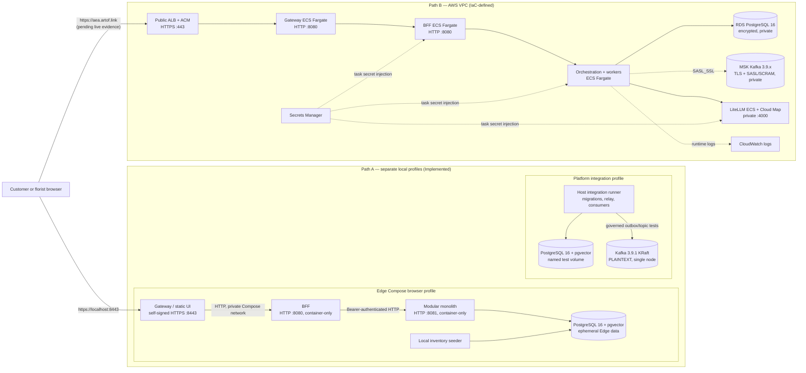
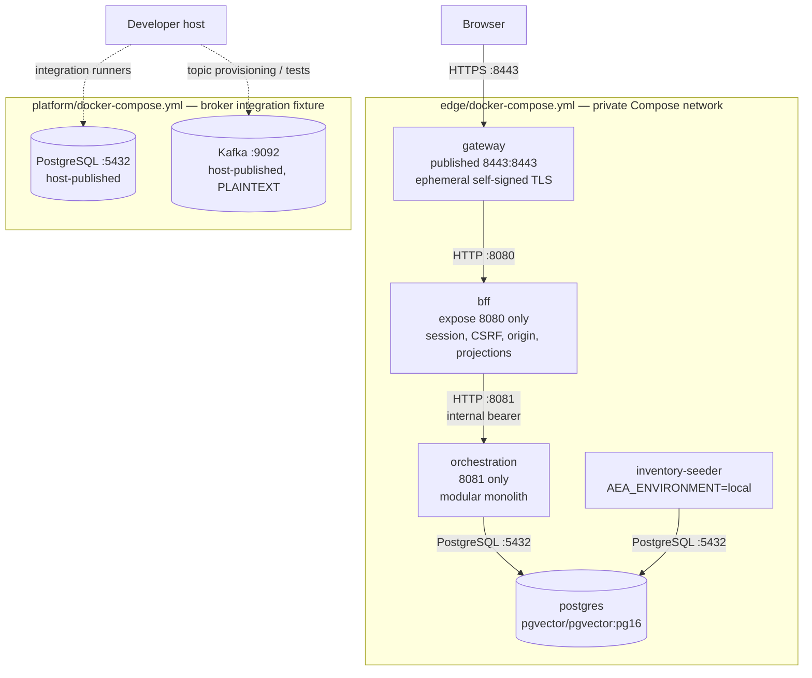
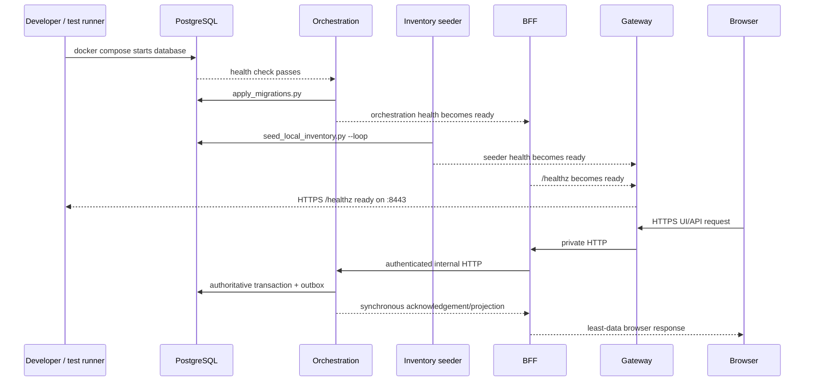
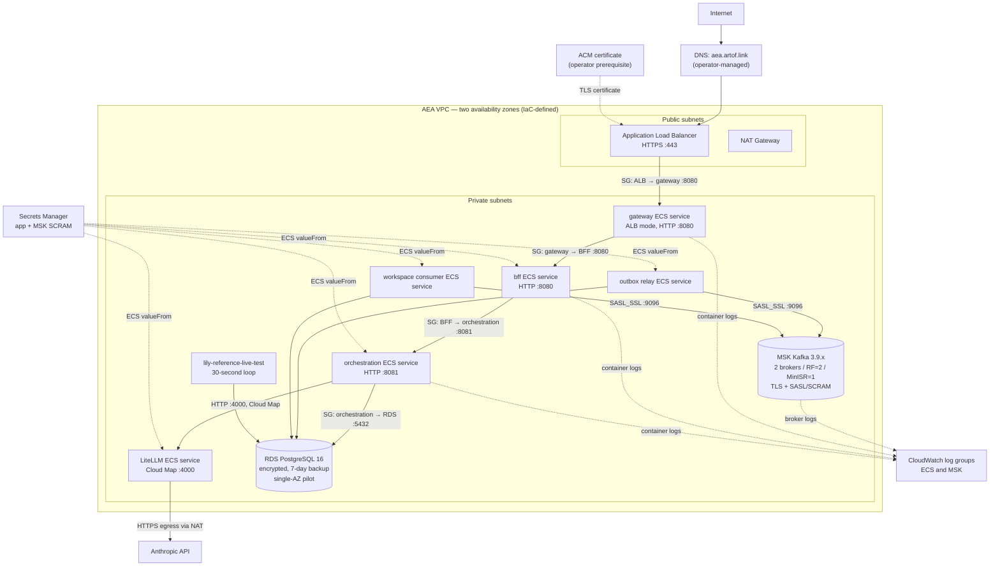
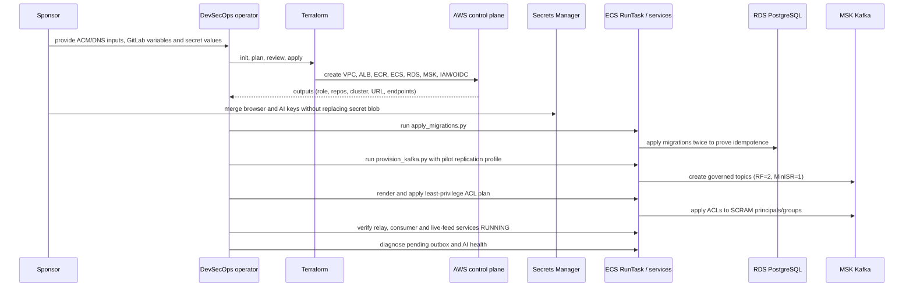
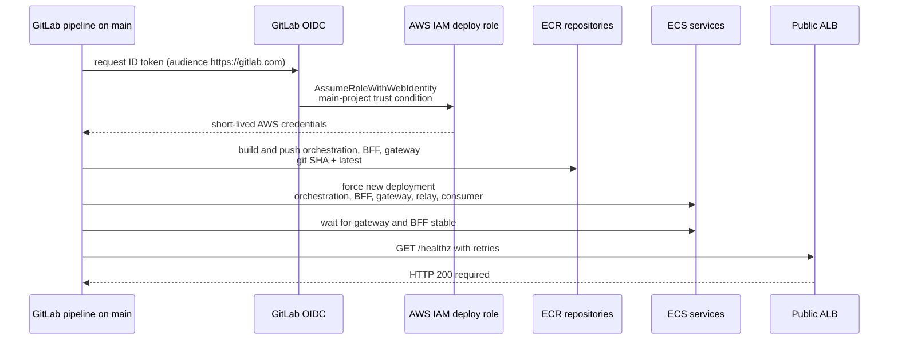

# AEA Pilot Deployment HLD and LLD

Status: architecture evidence view; not a deployment attestation

Related decisions: [ADR-007 Initial Deployment Topology](../06-adr/ADR-007-initial-deployment-topology.md),
[ADR-011 Experience-State Datastore](../06-adr/ADR-011-experience-state-datastore.md),
[ADR-012 MVP External Message Broker](../06-adr/ADR-012-external-message-broker.md),
[ADR-016 Agentic AI Boundary](../06-adr/ADR-016-agentic-ai-boundary.md)

This document details the AWS pilot and shows the local path only where a
side-by-side boundary comparison prevents ambiguity. The two
repository-supported execution paths are:

- **Path A — local reference:** Docker Compose on a developer machine.
- **Path B — `aea-pilot`:** the AWS topology declared in `infra/aws/`, built
  and deployed from GitLab CI.

It does not assert that Terraform has been applied or that a live endpoint is
healthy. Applied-resource, bootstrap, DNS, certificate, secret, alarm, and
end-to-end evidence must be recorded separately by the operator.

## Evidence-status legend

| Marker | Meaning |
|---|---|
| **Implemented** | Executable application, Compose, script, test, or CI behavior exists in the repository. |
| **IaC-defined** | Terraform declares the resource or control, but this document has no independent proof that the resource exists in AWS. |
| **Operationally pending** | Requires operator action or evidence from a reachable deployment target. |

## High-level design

Both paths preserve the ADR-007 boundary: the browser enters through the
gateway, the separately deployed BFF owns browser transport, and the modular
monolith owns orchestration and authoritative domain behavior. The browser
never connects directly to PostgreSQL or Kafka. Kafka is the external broker
selected by ADR-012; PostgreSQL remains authoritative state rather than Kafka.

## Path A — local low-level design

### Components and boundaries

The edge Compose stack exercises the customer-facing path and starts migrations
before orchestration. It enables the local-only inventory seeder and the local
florist operator. The platform Compose stack supplies PostgreSQL and Kafka for
platform integration testing. They are related test fixtures, not one combined
production topology.

Local trust and protocol properties:

- Only gateway `:8443` is published by the edge stack; BFF and orchestration
  remain on the Compose network.
- Gateway terminates ephemeral self-signed TLS. Gateway-to-BFF and
  BFF-to-orchestration traffic is HTTP within the local container network.
- BFF requires the configured origin, browser bearer/session controls, CSRF
  controls on mutations, and an internal orchestration bearer.
- Local PostgreSQL credentials, the browser bearer, and the internal bearer are
  fixtures. They must not be copied to the pilot.
- Local Kafka is one KRaft broker using `PLAINTEXT`, RF=1 and MinISR=1. It tests
  contracts and delivery behavior, not production encryption or availability.
- The local PostgreSQL volume is not evidence for NFR-007 at-rest encryption.

### Local startup and request sequence

## Path B — AWS pilot low-level design

### Network and runtime topology

The security-group chain permits only ALB → gateway → BFF → orchestration
ingress at the application edge. RDS accepts `:5432` from the orchestration
security group. MSK accepts its configured SASL/TLS ports from that same group;
workers share it. LiteLLM accepts `:4000` only from orchestration. The current
Terraform security groups permit broad outbound traffic, routed from private
subnets through the NAT gateway.

The pilot declares two public and two private subnets across two availability
zones because the two-broker MSK cluster requires them. The RDS pilot is
encrypted but explicitly `multi_az = false`, has seven-day backup retention,
and has deletion protection disabled with final snapshot skipped. Those are
pilot trade-offs, not a production resilience baseline.

### Production-mode controls and the named pilot exception

All application task definitions use `AEA_ENVIRONMENT=production`. Therefore:

- the local inventory seeder must fail closed and `AEA_SEED_INVENTORY` must not
  be set;
- generic production keeps florist operator routes at 404;
- only prefix `aea-pilot` sets both `AEA_FLORIST_OPERATOR=1` and
  `AEA_FLORIST_OPERATOR_EXCEPTION=aea-pilot` on the BFF;
- the exception exposes the read-only T-09 inbox only. It neither writes
  inventory nor unblocks T-03 Select;
- the named `lily-reference-live-test` service, not the local seeder, refreshes
  the five reference SKUs through the inventory service every 30 seconds.

The browser fixture bearer must match the UI value, but the live secret is
operator-merged into the existing Secrets Manager JSON object. Replacing the
whole secret risks dropping database, Kafka, or AI keys. AI credentials remain
behind private LiteLLM; orchestration receives only the proxy endpoint, proxy
bearer, and model together.

### Terraform, secret and bootstrap sequence

Terraform apply and bootstrap are operator activities. DNS changes, certificate
input, GitLab variable entry, and live secret values require sponsor handoff.
Neither the Scrum Master nor the GitLab deploy pipeline applies Terraform.

### GitLab build and deployment sequence

The CI path uses short-lived OIDC credentials and the Terraform-defined IAM
role; static AWS access keys are not part of the design. `resource_group:
path-b-ecs` serializes build/deploy activity. CI builds the pilot images and
pushes ECR tags; laptop-to-pilot image promotion is disallowed except for a
documented break-glass case.

The current `deploy-ecs` job refreshes orchestration, BFF, gateway, relay and
consumer-workspace. Terraform also declares LiteLLM and the reference live-test
service, but those two are not in this CI force-deploy loop; their rollout is
an operator step when their image or secret inputs change.

## Repository evidence and remaining gaps

| Concern | Repository status | Evidence still required |
|---|---|---|
| Local gateway/BFF/orchestration path | **Implemented** in `edge/docker-compose.yml` and edge integration tests | A successful run on the target workstation for the current commit. |
| Local PostgreSQL/Kafka integration | **Implemented** in `platform/docker-compose.yml` and platform integration runner | Local Compose proves behavior only; it does not prove cloud TLS, encryption, or HA. |
| AWS network, ALB, ECR, ECS, RDS, MSK, Secrets, OIDC | **IaC-defined** under `infra/aws/` | A reviewed Terraform plan and applied-state/resource inventory. |
| Public TLS and DNS | ALB HTTPS listener and ACM input are **IaC-defined** | Valid ACM certificate, DNS record, external TLS/hostname check. |
| RDS encryption and backups | `storage_encrypted=true`, seven-day retention are **IaC-defined** | AWS configuration evidence plus restore exercise. RDS is single-AZ in the pilot. |
| MSK transport and authentication | TLS + SASL/SCRAM, KMS-backed SCRAM secret, two brokers are **IaC-defined** | Live connection, topic configuration, ACL-denial, broker degradation and recovery evidence. Pilot RF=2/MinISR=1 is below ADR-012's preferred RF=3/MinISR=2 production baseline because the pilot has two brokers. |
| Migrations, topics and ACLs | Scripts and bootstrap procedure are **Implemented** | Successful in-VPC execution; second migration pass; ACLs applied to the real cluster. |
| GitLab cloud deploy | OIDC `build-ecr` and `deploy-ecs` jobs are **Implemented** | Successful main pipeline against configured AWS variables and an immutable SHA rollout record. |
| Secrets | Secrets Manager resources and ECS injection are **IaC-defined** | Operator confirmation that required keys exist, were merged safely, and no Compose fixture or raw secret entered git/CI logs. |
| Production flags | Task-definition settings and fail-closed code are **Implemented/IaC-defined** | Live negative tests for seeder and generic florist routes, plus positive read-only test for the named `aea-pilot` exception. |
| Observability | ECS/MSK CloudWatch log groups are **IaC-defined** | Retention review, dashboards, actionable alarms, trace correlation, and incident evidence. The deployment plan records 5xx/unhealthy-host alarms as post-pilot. |
| Availability and performance | Health checks and `/healthz` smoke are **Implemented** | Representative load, redundancy/failure exercises, SLO measurements, RDS restore, MSK recovery, and rollback evidence. |
| AI primary path | Private LiteLLM service and secret injection are **IaC-defined** | Live `/internal/v1/ai/health` showing `mode: primary`; no raw Anthropic key outside LiteLLM. |

## Acceptance evidence checklist

Before describing Path B as an operational pilot, retain evidence for:

1. reviewed Terraform plan and apply, with no secrets committed;
2. DNS and ACM validation for the canonical origin;
3. GitLab OIDC identity and least-privilege role assumption from `main`;
4. ECR images tagged with the deployed commit SHA;
5. idempotent migrations, governed topics, and applied Kafka ACLs;
6. running ECS services, drained outbox, healthy consumers, and CloudWatch logs;
7. external `/healthz`, authenticated browser journey, and exact-origin checks;
8. fail-closed production seeder and generic florist behavior, with the narrow
   `aea-pilot` operator exception verified separately;
9. RDS backup/restore, MSK degradation/recovery, deployment rollback, and the
   NFR-003/NFR-004 representative-load checks; and
10. CloudWatch alarms and operational ownership for 5xx, unhealthy targets,
    Kafka replication/lag, retry age, dead letters, and storage pressure.

Until those artifacts exist, Path B is accurately described as an
**IaC-defined pilot with operational evidence pending**, not a validated
production deployment.
