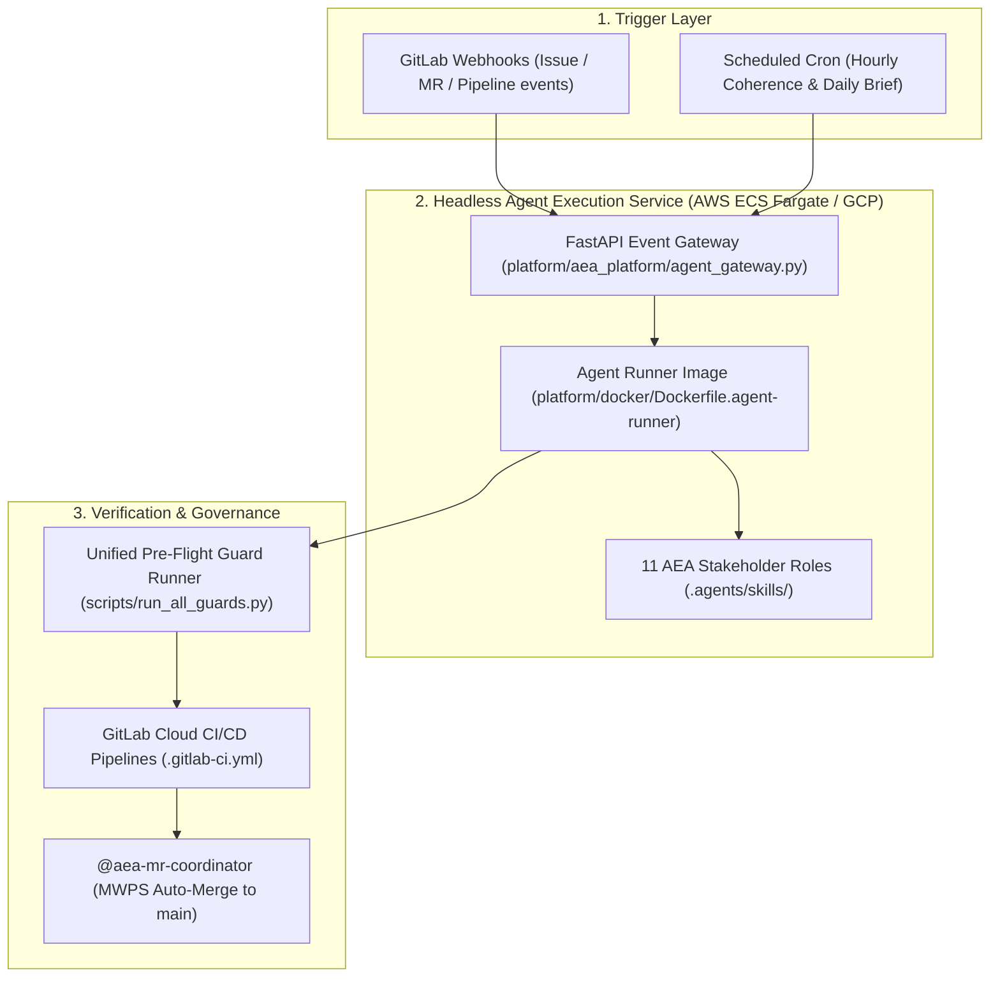

# Standard Operating Procedure: 24/7 Always-On Autonomous Cloud Agent Architecture

> **Status**: Published SOP  
> **Applies to**: DevSecOps Platform (`@aea-devsecops-platform`), Project Manager (`@aea-project-manager`), Product Owner (`@aea-product-owner`)  
> **Traceability**: NFR-003 (Availability), NFR-008 (Quality Monitoring), NFR-013 / NFR-017 (Data Protection & Privacy), ADR-016 (Agentic AI Boundary)

---

## 1. Overview & Purpose

This Standard Operating Procedure (SOP) defines the operational guidelines, deployment blueprint, event routing protocols, and safety controls for running AEA autonomous coding and coherence agents in a **24/7 always-on cloud environment**.

---

## 2. Cloud Architecture Topology

---

## 3. Environment Variables & Configuration

The 24/7 cloud agent service is configured using the following environment variables:

| Variable | Description | Default | Security / Privacy Gate |
| :--- | :--- | :---: | :--- |
| `AEA_AUTONOMOUS_LOOP_ENABLED` | Master emergency kill-switch toggle for autonomous iterations. | `true` | Set to `false` to immediately pause all background agent activity. |
| `AEA_AGENT_PORT` | HTTP port for the FastAPI agent gateway. | `8080` | Internal bearer authentication required. |
| `GITLAB_TOKEN` | Scoped API token for `glab` CLI operations. | Required | Stored in AWS Secrets Manager / GCP Secret Manager. |
| `AEA_AI_MODEL` | Provider-neutral model key for LLM interpretation. | Inherited | Subject to `ADR-016` non-authoritative boundary. |

---

## 4. Human Sponsor Emergency Kill-Switch SOP

The human Project Sponsor maintains absolute governance authority over 24/7 cloud agent execution.

### To Immediately Pause Autonomous Cloud Activity:
1. **Via Cloud Environment Variable**:
   * Set `AEA_AUTONOMOUS_LOOP_ENABLED=false` in ECS Task Definition / Cloud Run environment settings.
   * The gateway will immediately enter `paused` status and reject incoming webhook triggers.
2. **Via GitLab Issue Tag**:
   * Apply label `status::paused` to any open issue or parent milestone.

### To Resume Autonomous Cloud Activity:
* Set `AEA_AUTONOMOUS_LOOP_ENABLED=true` and verify health status via `GET /internal/v1/ai/health`.

---

## 5. Security & Privacy Safeguards

1. **Zero Credential Leaks (`NFR-017`)**:
   * All pull, push, and test actions run `scripts/check_secrets_posture.py` to guarantee zero raw `.env` or credentials enter git commits or log streams.
2. **Non-Authoritative AI Boundary (`ADR-016`)**:
   * Autonomous AI agents interpret intent and draft code/documentation, but domain services validate inventory, pricing, and delivery logic.
3. **Automated CI Merge Gates (`MWPS`)**:
   * Code merged into `main` must pass 100% of pipeline tests (`python scripts/run_all_guards.py`).
