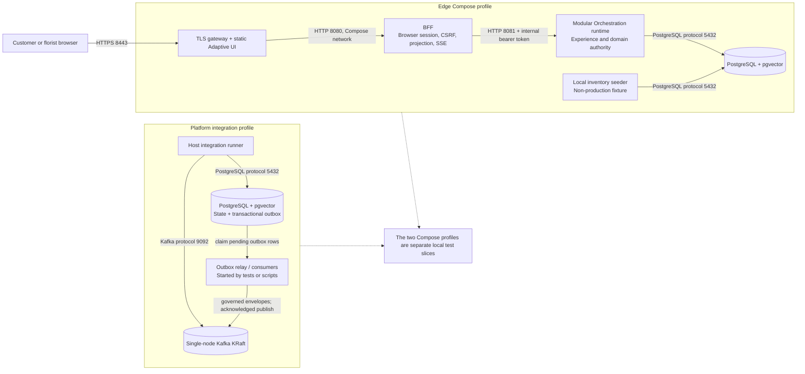
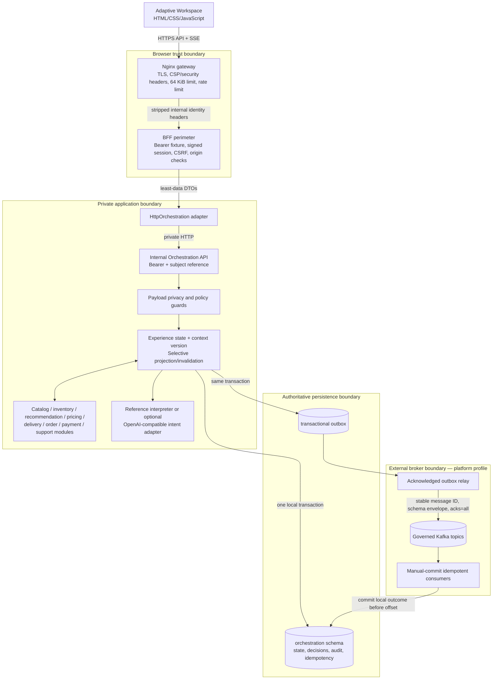
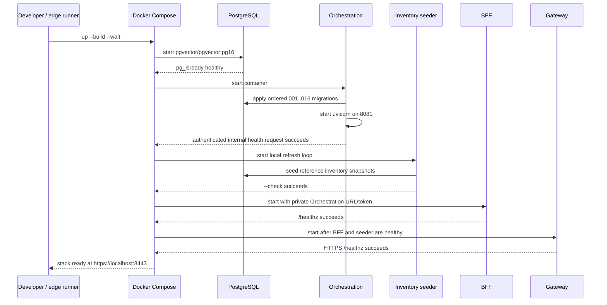

# Local Deployment HLD and LLD

This document describes the executable local deployment as it exists in this
repository. It is a developer and CI reference environment, not a production or
pilot deployment specification. The accepted architectural constraints remain
those in [ADR-007](../06-adr/ADR-007-initial-deployment-topology.md),
[ADR-008](../06-adr/ADR-008-contract-first-messaging.md),
[ADR-009](../06-adr/ADR-009-experience-state-ownership.md),
[ADR-011](../06-adr/ADR-011-experience-state-datastore.md),
[ADR-012](../06-adr/ADR-012-external-message-broker.md), and
[ADR-016](../06-adr/ADR-016-agentic-ai-boundary.md).

## Scope and implemented profiles

Local execution currently has two complementary Compose profiles:

1. `edge/docker-compose.yml` is the browser-facing reference path. It runs the
   TLS gateway, BFF, internal Orchestration runtime, inventory seed fixture, and
   PostgreSQL. It does **not** run Kafka, the outbox relay, or consumers.
2. `platform/docker-compose.yml` is the persistence and messaging integration
   path. It runs PostgreSQL and a single-node Kafka KRaft broker; host-side test
   scripts apply migrations, provision governed topics, and exercise outbox,
   relay, and consumer behavior.

These profiles validate different slices of the same architecture. They are not
one locally orchestrated end-to-end deployment. The canonical logical design is
described in
[`technical-architecture.md`](technical-architecture.md); the executable details
below come from the two Compose files and their runners.

## High-level design



The gateway is the sole host-published browser entry, as required by ADR-007.
The BFF has no database or broker credentials and cannot become a second
orchestration layer. Orchestration owns authoritative experience state under
ADR-009, PostgreSQL is the authoritative state store under ADR-011, and Kafka
is the external governed broker under ADR-012. AI interpretation may prepare
or recommend; business services retain validation and mutation authority under
ADR-016.

## Component responsibilities

| Component | Implemented responsibility | Explicit boundary | Source |
|---|---|---|---|
| Gateway | Terminates local TLS, serves customer/operator static assets, rate-limits and proxies `/api/` and `/healthz` | Only host-published browser entry; clears `X-Internal-Identity` | `edge/gateway/nginx.conf`, `edge/docker-compose.yml` |
| BFF | Authenticates the local browser fixture, manages browser session/CSRF/origin controls, exposes projections and SSE, calls Orchestration | No PostgreSQL/Kafka credentials; no authoritative workflow or state ownership | `edge/bff/aea_bff/runtime.py`, `edge/README.md` |
| Orchestration runtime | Exposes token-protected internal APIs; validates and mutates experience/domain state; builds workspace projections | Not published to host by Edge Compose; requires DSN and internal token | `platform/aea_platform/internal_runtime.py`, `edge/docker-compose.yml` |
| PostgreSQL | Stores module-owned authoritative state, audit/idempotency records, and transactional outbox; supplies `pgvector` for migration 013 | Orchestration schema remains private; Kafka is not the system of record | `platform/migrations/`, ADR-011, ADR-014 |
| Inventory seeder | Refreshes versioned snapshots for the fixed reference catalog so selection can be tested | Local-only fixture; never an inventory authority replacement | `platform/scripts/seed_local_inventory.py`, `edge/README.md` |
| Kafka | Carries versioned governed messages for integration tests | Local single node has no production quorum, TLS, SASL, or HA | `platform/docker-compose.yml`, ADR-008, ADR-012 |
| Topic provisioner | Creates policy-defined topics and aligns replication/minimum ISR settings | Auto-topic creation is disabled; policy is version-controlled | `platform/scripts/provision_kafka.py`, `platform/config/kafka-policy.json` |
| Relay and consumers | Publish stable outbox messages and exercise idempotent consumption | They are host-started test/script processes, not long-running Compose services | `platform/scripts/run_relay.py`, `platform/scripts/run_consumer.py`, `platform/tests/test_kafka_integration.py` |

## Protocols, ports, and health checks

| Profile | Endpoint | Exposure | Purpose / health evidence |
|---|---|---|---|
| Edge | `https://localhost:8443` | Host-published | Gateway/UI/API entry; `wget` checks `/healthz` with the self-signed certificate |
| Edge | `bff:8080` HTTP | Compose network only (`expose`) | Gateway upstream; Python health check calls `/healthz` |
| Edge | `orchestration:8081` HTTP | Compose network only | BFF internal API with `Authorization: Bearer`; health check performs an authenticated session `PUT` |
| Edge | `postgres:5432` PostgreSQL | Compose network only | Orchestration and seeder datastore; `pg_isready` health check |
| Platform | `localhost:5432` PostgreSQL | Host-published | Migration and integration-test access; `pg_isready` health check |
| Platform | `localhost:9092` Kafka | Host-published plaintext | Integration-test broker access; topic-list health check |
| Optional Edge overlay | `litellm:4000` HTTP | Compose network; host publication defined by overlay | OpenAI-compatible AI proxy with `/health/liveliness`; see `edge/docker-compose.litellm.yml` |

Local Compose credentials (`local-browser-token`, `local-internal-token`, and
`local-migration-only`) and the ephemeral self-signed certificate are test
fixtures. They must not be reused or represented as pilot controls.

## Detailed logical design



The combined logical view spans both local profiles: the message path is
implemented and integration-tested, but it is not wired into
`edge/docker-compose.yml` as a single browser-to-broker local deployment.

## Bootstrap sequences

### Browser-facing Edge profile



`edge/scripts/run_integration_tests.py` then runs the diagnostic browser path
and assistant SLO check, and always tears down the stack and volumes.

### Platform persistence and messaging profile

```mermaid
sequenceDiagram
    participant Run as Platform integration runner
    participant DC as Docker Compose
    participant PG as PostgreSQL
    participant K as Kafka KRaft
    participant Mig as Migration script
    participant Prov as Topic provisioner
    participant Tests as Integration tests

    Run->>DC: up -d --wait
    DC->>PG: start persisted database volume
    DC->>K: start persisted single-node KRaft volume
    PG-->>Run: pg_isready healthy
    K-->>Run: metadata/topic-list healthy
    Run->>Mig: apply migrations
    Mig->>PG: apply each missing ordered SQL version
    Run->>Mig: apply again (idempotency check)
    Run->>Prov: provision policy topics
    Prov->>K: create missing topics; align min.insync.replicas
    Run->>Tests: run unit + container integration suite with AEA_INTEGRATION=1
    Tests->>PG: state/outbox transactions and idempotency
    Tests->>K: relay, consume, retry/recovery behavior
    Run->>Run: diagnose migration, outbox, topics
    Run->>DC: down -v (finally)
```

## Runtime request and event flows

### Browser request and projection flow

1. The browser connects only to `https://localhost:8443`; Nginx serves assets
   or proxies `/api/` and `/healthz` to the BFF.
2. The BFF enforces the local authentication fixture, allowed origin, session,
   and CSRF rules, then forwards an authenticated least-data request to the
   private Orchestration API.
3. Orchestration validates business rules and context version. Accepted
   mutations update authoritative PostgreSQL state and associated outbox rows
   atomically where the governed event path applies.
4. The BFF returns a browser-safe projection. `GET /api/v1/stream` supplies a
   snapshot and reconnectable invalidations; the browser refetches affected
   projections rather than receiving database or broker details.

### Governed event flow

1. A service transaction persists its authoritative outcome and versioned
   ADR-008 message envelope in PostgreSQL outbox storage.
2. The relay claims unpublished rows and publishes them to a policy-provisioned
   Kafka topic with stable identity and acknowledged producer settings.
3. A logical subscriber validates schema/policy, rejects stale context, records
   idempotent processing and any resulting outbox work in its local transaction,
   then commits the Kafka offset.
4. Failures before offset commit may redeliver. ADR-012 therefore requires
   idempotency, bounded retry/dead-letter behavior, and operator-controlled
   replay rather than exactly-once assumptions.

The event flow is exercised by `platform/scripts/run_integration_tests.py`; it
is not a claim that the Edge Compose request path starts relay and consumer
daemons.

## Trust, authority, and privacy boundaries

- **Public-to-edge:** local TLS terminates at Nginx. Only port 8443 is published
  by the Edge profile. The self-signed certificate proves plumbing, not public
  trust or certificate lifecycle.
- **Gateway-to-BFF:** Nginx removes incoming `X-Internal-Identity`; security
  headers, request-size limits, and rate limits are applied at the gateway.
- **BFF-to-Orchestration:** a private HTTP hop uses an internal bearer token.
  The BFF has no DSN or Kafka bootstrap configuration and exposes only
  browser-appropriate DTOs.
- **Application-to-database:** Orchestration owns experience-state writes.
  Raw payment-card data and unnecessary recipient PII are rejected; browser
  flows use opaque references as documented in `edge/README.md` and ADR-011.
- **Application-to-AI:** the default is the deterministic reference
  interpreter. The optional LiteLLM overlay receives configured intent text;
  keys belong in uncommitted `platform/.env`. AI is non-authoritative and may
  not directly mutate order, payment, inventory, pricing, or experience-state
  tables.
- **Database-to-broker:** the transactional outbox is the consistency boundary.
  Kafka retention does not become domain authority or a substitute for the
  PostgreSQL lifecycle policy.
- **Operator surface:** `/florist` is a labeled local sample guarded by the
  environment/exception flag. Its presence is not production authorization or
  a CRM implementation.

## Local commands and validation ownership

| Purpose | Command | What it proves |
|---|---|---|
| Start browser path | `docker compose -f edge/docker-compose.yml up --build --wait` | Edge dependencies and health ordering |
| Validate browser path | `python edge/scripts/run_integration_tests.py` | Real local TLS, gateway, auth, BFF, Orchestration, PostgreSQL, diagnostics, and assistant latency guard |
| Validate platform path | `python platform/scripts/run_integration_tests.py` | PostgreSQL migrations/state/outbox and Kafka topic/relay/consumer integration |
| Edge unit/boundary suite | `python -m unittest discover -s edge/tests -v` | Perimeter, browser contract, adapters, and runner behavior |
| Platform suite | `python -m unittest discover -s platform/tests -v` | Domain, authority, privacy, persistence, messaging, and deployment contracts; container cases require `AEA_INTEGRATION=1` |

## Non-production caveats and pilot gaps

- The Edge profile uses fixed credentials committed as explicit local fixtures,
  an ephemeral self-signed certificate, one database instance, no connection
  pool, and no managed secret source.
- The Platform Kafka broker is plaintext, host-published, single-node, and uses
  replication factor one. It cannot validate quorum loss, multi-AZ placement,
  production TLS/SASL/ACL operation, or replication factor three.
- The local Postgres and Kafka volumes support developer restart exercises but
  do not establish encryption-at-rest, backup/restore, retention deletion,
  disaster recovery, or availability objectives.
- The inventory seeder is fabricated reference availability and must be absent
  from the pilot. A pilot needs an authoritative inventory integration.
- The optional LiteLLM overlay uses a rolling container tag and a local master
  key fixture. It is opt-in and not a production provider, egress, key rotation,
  or model-governance design.
- Edge Compose does not start Kafka, the outbox relay, or domain consumers.
  Platform tests validate those semantics separately; combined deployment and
  operational evidence belong to the pilot design.
- Local health checks establish process readiness only. They do not constitute
  pilot observability, alerting, SLO measurement, autoscaling, or synthetic
  customer monitoring.
- Compose DNS and host port mappings are local mechanics, not pilot network
  segmentation. The pilot must preserve the same logical boundaries with
  managed identity, least privilege, private networking, encryption, and
  auditable operations.

Any pilot HLD/LLD should map these logical responsibilities to deployed pilot
resources without weakening the ADR boundaries; it must not copy the local
fixtures as deployment controls.
