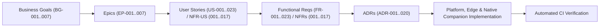
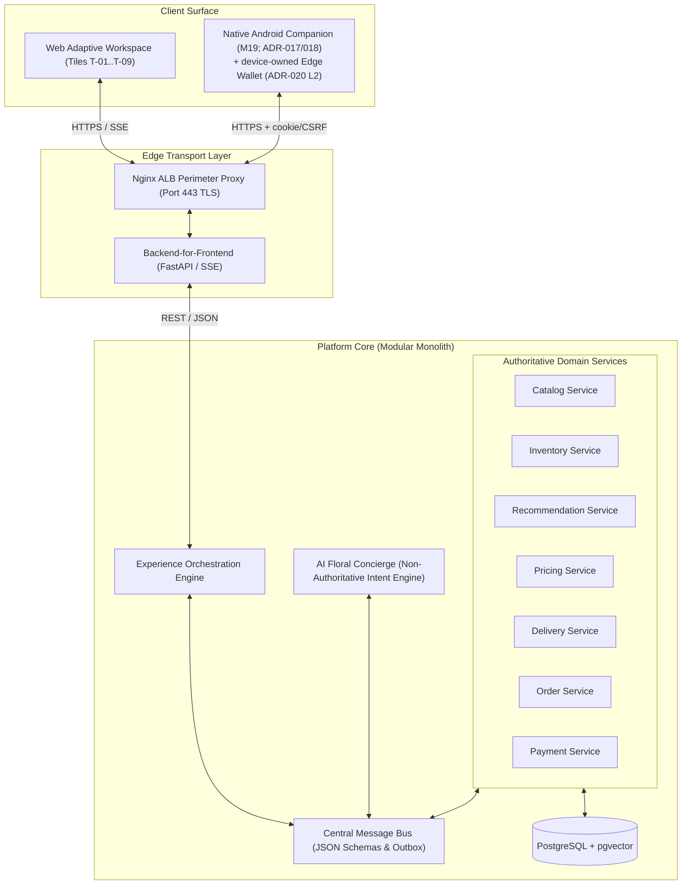
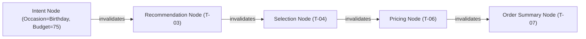
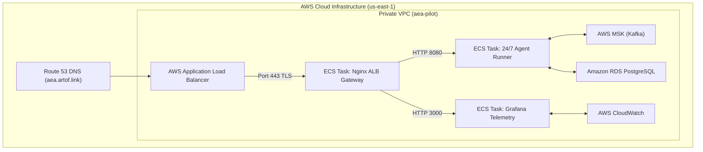

# Adaptive Experience Architecture (AEA) — Complete System Documentation

> **Reference Implementation**: Lily's Florist  
> **Source of Truth Workbook**: [`archive/Quantic_Project_Consolidated_Coherence_Validated.xlsx`](file:///c:/projects/code/adaptive-experience/archive/Quantic_Project_Consolidated_Coherence_Validated.xlsx)  
> **Repository**: `artof-group/adaptive-experience-architecture`  
> **Live 24/7 Cloud Deployment**: `https://aea.artof.link`  
> **Coherence Posture**: 100% Mechanically Validated (`python scripts/check_coherence.py`)

---

## 1. Executive Summary & Vision

The **Adaptive Experience Architecture (AEA)** represents a fundamental paradigm shift from static, page-based e-commerce storefronts to an **intent-driven, persistent Adaptive Workspace**. Grounded in the Lily's Florist reference design ([`docs/01-product-vision/product-vision.md`](file:///c:/projects/code/adaptive-experience/docs/01-product-vision/product-vision.md)), AEA dynamically composes, rearranges, and updates workspace tiles (`T-01` through `T-08`, plus the conditional `T-09` Contact Florist overlay) in real time based on progressive customer intent.

### Core Architecture Shift
* **Legacy E-Commerce**: Static HTML pages → Multi-step checkout funnel → Disjointed support.
* **AEA Paradigm**: Shared Understanding (`ADR-001`) → Persistent Adaptive Workspace (`ADR-002`) → Asynchronous Event Bus (`ADR-010`) → Non-authoritative AI Concierge (`ADR-016`) + Authoritative Domain Services.

---

## 2. Requirements & Traceability Framework

All system capabilities strictly trace to the canonical 40 requirement chains validated in the consolidated project workbook:



### Requirements Hierarchy
* **Business Goals (`BG-001`..`BG-007`)**: Revenue, conversion, customer retention, operational cost reduction, compliance, availability, and AI satisfaction.
* **Epics (`EP-001`..`EP-007`)**: Intent capture, recommendations, customization, delivery scheduling, order placement, support overlay, and security/reliability.
* **Functional Requirements (`FR-001`..`FR-023`)**: Concierge chat (`FR-001`), intent parsing (`FR-002`), recommendations (`FR-003`), arrangement options (`FR-004`), FAQ answers (`FR-005`), human escalation (`FR-006`), stock validation (`FR-007`), reorder history (`FR-008`), etc.
* **Non-Functional Requirements (`NFR-001`..`NFR-017`)**: Latency (<200ms edge response), availability (99.9% uptime), encryption at rest/in transit, privacy, least-privilege topic isolation, and auditability.

---

## 3. High-Level Design (HLD)

AEA is built as an **asynchronous, event-driven, experience-oriented modular monolith** ([`docs/04-technical-architecture/technical-architecture.md`](file:///c:/projects/code/adaptive-experience/docs/04-technical-architecture/technical-architecture.md)):



### Perimeter Routing Architecture
The Nginx Load Balancer proxies public traffic cleanly to internal micro-services:

```
https://aea.artof.link/           --> Static Web Assets (T-01..T-08 Workspace)
https://aea.artof.link/api/       --> BFF API (agent_gateway.py)
https://aea.artof.link/webhooks/  --> 24/7 Cloud Runner Webhook Receiver (Port 8080)
https://aea.artof.link/cloud/     --> 24/7 Autonomous Runner Status Engine
https://aea.artof.link/grafana/   --> Containerized Grafana Telemetry Dashboard (Port 3000)
```

---

## 4. Low-Level Technical Design (LLD) & ADRs

The system architecture is governed by 20 canonical Architectural Decision Records ([`docs/06-adr/`](file:///c:/projects/code/adaptive-experience/docs/06-adr/)):

| ADR | Title | Key Architectural Rule |
| :--- | :--- | :--- |
| [`ADR-001`](file:///c:/projects/code/adaptive-experience/docs/06-adr/ADR-001-shared-understanding.md) | Shared Understanding | Centralized session experience state shared across UI, Concierge, and Domain services. |
| [`ADR-002`](file:///c:/projects/code/adaptive-experience/docs/06-adr/ADR-002-experiences-instead-of-pages.md) | Experiences Instead of Pages | Workspace composed of modular, independent tiles (`T-01`..`T-08`) rather than traditional page routes. |
| [`ADR-005`](file:///c:/projects/code/adaptive-experience/docs/06-adr/ADR-005-latest-relevant-intent-wins.md) | Latest Relevant Intent Wins | Supersession rule: newest intent update automatically invalidates stale downstream workspace state. |
| [`ADR-008`](file:///c:/projects/code/adaptive-experience/docs/06-adr/ADR-008-contract-first-messaging.md) | Contract-First Messaging | Mandatory JSON Schema validation and transactional outbox for all bus events. |
| [`ADR-009`](file:///c:/projects/code/adaptive-experience/docs/06-adr/ADR-009-experience-state-ownership.md) | Experience State Ownership | Orchestration engine owns context versioning, tile projections, and dependency invalidation. |
| [`ADR-010`](file:///c:/projects/code/adaptive-experience/docs/06-adr/ADR-010-command-event-boundaries.md) | Command/Event Boundaries | Synchronous edge acknowledgement; asynchronous bus progression. |
| [`ADR-014`](file:///c:/projects/code/adaptive-experience/docs/06-adr/ADR-014-postgresql-pgvector.md) | PostgreSQL + `pgvector` | Unified relational outbox and vector embedding store for intent & product RAG. |
| [`ADR-013`](file:///c:/projects/code/adaptive-experience/docs/06-adr/ADR-013-confirmation-driven-experience.md) | Confirmation-Driven Experience | Tokenized/opaque references (no raw PII/PAN) confirmed rather than re-entered at checkout. |
| [`ADR-015`](file:///c:/projects/code/adaptive-experience/docs/06-adr/ADR-015-rag-hybrid-retrieval.md) | RAG Hybrid Retrieval | Approved-knowledge hybrid (pgvector + FTS) retrieval; similarity hits are never business truth. |
| [`ADR-016`](file:///c:/projects/code/adaptive-experience/docs/06-adr/ADR-016-agentic-ai-boundary.md) | Agentic AI Boundary | Strict separation between AI assistance (non-authoritative) and domain verification (authoritative). |
| [`ADR-017`](file:///c:/projects/code/adaptive-experience/docs/06-adr/ADR-017-native-client-architecture.md) | Native Client Architecture | Android companion (M19) reuses the same BFF contracts as the web workspace; no privileged client path. |
| [`ADR-018`](file:///c:/projects/code/adaptive-experience/docs/06-adr/ADR-018-mobile-session-auth.md) | Mobile Session & Auth | Companion uses the same opaque cookie/CSRF session model as the browser; no long-lived client secrets. |
| [`ADR-020`](file:///c:/projects/code/adaptive-experience/docs/06-adr/ADR-020-privacy-preserving-crm-and-edge-wallet.md) | Privacy-Preserving CRM & Edge Wallet | Pseudonymous zero-PII engagement CRM (L1) + device-owned encrypted Edge Wallet (L2) for FR-008 reorder; no server-side PII honeypot. |

### Session Property Graph State Engine (`Pillar 3`)
Workspace tile invalidation and context progression are driven by directed dependency edges in [`platform/aea_platform/graph.py`](file:///c:/projects/code/adaptive-experience/platform/aea_platform/graph.py):



### Privacy-Preserving CRM & Edge Wallet (`ADR-020`)

Returning-customer engagement is delivered **without** a server-side PII CRM, in three layers:

* **Layer 1 — Platform (zero-PII Engagement CRM, live):** `platform/aea_platform/crm.py` (`EngagementCrmService` + `CrmService`) with schema `crm.customer_occasion_memory` (migration 018) and `orchestration.subject_profile` (migrations 024/026) persists only pseudonymous, non-PII attributes (`browser_hash`, `occasion_type`, `event_month/day`, `recipient_relation`; and a pseudonymous `subject_reference`, `total_orders`, cumulative `lifetime_spend_band`, primary occasion, channel). A confirmed order captures both (best-effort, fail-closed); the workspace projection reads back a least-data `reminders` facet — **deterministic pull signals** computed on read (proactive FCM/APNs push is not shipped — ADR-019), not AI push. Reachable via `GET /api/v1/crm/reminders`, `POST`/`DELETE /api/v1/crm/occasions`, and operator `GET /api/v1/operator/subjects/{subject_reference}`. Privacy lifecycle (NFR-017): customer **erasure** (`forget` / `DELETE /internal/v1/crm/occasions`, plus subject-profile erasure) and time-based **retention** purge (`purge_expired`, ~13 months; subject profiles by `last_seen_at`) via `platform/scripts/purge_crm_retention.py`. Delivered under M12; `FR-016`/`FR-017` remain **Future** in the source-of-truth workbook (reference-extension delivery).
* **Layer 2 — Edge Client (device-owned Edge Wallet, implemented):** the Android companion stores order receipts and device-only convenience data (recipient label, card-message draft, occasion) in `EncryptedSharedPreferences` under an Android Keystore AES-256 key. Only an opaque `ReorderReference` (`product_id`, `order_reference`) is surfaced to the platform for `FR-008` one-tap reorder — no names, addresses, or card data leave the device (`NFR-017`/`ADR-013`). See [`research/design-notes/adr-020-layer2-edge-wallet.md`](file:///c:/projects/code/adaptive-experience/research/design-notes/adr-020-layer2-edge-wallet.md).
* **Layer 3 — Fulfillment (partial):** the ephemeral fulfillment table (`orchestration.ephemeral_fulfillment`, migration 024) and the **14-day auto-shredding lifecycle** (`purge_expired_fulfillment`, run by `purge_crm_retention.py`) are implemented; the KMS-encrypted write path that populates the vault remains **sponsor-gated** (cloud KMS + budget).

A traditional centralized PII CRM and staff live chat/ticketing are explicitly out of scope.

---

## 5. Software Security & Deployment Design (SSDD)

### 5.1 Security Perimeter & OWASP Defenses
* **Prompt Injection Defense (`ADR-016`)**: Natural language inputs undergo sanitization before LLM processing; LLM responses are validated against authoritative domain rules before UI rendering.
* **Tokenized Payment Security (`NFR-015`)**: Zero PAN (Primary Account Number) handling; payments use temporary session tokens validated via sandbox gateway.
* **Perimeter Hardening**: Nginx enforces CSP, HSTS, `X-Frame-Options: DENY`, `X-Content-Type-Options: nosniff`, and CORS policy.

### 5.2 AWS ECS Fargate 24/7 Deployment Topology



---

## 6. Integrated Graph Engineering Subsystems (4 Pillars)

The repository incorporates full **Graph Engineering** across four dedicated subsystems:

```mermaid
flowchart TD
    subgraph P1["Pillar 1: Traceability DAG"]
        P1_S["scripts/generate_traceability_graph.py"] --> P1_O["docs/08-traceability/graphs/traceability.mmd / .dot"]
    end
    subgraph P2["Pillar 2: Loop Network Guard"]
        P2_S["scripts/check_loop_graph.py"] --> P2_O["research/loop-graph.md Node Verification"]
    end
    subgraph P3["Pillar 3: Session State Property Graph"]
        P3_S["platform/aea_platform/graph.py"] --> P3_O["SessionPropertyGraph & Tile Invalidation"]
    end
    subgraph P4["Pillar 4: Knowledge Graph Exporter"]
        P4_S["platform/aea_platform/knowledge_graph.py"] --> P4_O["CatalogKnowledgeGraph & JSON-LD Exporter"]
    end
```



1. **Pillar 1: Traceability DAG Engine** ([`scripts/generate_traceability_graph.py`](file:///c:/projects/code/adaptive-experience/scripts/generate_traceability_graph.py)): Generates Mermaid `.mmd` and Graphviz `.dot` representations of the 40 requirement dependency chains.
2. **Pillar 2: Governance Loop Network Guard** ([`scripts/check_loop_graph.py`](file:///c:/projects/code/adaptive-experience/scripts/check_loop_graph.py)): Validates node/edge parity between [`research/loop-graph.md`](file:///c:/projects/code/adaptive-experience/research/loop-graph.md) and active scripts/CI jobs.
3. **Pillar 3: Session State Property Graph** ([`platform/aea_platform/graph.py`](file:///c:/projects/code/adaptive-experience/platform/aea_platform/graph.py)): Models intent, tile (`T-01`..`T-08`), recommendation, and customization nodes with directed dependency & invalidation edges.
4. **Pillar 4: Catalog & Policy Knowledge Graph Exporter** ([`platform/aea_platform/knowledge_graph.py`](file:///c:/projects/code/adaptive-experience/platform/aea_platform/knowledge_graph.py)): Converts product taxonomy, occasion matching, recipient suitability, and delivery slot compatibility into queryable JSON-LD graph topologies.

---

## 7. Stakeholder Governance & 6-Way Skill Portability

The AEA project is driven by a **14-role stakeholder team** ([`AGENTS.md`](file:///c:/projects/code/adaptive-experience/AGENTS.md)):

| Stakeholder Role | Primary Domain & Responsibility | Canonical Skill File |
| :--- | :--- | :--- |
| `aea-project-manager` | Scrum Master, delivery cadence, WIP, readiness/done gates | [`.cursor/skills/aea-project-manager/SKILL.md`](file:///c:/projects/code/adaptive-experience/.cursor/skills/aea-project-manager/SKILL.md) |
| `aea-product-owner` | Product mission, vision, go/no-go decisions, backlog priority | [`.cursor/skills/aea-product-owner/SKILL.md`](file:///c:/projects/code/adaptive-experience/.cursor/skills/aea-product-owner/SKILL.md) |
| `aea-ux-designer` | Workspace UI, tiles T-01..T-08, Figma visual parity | [`.cursor/skills/aea-ux-designer/SKILL.md`](file:///c:/projects/code/adaptive-experience/.cursor/skills/aea-ux-designer/SKILL.md) |
| `aea-customer-journey` | End-to-end customer journey walks (localhost shop) | [`.cursor/skills/aea-customer-journey/SKILL.md`](file:///c:/projects/code/adaptive-experience/.cursor/skills/aea-customer-journey/SKILL.md) |
| `aea-support-coordinator` | Customer & operator issue triage, escalation routing | [`.cursor/skills/aea-support-coordinator/SKILL.md`](file:///c:/projects/code/adaptive-experience/.cursor/skills/aea-support-coordinator/SKILL.md) |
| `aea-ai-engineer` | Intent parsing, LLM Concierge, RAG, AI honesty audits | [`.cursor/skills/aea-ai-engineer/SKILL.md`](file:///c:/projects/code/adaptive-experience/.cursor/skills/aea-ai-engineer/SKILL.md) |
| `aea-appsec-auditor` | Prompt injection defenses, CORS, rate limits, OWASP security | [`.cursor/skills/aea-appsec-auditor/SKILL.md`](file:///c:/projects/code/adaptive-experience/.cursor/skills/aea-appsec-auditor/SKILL.md) |
| `aea-devsecops-platform`| Infrastructure, Docker, Terraform, CI/CD pipelines, PostgreSQL | [`.cursor/skills/aea-devsecops-platform/SKILL.md`](file:///c:/projects/code/adaptive-experience/.cursor/skills/aea-devsecops-platform/SKILL.md) |
| `aea-senior-software-engineer` | Code implementation, architecture refactoring, conflict resolution | [`.cursor/skills/aea-senior-software-engineer/SKILL.md`](file:///c:/projects/code/adaptive-experience/.cursor/skills/aea-senior-software-engineer/SKILL.md) |
| `aea-mr-coordinator` | GitLab MR review, gate validation, automated merge authority | [`.cursor/skills/aea-mr-coordinator/SKILL.md`](file:///c:/projects/code/adaptive-experience/.cursor/skills/aea-mr-coordinator/SKILL.md) |
| `aea-coherence-guardian` | Coherence checks, daily briefs, findings loop remediation | [`.cursor/skills/aea-coherence-guardian/SKILL.md`](file:///c:/projects/code/adaptive-experience/.cursor/skills/aea-coherence-guardian/SKILL.md) |
| `aea-knowledge-guardian` | Second Brain curation, session memory, vault index | [`.cursor/skills/aea-knowledge-guardian/SKILL.md`](file:///c:/projects/code/adaptive-experience/.cursor/skills/aea-knowledge-guardian/SKILL.md) |
| `aea-cost-guardian` | FinOps, Fargate sizing, LLM token budget | [`.cursor/skills/aea-cost-guardian/SKILL.md`](file:///c:/projects/code/adaptive-experience/.cursor/skills/aea-cost-guardian/SKILL.md) |
| `aea-performance-guardian` | Web Vitals, LCP, hydration audit | [`.cursor/skills/aea-performance-guardian/SKILL.md`](file:///c:/projects/code/adaptive-experience/.cursor/skills/aea-performance-guardian/SKILL.md) |

### 7.1 Stakeholder Roster Status, State & Definition Mapping

| Roster Status Label | Standard Scrum State | Operational Definition & Execution Boundary |
| :--- | :--- | :--- |
| **`Dispatched`** | **`In Progress (Cloud Agent)`** | The task has been dispatched via webhook (`POST /webhooks/gitlab`) to the **24/7 Cloud Runner** (`agent-runner` on AWS ECS Fargate), where the automated cloud agent creates a Git feature branch, executes specialist pre-flight guards, and generates a GitLab MR. |
| **`Assigned`** | **`In Progress (Local Task)`** | The issue is assigned to a human or local specialist actively implementing code on a local workspace feature branch. |
| **`Active`** | **`In Progress (Lead Process)`** | The role is actively executing a continuous Scrum process or Product Owner acceptance loop (e.g., `@aea-product-owner` roadmap sign-off). |
| **`Available`** *(On Bench)* | **`Idle / Bench Ready`** | The specialist has finished their assigned MR/issue, has zero active blockers, and is ready to be dispatched for the next priority issue in line. |
| **`Blocked`** | **`Blocked`** | Halted due to an external dependency (e.g., `user` waiting on sponsor secrets/budget, or `merge` waiting on MR pipeline pass). |

---

## 8. Automated CI/CD Pipelines & Quality Guards

All changes merged into `main` must pass automated CI jobs configured in [`.gitlab-ci.yml`](file:///c:/projects/code/adaptive-experience/.gitlab-ci.yml):

* `coherence-guard`: Runs `scripts/check_coherence.py`.
* `stakeholder-cadence-guard`: Runs `scripts/check_stakeholder_cadence.py` and unit tests.
* `ui-visual-sync-guard`: Runs `edge/scripts/check_ui_visual_sync.py` (Figma asset & UI tile coverage).
* `secrets-posture-guard`: Runs `scripts/check_secrets_posture.py` (`.gitignore` & secret patterns).
* `traceability-graph-guard`: Runs `scripts/generate_traceability_graph.py --check`.
* `loop-graph-guard`: Runs `scripts/check_loop_graph.py` (Governance loop node verification).
* `traceability-guard`: Runs `scripts/check_requirement_evidence.py` and `scripts/check_traceability.py`.
* `process-coherence-guard`: Runs `scripts/check_process_coherence.py`.

---

## 9. Operational SOPs & Developer Reference

1. **Local Coherence Check**:

   ```bash
   python scripts/check_coherence.py
   ```

2. **Synchronize 6-Way Stakeholder Skills**:

   ```bash
   python scripts/generate_codex_stakeholder_skills.py
   python scripts/generate_codex_stakeholder_skills.py --check
   ```

3. **Execute Unit & Graph Engineering Tests**:

   ```bash
   python scripts/test_traceability_graph.py -v
   python scripts/test_loop_graph.py -v
   python platform/tests/test_graph.py
   python platform/tests/test_knowledge_graph.py
   ```
4. **GitLab Merge Request Workflow**:
   * Issue creation (`glab issue create`) → Feature branch → Code implementation → Unit tests → Local coherence check → Push branch → Create MR (`glab mr create`) → MR Coordinator review → Auto-merge on CI success (`MWPS`).

---

## 10. Privacy-Preserving CRM & Ephemeral Fulfillment (`ADR-020`, `NFR-017`)

Under **ADR-013** and **ADR-020**, AEA strictly forbids storing permanent unencrypted customer PII (names, phone numbers, addresses, card messages) in platform databases. Returning-customer loyalty, operator cohort insights, and one-tap reorders are delivered via a **3-Layer Architecture**:

```mermaid
flowchart TB
    subgraph L2 ["Layer 2: Client Edge Wallet (Device-Held)"]
        EW["Android Keystore AES-256\nEncryptedSharedPreferences"]
        EW_D["Device-Only Fields:\n- recipientLabel ('Mom')\n- cardMessageDraft\n- occasionType ('birthday')"]
        EW_O["Opaque Reorder Reference:\n- product_id ('classic-rose-dozen')\n- order_reference ('ord_...')"]
    end

    subgraph L1 ["Layer 1: Platform Pseudonymous Intelligence (Server)"]
        HMAC["Salted HMAC-SHA256\nsubject_reference = 'sub_' + hex[:32]"]
        PROF["orchestration.subject_profile\n- spend_band ('band_50_100')\n- occasion_vector ('birthday:1')\n- preferred_channel ('companion-android')"]
    end

    subgraph L3 ["Layer 3: Ephemeral Fulfillment Vault (14-Day TTL)"]
        VAULT["orchestration.ephemeral_fulfillment\n- destination_reference (UUID)\n- encrypted_address (AES-256)\n- expires_at (clock_timestamp() + 14 days)"]
    end

    EW_O -->|FR-008 Reorder (Zero PII)| L1
    L1 -->|Fulfillment Token| L3
```

1. **Layer 1: Platform Pseudonymous Intelligence** (`platform/aea_platform/crm.py`, Migrations `024_operator_crm_subject_profile.sql` + `026_crm_lifetime_spend.sql`):
   * Computes deterministic, salted HMAC-SHA256 hashes (`subject_reference`).
   * Groups spend into non-identifying buckets (`band_0_50`, `band_50_100`, `band_100_250`, `band_250_plus`), computed from the **cumulative** `lifetime_spend_cents` running total across orders (migration 026), not the last order alone.
   * Tracks a primary occasion and coarse channel distribution (`web`, `companion-android`) for operator cohort intelligence — no personal associations.
   * **Capture→read wiring:** on a confirmed order the platform order path records a zero-PII occasion memory (`crm.customer_occasion_memory`, migration 018) and upserts the pseudonymous `subject_profile`. Capture is best-effort and fail-closed — it never blocks order creation and only stores categorical fields (`NFR-017`). The customer-facing workspace projection surfaces a least-data `reminders` facet (occasion, `days_until_event`, reminder text, recipient relation), e.g. "Upcoming: Mum's Birthday in N days". These are **deterministic pull signals**, not AI push. Reachable via `GET /api/v1/crm/reminders` and `POST /api/v1/crm/occasions`; operator subject insights via `GET /api/v1/operator/subjects/{subject_reference}`.
   * **Erasure & retention parity:** customers can erase occasion memory (`DELETE /api/v1/crm/occasions`), and subject profiles support erasure plus a retention purge by `last_seen_at` (`NFR-017` right-to-be-forgotten). Delivered under M12; `FR-016`/`FR-017` remain **Future** in the source-of-truth workbook. The Layer 3 KMS ephemeral-address write path remains sponsor-gated.
2. **Layer 2: Device-Owned Edge Wallet** (`clients/mobile/android/.../data/wallet/`):
   * Stores receipt history on-device under Android Keystore AES-256 master keys (`EncryptedSharedPreferences`).
   * Encrypts convenience attributes (`recipientLabel`, `cardMessageDraft`, `occasionType`) locally. These fields **never** traverse the network.
   * Exposes an opaque `ReorderReference` (`productId`, `orderReference`) enabling **FR-008 one-tap reorders** with authoritative server-side inventory re-validation (**NFR-009**).
3. **Layer 3: Ephemeral Fulfillment Vault** (`platform/migrations/024_operator_crm_subject_profile.sql`):
   * Physical delivery addresses and recipient phone numbers are held in an isolated table with an indexed 14-day cryptographic TTL (`expires_at`), automatically shredded post-delivery.

---

## 11. Native Mobile Companion Client Architecture (`ADR-017`, `ADR-018`, `ADR-019`)

The AEA Native Android Companion (`clients/mobile/android`) provides an ultra-responsive, accessible, native Jetpack Compose mobile shopping experience complementing the web Adaptive Workspace:

* **Dual-Probe Parity against Live BFF** (`ADR-017`, `#360`, `#365`):
  * The companion communicates directly with the live Edge BFF endpoints (`/api/v1/session`, `/api/v1/selection`, `/api/v1/delivery`, `/api/v1/order`, `/api/v1/checkout`).
  * Rejects deceptive mock testing: all integration tests must validate against real BFF session semantics, cookie jars (`__Host-aea_session`), CSRF tokens, and authoritative workspace order summaries.
* **Perimeter Client Attribution & Telemetry** (`#376`):
  * Emits allowlisted `X-AEA-Client: companion-android` headers.
  * Verified across BFF rate-limiting and platform order persistence (`orchestration.customer_order.aea_client`).
* **Google Play Internal Track CD & Honesty Gate** (`#390`):
  * Automated delivery pipeline generates release bundles (`bundleRelease`) signed via protected CI keystore variables (`android-bundle-release`).
  * Uploads to Google Play Console **Closed Testing Track (`internal`)** via Google Play Developer API (`scripts/upload_play_aab.py`).
  * **Honesty Policy Gate**: Verification requires an authentic production-signed APK (`installerPackageName=com.android.vending`, `DEBUGGABLE=false`, `versionCode 4`) verified on physical hardware (e.g. Samsung Galaxy A36) before issue closure.
