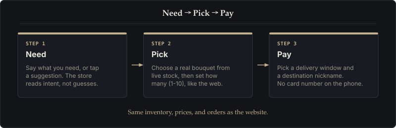
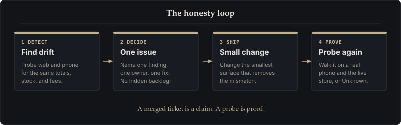

# Mobile Companion App

The Android companion is a **lightweight shopping app** for Lily's Florist. It does one job on a phone: help you find, customize, and order flowers quickly.

> **In Plain English:** You do not need a desktop workspace or a chatbot pretending to be the store. You say what you need, you pick a bouquet that is actually in stock, and you check out. The phone draws the screens. The store decides prices, stock, and orders.

The live shop is [https://aea.artof.link](https://aea.artof.link). This page is knowledge about the phone app — not a shop route. Knowledge lives here on [architecture.artof.link](https://architecture.artof.link). The shop host does not publish `/native` or `/framework` documentation pages.

Formal IDs below already exist in `docs/`. They are citations, not new requirements. If this page and the workbook disagree, [requirements.md](https://gitlab.com/artof-group/adaptive-experience-architecture/-/blob/main/docs/02-business-analysis/requirements.md) and the ADRs win.

[How it works](#how-it-works-a-thin-client) · [Need → Pick → Pay](#need-pick-pay) · [Video](#see-it-in-action-30-second-video) · [Honesty loop](#the-honesty-loop) · [Verified ledger](#verified-ledger) · [Technical audit](#technical-audit) · [Privacy](#shopper-privacy-edge-wallet)

---

## How it works: a thin client

In architecture terms, a **thin client** shows screens and collects taps. It does not keep its own inventory, price list, or checkout rules.

The companion is a third presentation of the same store session ([ADR-017](https://gitlab.com/artof-group/adaptive-experience-architecture/-/blob/main/docs/06-adr/ADR-017-native-client-architecture.md), [ADR-018](https://gitlab.com/artof-group/adaptive-experience-architecture/-/blob/main/docs/06-adr/ADR-018-mobile-session-auth.md)). It talks to the same Backend-for-Frontend as the website. The phone never invents stock or totals.

- **The store decides (FR-007, FR-011, NFR-009, ADR-016):** If the cooler is empty, the app must not sell the bouquet.
- **Need → Pick → Pay:** Three steps, same journey as the mobile-web concierge spec. Not a second catalog.
- **Least data (NFR-017, ADR-013, ADR-016):** The app never sees a raw card number. Pay sends an opaque payment reference. Destination is a nickname (`home` / `work`), not a street-address form.




---

## Need → Pick → Pay

These steps cite existing IDs. They do not add workbook rows.

1. **Need (FR-001, FR-002):** Tap a suggestion (for example *Mom's Birthday, Same-Day*) **or type your own words**. Continue unlocks once the app has something useful — not only a parsed occasion keyword. Issues #401 and #402 (closed on `main` via !457 and !460) cover budget chips after free-text and an honest **No limit** label.
2. **Pick (FR-003, FR-007):** Browse arrangements the store actually has. Choose one. Set **how many** (1–10), same as the website customize step.
3. **Pay (FR-013, FR-014, FR-018, FR-019, ADR-013):** Choose a delivery window and a destination nickname, see an itemized total, then confirm. Payment on Path B is a deterministic simulation under ADR-016. Live Stripe is not claimed.

Staff fulfillment stays on the **shop** at `/florist` in a browser. That is not a second Play Store app. Contact Florist is the thin FR-006 overlay already documented in the requirements notes — FR-006 stays **Future** in the workbook.

---

## See it in action (30-second video)

A 30-second recording of the app on a physical Android phone against the live store.

Watch **Need → Pick → Pay**: **Mom's Birthday (Same-Day)**, budget chip, **Budget Mixed Bunch**, then **Confirm** through to **Order Confirmed**.


This clip is a UX walk (4 Sep 2026, App Dist / packageinstaller take). It is **not** the Google Play install honesty proof. Play-install facts are in the [verified ledger](#verified-ledger) and [technical audit](#technical-audit).

---

## The honesty loop

A website and a phone app drift if nobody checks them against each other. We use a four-step loop. A merged ticket is a claim. A probe is proof. Unprobed work stays **Unknown**.



1. **Detect:** Probe web and phone for the same totals, fees, and stock.
2. **Decide:** One difference becomes one tracked issue with one owner.
3. **Ship:** Fix the smallest surface that removes the mismatch.
4. **Prove:** Walk it on a physical phone and the live store before anyone says it works.

---

## Verified ledger

Plain-English status only. Device serials, `versionCode` dumps, and order IDs are in [Technical audit](#technical-audit). This table does not invent new prove dates.

| What we asked | Status | What that means |
|---|---|---|
| Installs from Google Play Internal | **Verified** (named later builds) | Play-signed, non-debug installs on the named Samsung A36 and ASUS ROG. A36 Play Internal v9 was **not** walked. |
| This page's 30s demo clip | **UX proof, not Play-install proof** | 4 Sep Need→Pick→Pay→Confirmed on ROG. Not a Play honesty take. |
| Florist sees web vs phone orders | **Verified (4 Sep 2026)** | Orders land on the florist dashboard with `client: companion-android`. |
| Choosable delivery window + Contact Florist | **Verified (4 Sep 2026)** | Morning / afternoon / evening. Contact Florist is the thin FR-006 overlay; workbook scope for FR-006 stays Future. |
| Order writes through to the shared store | **Verified (4 Sep 2026)** | Confirm writes the same order path the website uses (FR-013, NFR-009). |
| Phone stores an encrypted last-order receipt | **Write verified** | After Confirm, an Edge Wallet receipt is saved on-device (ADR-020). No street, no card number. |
| Need-screen **Reorder →** control | **Code on `main`** (!459 / #404) | Shown only when a device-held receipt exists. A saved receipt is not, by itself, a button. |
| Play Internal reorder tap when a receipt exists | **Verified on ROG (9 Sep 2026)** | Play Internal v8 on the named ROG showed the card and walked tap → Pick. |
| Play Internal empty-wallet Need | **Absent (5 Sep 2026)** on A36 and ROG | Fresh / empty wallet showed chips only. Empty-wallet **ABSENT** was **not** re-probed on 9 Sep (no `pm clear`). |
| Review wallet + Clear History | **Verified on ROG Play Internal v9 (9 Sep 2026)** | Privacy lists on-device receipts; Clear History wipes them. A36 v9 was **not** walked. #410 / !487 shipped the code; this row is the Play-honest prove, not a reopen. |
| Budget chips after free-text / No limit | **Device prove (A36 Play v8, 5 Sep 2026 — not ROG)** | #401 and #402 closed on `main`. Not an ROG claim. |
| Demo operator inbox is the billing system | **No** | Fulfillment visibility, not a commercial ledger. |
| Web vs app traffic series | **Verified in code** | Telemetry labels the two clients separately. Live dashboard health is not restated here. |

---

## Technical audit

For developers and reviewers who need the exact dumps. These are the same facts as the ledger above — not new proves.

### 1. Google Play release verification (#390)

Sideloaded early builds carried debug flags. Later Internal builds went through Google Play Internal. Play-honest v8 dumpsys on 5 Sep 2026 matches on **both** named handsets (A36 `SM_A366B` / `RZCY60W1EZW`, and ROG `ASUS_I001DC` / `K9AIKN07B088C89`):

```text
versionCode=8 versionName=0.1.0-alpha.8
installerPackageName=com.android.vending
non-DEBUGGABLE
# prior Play-honest proves: ROG/A36 on versionCode 4–5; Play Internal upload also reached versionCode 7
```

Both v8 installs are signed and distributed by Google Play (`com.android.vending`) with no debug flag. On 9 Sep 2026 ~21:40 Europe/Berlin the named ROG additionally had Play Internal `versionCode` **9** / `0.1.0-alpha.9` (`com.android.vending`, non-DEBUGGABLE) — that is the #410 wallet review / Clear History prove, not an A36 v9 claim. Companion source on `main` remains `versionCode` **9** / `0.1.0-alpha.9` (#410 / !487). This session did not inspect the sponsor evidence directories (`C:\Users\claud\Temp\aea-v8\evidence\`, `C:\Users\claud\Temp\aea-rog-404\`, `C:\Users\claud\Temp\aea-rog-reorder-2026-09-09\`, `C:\Users\claud\Temp\aea-rog-wallet-410-2026-09-09\`).

### 2. Live order verification (#375, #384)

On 4 September 2026, live test purchases completed from the mobile app on the ASUS ROG. Latest demo recording:

- **Order ID:** `f3583908-b2ca-4b5e-a4e8-aa0c6c040177`
- **Item:** Budget Mixed Bunch + delivery (**$47,00** total)
- **Status:** SUBMITTED (Preparing in atelier) · ETA afternoon → home
- **Result:** Companion showed **Order Confirmed!**; same write-through path as prior florist probes (`client: companion-android`).

### 3. Reorder + wallet review dumps (already published)

- **9 Sep 2026 ~00:10 Europe/Berlin, Play Internal v8, named ROG:** Need opened with a wallet receipt already present. Reorder CTA **PRESENT**: "Reorder previous bouquet", "1-tap repeat order from this phone's encrypted wallet", button "Reorder →". Force-stop cold relaunch: still **PRESENT**. Tap Reorder → Pick with Classic Rose Dozen recommended; Continue to Checkout enabled.
- **5 Sep 2026, Play Internal v8, A36 and ROG:** fresh / empty-wallet Need showed **no** Reorder CTA (chips only).
- **9 Sep 2026 ~21:40 Europe/Berlin, Play Internal v9, named ROG:** Privacy **PRESENT**, listed **2** receipts. Confirm **Clear History** → empty state **"No receipts on this phone"**. Need Reorder CTA **PRESENT** before clear and **ABSENT** after clear. JVM unit tests cover list + clear. Instrumentation (`EdgeWalletInstrumentationTest`) needs a device/emulator and is **not** a Play Internal prove.
- The #404 vault note records a sideloaded ROG walk — UX/code proof, not Play-install honesty.

---

## Shopper privacy & Edge Wallet

When you place an order, recipient labels and card-message drafts do not enter a centralized CRM of names. They stay in the phone's **Edge Wallet** (Android Keystore; [ADR-020](https://gitlab.com/artof-group/adaptive-experience-architecture/-/blob/main/docs/06-adr/ADR-020-privacy-preserving-crm-and-edge-wallet.md), [ADR-018](https://gitlab.com/artof-group/adaptive-experience-architecture/-/blob/main/docs/06-adr/ADR-018-mobile-session-auth.md)):

1. **Least data (NFR-017):** The atelier receives the bouquet SKU, delivery window, and card text to print. Not a permanent address book.
2. **1-tap reorder hint (FR-008):** FR-008 stays **Future** in the workbook. The thin path already documented on `main` is: when a **local encrypted receipt** exists and Need is still fresh, a private card may appear (*"Reorder for {recipient}"* or *"Reorder previous bouquet"*). Tapping **`Reorder →`** revalidates current cooler stock and opens Pick with that arrangement selected. The card is **not** shown on an empty wallet. Play facts stay in the ledger above (9 Sep receipt-present tap on ROG; 5 Sep empty-wallet absent on both phones; empty-wallet not re-probed on 9 Sep).
3. **Review + right to be forgotten (#410):** App-bar **Privacy** lists device-held receipts (recipient label, arrangement nickname, order ref, relative date — no street, no card PAN). **Clear History** wipes the on-device wallet. Physical delivery addresses at the shop are still shredded after 14 days (ADR-020). A36 Play Internal v9 was not walked.

The published privacy story on this site is [Privacy-Preserving CRM](crm.html). The longer operator/wallet guides live in the repository; they are not Pages routes.

---

## Related framework topics

- [Path B Case Study](path-b.html) — Browser journeys and the florist staff console (not a second app).
- [Privacy-Preserving CRM](crm.html) — Zero-PII layers and the on-phone wallet.
- [Journal](journal.html) — Why a saved receipt is not the same as a reorder button.
- [System Architecture & Stack](stack.html) — How cloud servers and clients connect.
- [Architecture Glossary](glossary.html) — Plain-English terms.
- [Framework Home](index.html) — Return to the overview.
