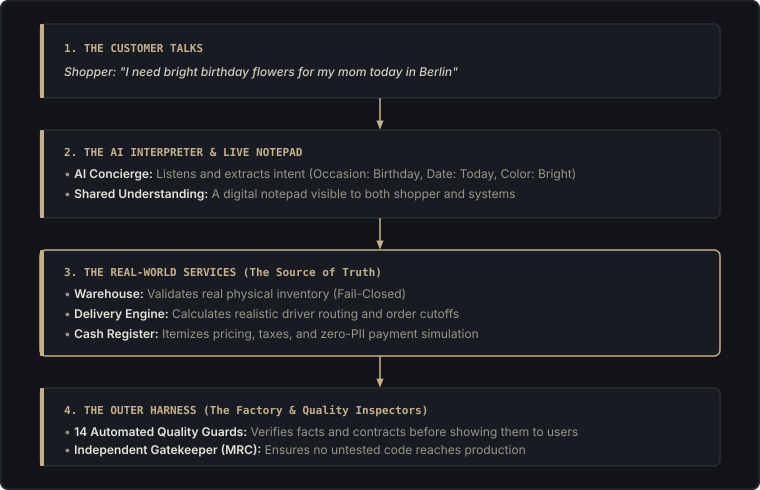
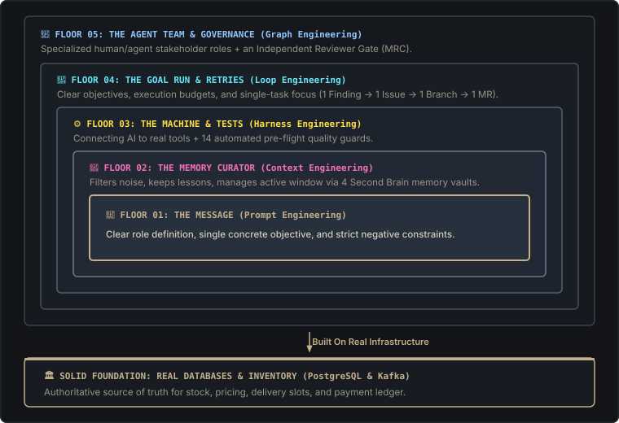

# Comparison & Visual Guide

This page is the public comparative guide to Adaptive Experience Architecture: mapping the six-layer outer harness, the 5 concentric building floors, and engineered memory alongside modern software engineering practices.

> **Why Most AI Prototypes Never Make It to Production:** A chatbot that talks charmingly in a demo is not a finished business. When real customers order flowers, the system must check physical cooler inventory, calculate delivery routes, itemize taxes, and process payments without leaking data. AI language models are probabilistic word predictors—they cannot manage a real warehouse. **The Outer Harness** is the software factory built around the AI to guarantee real-world honesty and safety.

[What this is](#what-this-is) · [Why prototypes fail](#why-most-ai-prototypes-never-make-it-to-production) · [Everyday formula](#1-the-core-formula-in-everyday-terms) · [Three eras](#2-the-three-eras-of-building-with-ai-2023-2026) · [5 floors](#3-the-5-concentric-floors-why-ai-apps-break) · [Second brain](#4-how-the-second-brain-solves-ai-amnesia) · [Team roles](#5-team-organization-14-hats-mapped-to-6-functions) · [Six layers](#6-the-six-layers-of-the-outer-harness-in-practice) · [Honest ledger](#honest-status-ledger) · [Sources](#sources)

---

## What this is

An independent architecture analysis by Art of Group. It maps AEA onto six harness layers (guides, sensors, loop, memory, permissions, observability) and five concentric floors used in contemporary engineering literature. The AEA formula remains: **Shared Understanding + Domain Services + Outer Harness**. The flower shop at [aea.artof.link](https://aea.artof.link) serves as our live reference case study.

---

## What this is not

- Not an official paper from Google, OpenAI, Anthropic, or HashiCorp.
- Not affiliated with or endorsed by those organizations.
- Not an artificial benchmark leaderboard. Third-party benchmarks (GAIA swings, Terminal Bench ranks, million generated lines) belong to cited external papers and were not measured on Lily's Florist.
- Not proof that dual-viewport presentation is finished. A fresh journey clip after the recent CSS updates remains **Unknown**.

---

## 1. The Core Formula in Everyday Terms

**Adaptive Experience = Shared Understanding + Domain Services + Outer Harness**

### The Three Golden Rules:
- **AI Interprets, Domain Services Decide:** The AI suggests flowers, but only the database confirms they are in stock.
- **Fail-Closed Availability:** If the inventory server is unreachable, the purchase button turns off. It is far better to say "Checking stock..." than to sell bouquets you cannot deliver.
- **No Self-Approval:** The engineer or AI that writes code is never the one who signs off on pushing it to customers.

---

## 2. The Three Eras of Building with AI (2023 → 2026)

| Era | Core Focus | What It Optimized | The Fatal Flaw |
|---|---|---|---|
| **Era 1: Prompting (2023–24)** | Single Utterance | Magic prompt keywords, tone, phrasing | The AI forgets everything the second the chat window closes. |
| **Era 2: Context / RAG (2025)** | What the AI sees | Stuffing large PDF manuals and search results | Information overload; the AI knows facts but lacks real actions. |
| **Era 3: Harness Eng. (2026)** | The Entire System | Automated test guards, databases, merge gates | None. The AI is bounded by real-world software engineering. |

---

## 3. The 5 Concentric Floors (Why AI Apps Break)

Think of an AI system like a 5-story building. **Each floor rests on the one below it.** If you skip the lower floors, the top floor collapses.

- **The Dependency Law:** If your multi-agent team keeps failing, don't blame the agents—check your memory filter. Bad input on Floor 2 ruins everything above it.
- **The Economic Law:** Swapping the AI model (like switching from Claude to GPT or Gemini) takes **1 afternoon**. Rebuilding your 5-floor operational harness takes **3 months**. The harness is your real intellectual property.

---

## 4. How the "Second Brain" Solves AI Amnesia

Without engineered memory, an AI starts every new conversation from scratch. Dumping hundreds of pages of past chat logs into the prompt makes the AI slow, expensive, and confused. AEA organizes memory into **4 clean vaults**:

- **📖 1. Procedure Memory (Skills):** Step-by-step playbooks for repeatable workflows (e.g., how to build an Android app or run tests).
- **🚫 2. Correction Memory (Constraints):** Hard rules learned from past mistakes (e.g., "Never invent fake requirement IDs").
- **🕸️ 3. Relationship Memory (Graph):** Links showing how features, requirements, customer occasions, and code connect.
- **📅 4. Daily Brief (Handoff):** A clean 1-page summary of exactly where the team left off today so work resumes instantly.

---

## 5. Team Organization: 14 Hats Mapped to 6 Functions

To prevent agents and developers from stepping on each other, AEA organizes 14 specialized roles into 6 clear functions:

| Function | Stakeholder Roles | Core Responsibility |
|---|---|---|
| **1. Discovery** | UX Designer, Customer Journey, Support Coordinator | Identify shopper friction, design mobile/web flows, and intake customer needs. |
| **2. Strategy** | Product Owner, Project Manager | Set business priorities, manage milestone delivery, and enforce scope gates. |
| **3. Safety** | Security Auditor, Cost Guardian, Performance Guardian, Coherence Guardian | Block prompt injection, enforce cloud spending caps, guarantee fast loading times. |
| **4. Builders** | Senior Software Engineer, AI Engineer, DevSecOps Platform | Build backend services, native Android apps, cloud infrastructure, and AI models. |
| **5. Gatekeeper** | Merge Request Coordinator (@aea-mrc) | **Independent Review:** Verifies all tests pass before code touches production. |
| **6. Knowledge** | Knowledge Guardian (@aea-kg) | Records every breakthrough and lesson into the Second Brain for future sessions. |

---

## 6. The Six Layers of the Outer Harness in Practice

1. **Guides (The Rulebook):** Clear instructions, role limits, and playbooks loaded before starting any task.
2. **Sensors (The Smoke Alarms):** Automated tests and fail-closed checks that detect errors before customers see them.
3. **The Loop (The Factory Line):** Disciplined workflow: One issue → one branch → one merge request.
4. **Memory (The Vault):** Preserves lessons and daily handoffs so past mistakes are never repeated.
5. **Permissions (The Keycard):** Strict controls over who can touch sensitive customer data, budgets, or servers.
6. **Observability (The Dashboard):** Real-time Grafana telemetry proving the entire system is healthy with hard facts.

---

## Honest Status Ledger

To avoid confusing architecture mental models with live production software, every concept on this site is explicitly flagged:

| Item / Concept | Status Flag | Operational Reality |
|---|---|---|
| **Domain Services & Backend** | **Live / Production** | PostgreSQL, Kafka, Nginx, and Edge BFF running on AWS ECS Fargate (`aea.artof.link`). |
| **Fail-Closed Availability** | **Live / Verified** | Select button automatically disables when inventory or delivery probes are stale or missing. |
| **14 Pre-Flight Quality Guards** | **Live / Verified** | Automated Python guards blocking secret leaks, skill drift, and broken traceability in CI. |
| **14 Stakeholder Hats & MRC Gate** | **Live / Operational** | Role separation and independent MR coordinator gate enforced before merging code. |
| **Second Brain Memory Vaults** | **Live / Operational** | 4-vault curated Obsidian structure (Skills, Constraints, Graph, Daily Briefs) in Git. |
| **5 Concentric Wrapping Floors** | **Taxonomy Map Only** | Conceptual framing (Kocer) adapted to explain how AEA layers nest; not a separate library. |
| **rvaniaaaa 6-Role Second Brain** | **Taxonomy Map Only** | Pattern evaluated for pre-irreversible gates; 6 generic role collapse is rejected. |
| **CF-054 Dual-Viewport Live Re-record** | **Unknown / Regressed** | CSS merged to repo, but dual-viewport side-by-side video clip re-recording remains unprobed. |
| **Live Stripe Card Gateway** | **Simulated Extension** | Runs deterministic payment simulation engine under ADR-016; live Stripe is not active. |
| **Third-Party Benchmark Scores** | **Not AEA Evidence** | GAIA, Terminal Bench, and 1M-line metrics belong strictly to cited papers [2], [6], [7]. |

## Sources

Related work (cited, not inherited as AEA evidence):

1. Mitchell Hashimoto, “My AI Adoption Journey,” mitchellh.com, 5 Feb 2026. Agent mistakes get a ratchet so they do not recur.
2. Ryan Lopopolo, “Harness Engineering: Leveraging Codex in an Agent-First World,” OpenAI, 11 Feb 2026. Coding-agent field report. The million-line figure is not an AEA result.
3. Birgitta Böckeler, “Harness Engineering for Coding Agent Users,” martinfowler.com, Apr 2026. Guides and sensors vocabulary.
4. Vinay Trivedy, “The Anatomy of an Agent Harness,” LangChain Blog, 10 Mar 2026.
5. Adnan Masood, “Agentic Harness Engineering,” Google Cloud / Medium, Jun 2026. GAIA deltas are not AEA results. Not an official Google research paper.
6. LangChain Engineering, “Improving Deep Agents with Harness Engineering,” 17 Feb 2026. Terminal Bench ranks are not AEA results.
7. Lauren Tan, “How Cursor Turned AI Agents Into Better Engineers,” Aug 2026.
8. Anthropic, “Building Effective AI Agents,” anthropic.com, Dec 2024.
9. Independent compilation, “Production Agent Engineering Practice 2026” (`harness_final.pdf`). Independently compiled. Not affiliated with Google, OpenAI, or Anthropic. Used as a **document-design template** only, not as an official source of AEA evidence.
10. 0xWast3 (wast3), “Memory Engineering for Kimi,” Aug 2026. Context window is a workspace, not memory; splits procedure, correction, and relationship memory.
11. Kocer (@kocer_eth), “Five Layers of Agent Engineering: Each One Wraps the One Below It,” Aug 2026. Resolves harness vs loop vs graph as five concentric floors (prompt, context, harness, loop, graph).
12. rvaniaaa (@rvaniaaaa), “The Second Brain That Acts. The Agent Team That Remembers,” Aug 2026. Six non-overlapping roles around a compiled second brain; guardian blocks irreversible acts before executor.

Primary AEA sources (probed on GitLab `main`, not chat):

- GitLab project [artof-group/adaptive-experience-architecture](https://gitlab.com/artof-group/adaptive-experience-architecture)
- Live Path B shop [aea.artof.link](https://aea.artof.link)
- This public site, allowlisted from `docs/framework/`

## Where they agree

- A fluent demo is not a production system.
- Prompt patches do not survive the next session. Environment changes do.
- Computational sensors beat asking a model whether it “feels” done.
- When the same failure repeats, fix the strongest layer (a sensor or a gate), not another paragraph.

## Where they differ

- The product. Related work is mostly coding agents. AEA is a customer-facing florist experience. Domain services stay authoritative for stock, price, delivery, and payment.
- The evidence. This page does not copy third-party bench deltas as if Path B had run them.
- The merge gate. AEA treats merge as an independent job. The hat that produced the change is not the judge of “verified.”
- Honesty as a sensor. Closing a ticket, merging CSS, or publishing Pages is not a journey clip.

## What AEA claims here

Only what has a probe, or Unknown:

- The formula and six layers are the public map.
- Path B exists as a live shop. Dual-viewport is the **intended** presentation.
- Daily-brief honesty (unprobed status words; same incident as [Claim vs probe](journal.html#claim-vs-probe) in the journal) was a real finding and was corrected in GitLab.
- Dual-viewport CSS merged. A journey on phone and desktop **after** that CSS is still **Unknown**. Do not round that up to verified.

## What AEA does not claim here

- Live Stripe, a finished dual-viewport, a 14/14 skill score, GAIA, Terminal Bench, or a million generated lines.
- Endorsement by any organization named in related work.

Back to the [framework](index.html), the [schema](schema.html), the [glossary](glossary.html), the [Path B case study](path-b.html), or the [journal](journal.html).
