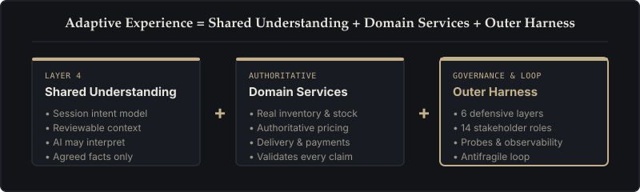
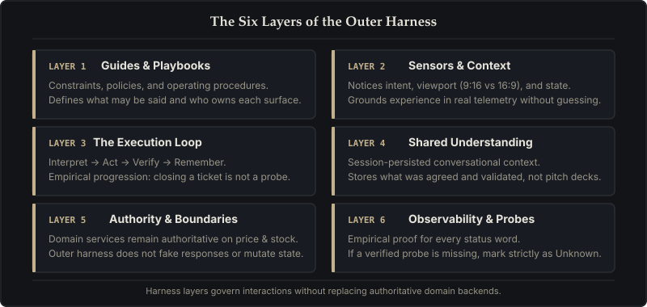

# Adaptive Experience Architecture

**Adaptive Experience = Shared Understanding + Domain Services + Outer Harness.**

This site is the public surface for that architecture. It is not a shop, not a content management system, and not a pitch deck.

- **Shared Understanding** is the session's current, reviewable model of customer intent.
- **Domain Services** are authoritative: they validate inventory, price, delivery slots, and payment.
- **The Outer Harness** keeps both honest in production — through guides, sensors, the loop, memory, permissions, and observability.

AI may interpret. Domain services decide. Status words are claims; they need a probe.

## The Outer Harness

The outer harness wraps around domain services and shared understanding across six layers:

1. **Guides** — constraints and playbooks that steer the experience.
2. **Sensors** — how the system perceives intent, viewport, and environment without guessing.
3. **Loop** — interpret, act, verify, remember. Closing a task is not the same as a probe.
4. **Memory** — shared understanding that persists across a session.
5. **Permissions** — who may change what; domain services remain authoritative.
6. **Observability** — empirical evidence for every status word. If evidence is missing, write **Unknown**.

## Case study & references

The live florist at [aea.artof.link](https://aea.artof.link) is one case study, not the framework home. Dual-viewport is the intended presentation, not yet fully verified.

- Read the [journal](journal.html) for curated stories of challenge, solve, ship, and lesson.
- Explore the [schema](schema.html) for the full architectural map, layers, loop, and named journeys.
- See the [comparison](comparison.html) for sources and how this taxonomy relates to other agent architectures.
- Review the [Path B case study](path-b.html) for implementation details.
- See the [glossary](glossary.html) for terms used across this site (Path B, CF-NNN, ID freeze, and more).
