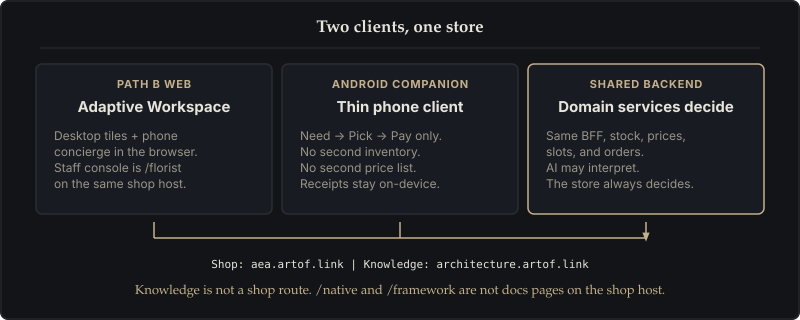

# Adaptive Experience Architecture

**Adaptive Experience = Shared Understanding + Domain Services + Outer Harness.**

> **In Plain English:** A chatbot should not guess prices or invent inventory. This architecture pairs conversational AI with real store systems (stock, prices, delivery, payment) and an outer harness of checks so orders stay reliable, private, and honest.

This site is the public **knowledge** surface. It is not a shop, not a CMS, and not a pitch deck.

- **The shop** is [aea.artof.link](https://aea.artof.link) — Lily's Florist, including `/florist` for staff in a browser.
- **The knowledge** is this site — [architecture.artof.link](https://architecture.artof.link).
- Routes such as `/native` or `/framework` on the shop host are **not** documentation pages. Read the companion and Path B notes here instead.

If this site and the repository docs disagree, `docs/02-business-analysis/requirements.md` and the ADRs win. This site does not invent requirement IDs.

- **Shared Understanding** is the session's current, reviewable model of what the customer wants (a live digital notepad).
- **Domain Services** are authoritative: they validate inventory, prices, delivery slots, and payments.
- **The Outer Harness** keeps both honest in production — guides, sensors, a loop, memory, permissions, and telemetry.

AI may interpret. Domain services decide. Status words are claims; they need a probe.

---

## The Six Outer Harness Layers

The outer harness wraps around domain services and shared understanding across six layers:

| Layer | Plain-English Job | What It Prevents |
|---|---|---|
| **1. Guides** | Clear instructions, role boundaries, and playbooks | Prevents out-of-scope actions before work begins |
| **2. Sensors** | Automated test checks and fail-closed availability | Catches errors before customers see them |
| **3. Loop** | Interpret → Act → Verify → Remember | Stops sprawling tasks: 1 finding → 1 issue → 1 review |
| **4. Memory** | Persistent session context across page reloads | Solves AI amnesia without stuffing raw chat history |
| **5. Permissions** | Strict controls over who can touch data, funds, or code | Prevents unauthorized merges and self-approval |
| **6. Observability** | Real-time telemetry and proof for every status claim | Eliminates guesswork; unprobed claims stay Unknown |

---

## Explore the Framework & Case Studies

The live flower shop at [aea.artof.link](https://aea.artof.link) is the reference case study. The pages below explain the architecture in plain English, with formal IDs where behavior is cited.

- Read the [Comparison & Visual Guide](comparison.html) for the 5-floor building model, 3 eras of AI development, and the honest status ledger.
- Explore the [Schema](schema.html) for the architectural blueprint, execution loop, and team roles.
- See the [Stack](stack.html) for high-level system architecture, cloud deployment, and the two-hostname split.
- Review the [Path B Case Study](path-b.html) for customer journey recordings and how the web workspace differs from the phone app.
- See the [Mobile Companion App](companion.html) for the thin Android client, Need → Pick → Pay, and the verified ledger.
- Learn about [Privacy-Preserving CRM](crm.html) for zero-PII customer intelligence, edge wallets, and 14-day address shredding.
- Read the [Journal](journal.html) for curated stories of challenges, solutions, and lessons.
- Check the [Glossary](glossary.html) for plain-English definitions of terms used across this site.
