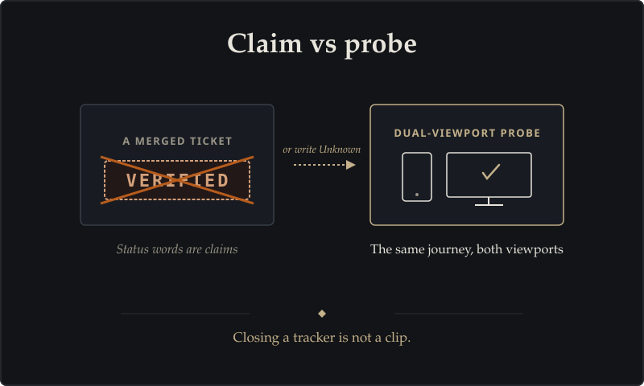
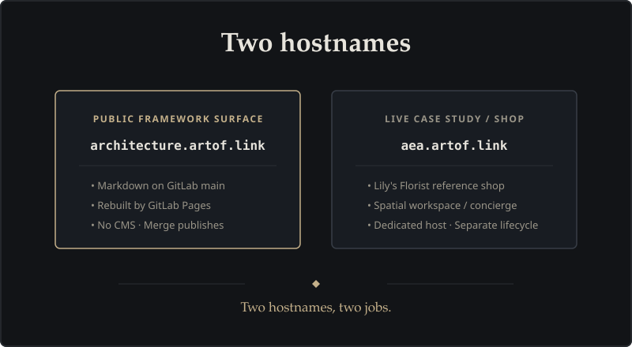
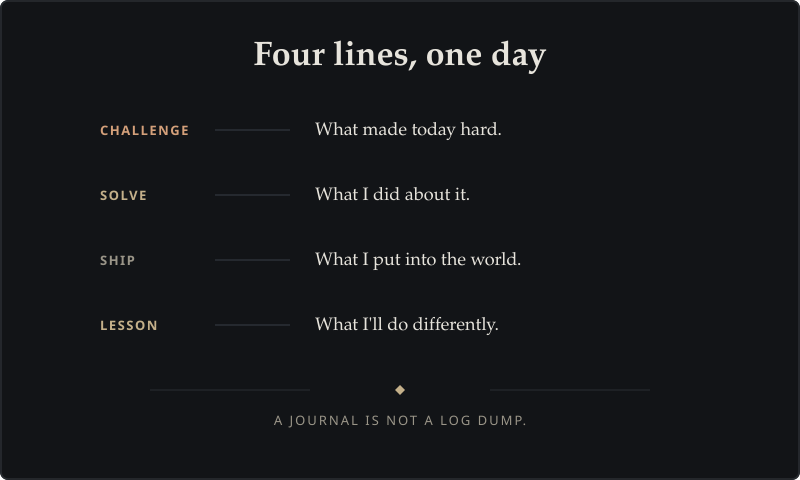

# Journal

A short public history of Adaptive Experience Architecture: what was hard, what we solved, what shipped, and what we learned. Not a ticket dump. Not a daily log.

## Claim vs probe

**Challenge.** Status words started standing in for evidence. "Verified" and "shipped" felt finished because a ticket closed.

**Solve.** A status word is a claim. In the same session, point at a probe, or write Unknown.

**Ship.** The live florist taught that a merged change is not a clip.

**Lesson.** Closing a tracker is not a clip. Probe the same journey on both a phone and a desktop, or leave it Unknown.

## Two hostnames

**Challenge.** One product looked like one website. It is not.

**Solve.** The framework lives at architecture.artof.link. The florist shop stays at aea.artof.link. Merge publishes the first. The shop has its own host.

**Ship.** The framework site is markdown on GitLab main, rebuilt by Pages. No CMS. DNS can be live while the public page is still private, and a verified domain is not yet a certificate.

**Lesson.** Merge is not "the site is up." Two hostnames, two jobs.

## Four lines, one day

**Challenge.** The first story about the florist was wrong. Failures stacked. Green boards hid that.

**Solve.** Name the journeys. Treat a clip as evidence, not theater. When the first hypothesis dies, write that down instead of restyling the shop.

**Ship.** Four named journeys on the live shop, on two viewports. Dual-viewport is the intended presentation. After the CSS landed, a fresh clip is still Unknown, so the case study stays honest: not verified.

**Lesson.** Written must match implemented. The first line can be wrong. The work is to notice, not to decorate.

## How this journal stays honest

- Curated episodes only. No daily dump.
- Pictures that explain a lesson. No screenshot gallery of the shop.
- If a later check is missing, the page says so. It does not borrow a status from chat.

Back to the [framework](index.html), the [schema](schema.html), the [comparison](comparison.html), or the [Path B case study](path-b.html).
