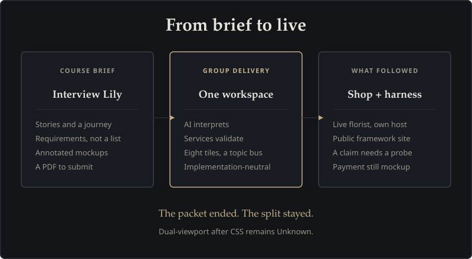

# Architecture Journal & Lessons Learned

A short history of Adaptive Experience Architecture: what was difficult, how we solved it, what shipped to production, and the lessons we learned along the way. Not an issue dump. Not a daily changelog.

> **In Plain English:** Great software architecture isn't just about writing code; it's about confronting flawed assumptions, learning from mistakes, and building automated safeguards so failures never recur. This journal documents the key turning points in developing AEA.

---

## Why This Project Started

- **The Challenge:** A florist needed a modern website that could accept customer orders around the clock, keep cooler inventory 100% accurate, and provide conversational guidance. The most common mistake in AI projects is treating this as a request for a generic chatbot widget.
- **The Solution:** Developed during a Quantic Executive AI Engineering project (Meghna Desai, Hiren Vadalia, Claude Tsarafidy). Instead of an unconstrained chatbot, we created the **Adaptive Workspace**: the conversation stays docked on the left, conversational AI interprets intent into a shared digital notepad, and authoritative backend services validate inventory, pricing, delivery slots, and orders on the right.
- **What Shipped:** What began as wireframes and course slides evolved into a production-deployed architecture across two separate hostnames, backed by an automated pre-flight harness.
- **The Lesson Learned:** A customer's initial wishlist is an interview, not a technical specification. The AI should interpret what the customer wants, but deterministic domain databases must always control inventory, pricing, and orders.

---

## Claim vs probe

*(Referred to as **Daily-brief honesty** on the [comparison](comparison.html#what-aea-claims-here) page).*

- **The Challenge:** Words like "verified", "tested", and "complete" were being treated as facts simply because a developer closed an issue tracker ticket or merged a pull request.
- **The Solution:** We instituted the **Honesty Gate**: any status word is treated merely as an unverified claim until supported by automated test logs or a hardware recording. If a test has not been executed, the status remains explicitly labeled **Unknown**.
- **What Shipped:** Automated pre-flight guards (14 independent check scripts) that block code merges if documentation, schemas, or tests drift.
- **The Lesson Learned:** Closing a ticket in Git is not proof that the software works. Probe the feature on physical devices and live servers, or honestly leave it labeled Unknown.

---

## Two Hostnames, Two Jobs

- **The Challenge:** Early on, having the architecture documentation and the reference shop on overlapping domains created operational confusion.
- **The Solution:** Complete separation:
  - **[architecture.artof.link](https://architecture.artof.link):** Pure static documentation, zero CMS, deployed via GitLab Pages.
  - **[aea.artof.link](https://aea.artof.link):** The live flower shop, running on containerized cloud infrastructure.
- **What Shipped:** Two independent cloud pipelines. If the store experiences high customer traffic, the architecture site is unaffected.
- **The Lesson Learned:** Never mix your public case study documentation with your live operational application. Two hostnames, two jobs.

---

## Four Lines, One Day

- **The Challenge:** The team's initial assumptions about how shoppers interact with an adaptive workspace were overly complex.
- **The Solution:** Grounded the entire evaluation in four concrete, relatable customer personas:
  1. *Urgent Sam* (needs flowers delivered today)
  2. *Planner Sarah* (schedules custom flowers and card messages in advance)
  3. *Loyal Alex* (expects cart and occasion preferences to survive browser refreshes)
  4. *Tracker Chris* (checks order delivery status and reaches florist support)
- **What Shipped:** Four reproducible 30-second recordings testing each persona against the live shop.
- **The Lesson Learned:** Real customer walkthroughs beat theoretical debates every time. When an assumption proves incorrect, document the reality immediately rather than cosmetically decorating the demo.

---

## A saved receipt is not a button

- **The Challenge:** Once the phone could store an encrypted last-order receipt, it was easy to write as if shoppers already had “reorder in one tap.” The save happens quietly on Confirm. For a stretch, Need had no reorder control even though `reorderFromWallet()` existed.
- **The Solution:** Say the two facts separately. The **wallet write** is probed on a physical phone. The **reorder tap** is only claimed once that button exists and is walked on the same class of device.
- **What Shipped:** Companion Need can continue from the shopper’s own words (not only occasion chips). Pick/Pay can set quantity 1–10 like the website. Need **code** on `main` shows a returning-customer **Reorder →** card when the on-phone wallet has a receipt (!459 / #404; sideload ROG walk in the #404 vault note). Play Internal v8 cold-start Need on ROG and A36 (5 Sep 2026) showed **no** CTA — Play tap stays Unknown (#407). Florist staff `/florist` gained day-window filters, load-more paging, faster first paint, and phone-sized tap targets. A native **staff** app is explicitly a future — the operator stays mobile web until four gates are evidenced.
- **The Lesson Learned:** “The code can reorder” is not the same as “the customer can tap Reorder.” Pages and vault notes must not collapse those sentences. After !459 the tap exists on `main`; that does not rewrite the earlier write-only evening. Two merge requests that both edit the staff `florist.js` file will collide; the merge coordinator does not rebase — a named engineer keeps both features, then merge resumes.

---

## How This Journal Stays Honest

- **Curated Milestones Only:** Focuses on substantive architectural decisions, not routine bug fixes.
- **Illustrative Evidence:** Every diagram illustrates a concrete design decision or lesson learned.
- **Transparent Status:** If a test or recording has not been captured, this site plainly states so. We never claim "done" on faith.

---

## Related Documentation

- [Framework Home](index.html) — Architecture formula and principles.
- [Architecture Blueprint](schema.html) — The 6 layers and execution loop.
- [Comparison & Visual Guide](comparison.html) — 5-floor building model and [What AEA claims here](comparison.html#what-aea-claims-here).
- [System Stack](stack.html) — How the cloud infrastructure connects.
- [Path B Case Study](path-b.html) — Customer journey recordings.
- [Architecture Glossary](glossary.html) — Plain-English definitions.

