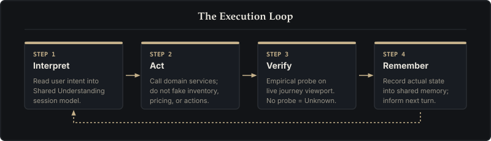

# Schema

This page is the public map of Adaptive Experience. Use it when talking about the framework. It is not the shop and not a trophy.

[Formula](#formula) · [Six layers](#six-layers) · [The loop](#the-loop) · [Hats & jobs](#fourteen-hats-three-jobs) · [Journeys](#journeys-path-b-case-study)

## Formula

**Adaptive Experience = Shared Understanding + Domain Services + Outer Harness.**

Shared Understanding is the session's current, reviewable model of intent. Domain services are authoritative: they validate stock, price, delivery, and payment. The outer harness keeps those two honest in production.

AI may interpret. Domain services decide. A status word is a claim; it needs a probe.

## Six layers

1. **Guides** — constraints and playbooks (what may be said, what must be checked, who owns a surface).
2. **Sensors** — how the system notices intent, viewport, and state without inventing it.
3. **Loop** — interpret, act, verify, remember.
4. **Memory** — Shared Understanding that persists for a session. Memory stores what was agreed.
5. **Permissions** — who may change what. Domain services stay authoritative.
6. **Observability** — evidence for every status word. If the probe is missing, write **Unknown**.

These are layers of the harness. They are not extra products.

## Loop

1. **Interpret** — read intent into Shared Understanding.
2. **Act** — call domain services; do not fake their answers.
3. **Verify** — a probe on the same journey and viewport, or a mechanical check. Closing a ticket is not a probe.
4. **Remember** — write what was actually shown, not what would look good.

## Roles

Fourteen hats are **roles**, not extra layers and not headcount:

project manager, product owner, UX designer, customer journey, support coordinator, AI engineer, appsec auditor, devsecops platform, senior software engineer, MR coordinator, coherence guardian, knowledge guardian, cost guardian, performance guardian.

Three executable jobs: implement, verify, merge. Only the MR coordinator merges.

## Honesty, knowledge, antifragility

`verified`, `shipped`, and `complete` are claims. Probe them or write Unknown. A merged spec or a CSS change is not verification. GitLab closing an issue is not the site being up and is not a journey clip.

**Knowledge First.** Committed repository history is shared memory. Ephemeral chat is not. Read the committed memory before starting new work.

**Antifragility.** The same miss twice is a missing sensor or gate, not a missing pep talk. This map does not claim Path B is antifragile. Dual-viewport is not yet fully verified.

See the [comparison](comparison.html) for sources and related work.

## Journeys (Path B case study)

Named scripts used to probe the florist instantiation at [aea.artof.link](https://aea.artof.link):

- **J1 Urgent Sam** — Same-day roses, rapid checkout flow. A dual-viewport probe requires verifying this script on mobile (9:16) and desktop (16:9). That verification remains **Unknown**.
- **J2 Planner Sarah** — Card customization (satin ribbon) with dual Update vs Continue action controls.
- **J3 Loyal Alex** — Session reload with state persistence and cart retention.
- **J4 Tracker Chris** — Order tracking and gated florist support.

## What this page is not

- Not the live shop, not internal working papers, and not a pitch deck.
- Not a request to restyle the florist reference implementation.

Back to the [framework](index.html), the [comparison](comparison.html), the [glossary](glossary.html), the [Path B case study](path-b.html), or the [journal](journal.html).
