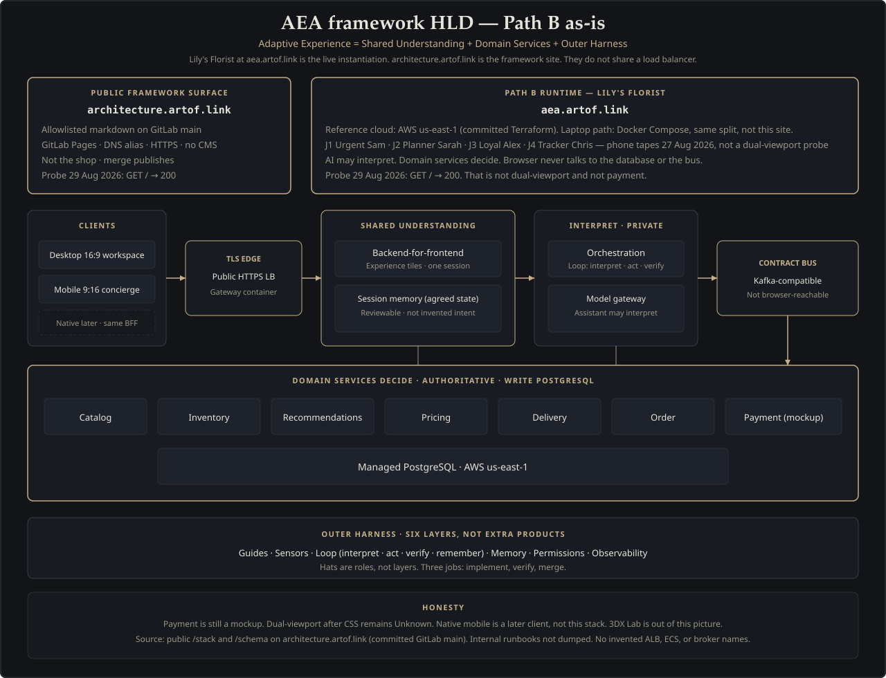
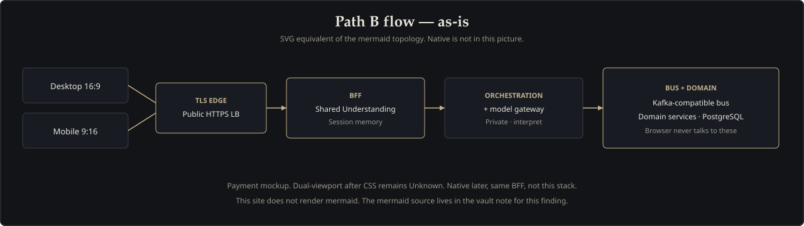
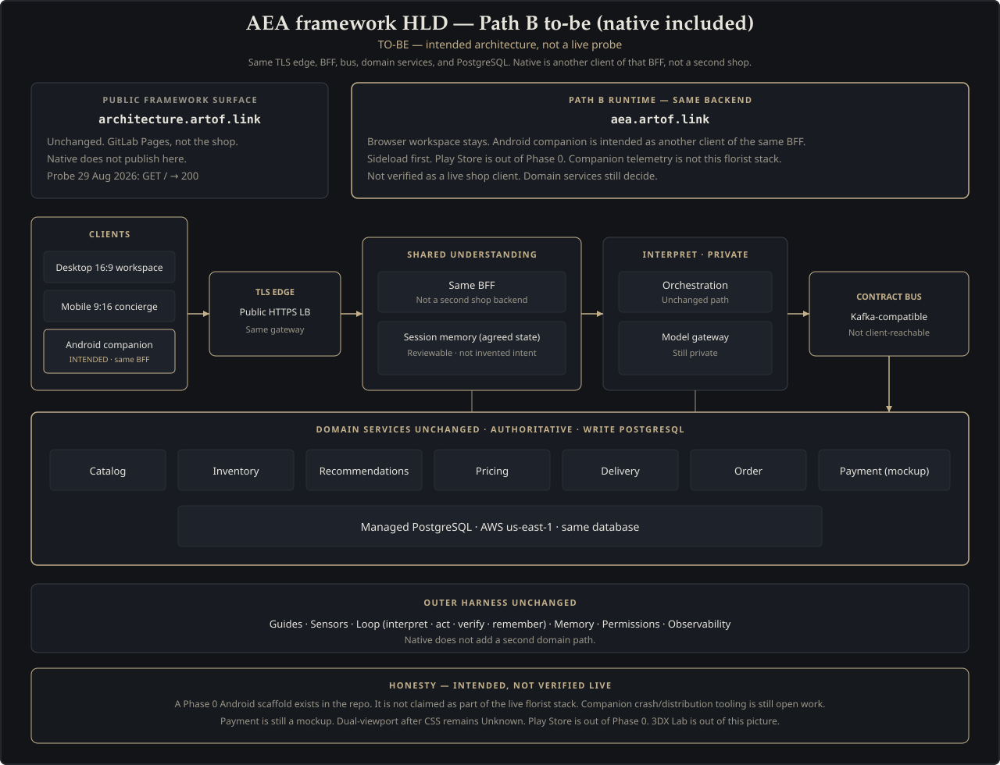

# Stack

This page is the high-level design **used so far**, plus how the native companion fits the same Path B edge. The formula and layers stay on the [schema](schema.html). A thin live-BFF companion page is published at [Companion](companion.html). Dual-viewport after CSS remains **Unknown**. Payment is still a mockup.

[Two hostnames](#two-hostnames) · [This site](#this-site) · [Florist runtime](#florist-runtime) · [As-is HLD](#as-is-hld) · [As-is flow](#as-is-flow) · [Native companion](#native-companion) · [Honesty](#honesty)

## Two hostnames

Two public hostnames, two jobs:

- [architecture.artof.link](https://architecture.artof.link) is this framework site.
- [aea.artof.link](https://aea.artof.link) is the live florist case study.

They do not share a load balancer. This site is not the shop.

## This site

Allowlisted markdown in the framework folder is built to static HTML and published as GitLab Pages. The hostname is a DNS alias to that Pages site, with HTTPS. There is no CMS.

Probed 29 August 2026: `GET https://architecture.artof.link/` returned 200.

## Florist runtime

The live shop at [aea.artof.link](https://aea.artof.link) is the Path B instantiation of the formula.

The browser workspace (experience tiles) goes through a TLS edge, then a backend-for-frontend, then orchestration and a contract-first message bus. Authoritative domain services (catalog, inventory, recommendations, pricing, delivery, order, payment) write to PostgreSQL. The assistant may interpret intent. Domain services still decide.

The reference cloud path is AWS (region `us-east-1` in the committed Terraform): public HTTPS load balancer, containers for gateway, BFF, and orchestration, managed PostgreSQL, and a Kafka-compatible bus. A model gateway sits on the private side of that path so the browser never talks to the database or the bus.

A laptop path exists too: Docker Compose with the same edge / BFF / platform split. That is for developers. It is not this website.

Probed 29 August 2026: `GET https://aea.artof.link/` returned 200. That is not a dual-viewport probe and not a payment probe.

## As-is HLD

Path B as used so far, through the florist lens. The diagram still shows native dashed as a historical as-is sketch. That dashed box is not a denial of the live thin client — see [Companion](companion.html) for App Tester / internal live-BFF Need → Pick → Pay on the same Edge and BFF as [aea.artof.link](https://aea.artof.link).

## As-is flow

Same path, left to right. This Pages builder does not render mermaid, so the publishable form is SVG. The mermaid source is in the vault note for this finding, not on this page.

## Native companion

The Android companion is another client of the **same** TLS edge and BFF as the web shop. Domain services, bus, and PostgreSQL stay. It is not a second shop backend.

**Live thin client (documented stance):** Need → Pick → Pay through the Edge BFF (cookie session + CSRF), same contracts as [aea.artof.link](https://aea.artof.link). Internal App Tester / Firebase App Distribution builds exercise that path. Details and honesty gates live on [Companion](companion.html).

**What this is not:** Play Store production, a full Adaptive Workspace port (tiles, SSE topic bus, dual-viewport), or a claim that companion Confirm write-through to the website/atelier is proven.

The SVG below is the fuller native-on-the-same-BFF vision. Label it honestly: useful architecture sketch; App Tester live-BFF exists; not Play production.

## Honesty

- Payment is still a mockup.
- Dual-viewport after CSS remains **Unknown** (no visual probe claimed on this page).
- Play ≠ App Dist: installs from Play (internal testing) are a separate gate from Firebase App Distribution or debug APK alone — see [Companion](companion.html).
- Dual-probe write-through (companion Confirm → website / atelier tracking) remains **Unknown** until a sponsor dual-probe.
- Operator sample surfaces are not live billing CRM orders.
- Grafana native vs web traffic still needs an explicit client channel label on requests — still open.
- This page does not dump internal runbooks, and it does not include 3DX Lab.

See the [Companion](companion.html) page for the thin live-BFF client, the [schema](schema.html) for the formula, the [Path B case study](path-b.html) for the florist journeys, or the [journal](journal.html) for how this was learned.
