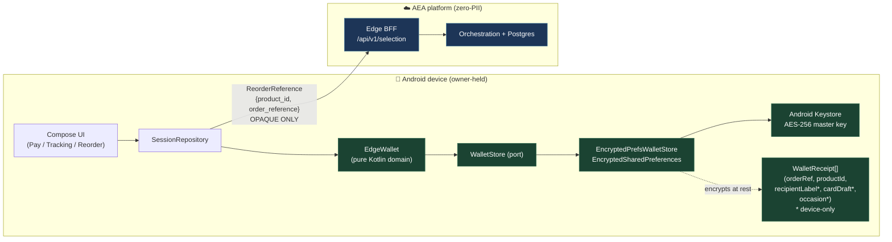
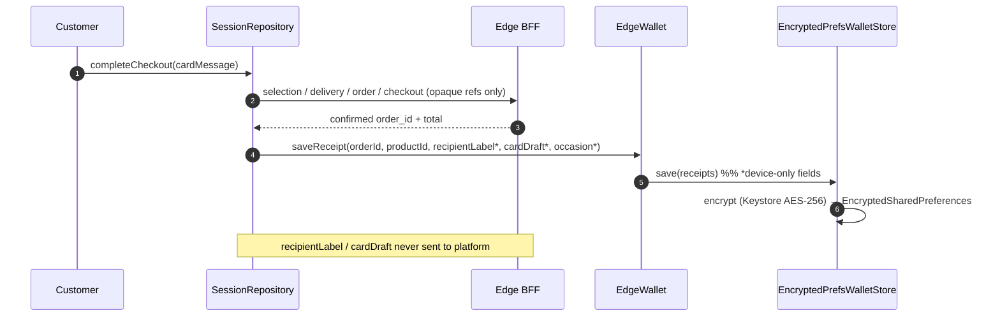
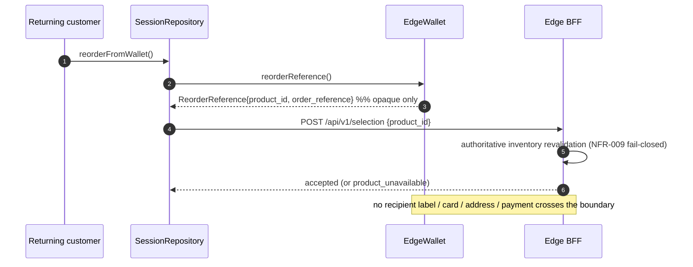

# ADR-020 Layer 2 — Edge Wallet implementation

> Companion to [`docs/06-adr/ADR-020-privacy-preserving-crm-and-edge-wallet.md`](../../docs/06-adr/ADR-020-privacy-preserving-crm-and-edge-wallet.md).
> Scope: the device-owned Edge Wallet in the Android companion
> (`clients/mobile/android`). Enables FR-008 one-tap reorder without a
> server-side PII CRM (ADR-013 / NFR-017).

## Zero-PII boundary (the key idea)

Device-only convenience data (recipient label such as "Mom", card message
draft, occasion month/day) is encrypted at rest on the device and **never**
leaves it. Only opaque references (`product_id`, `order_reference`) are ever
surfaced back to the platform for a reorder — enforced structurally by
`ReorderReference`, which cannot carry a label, card, address, or payment.

## Components

| Layer | Type | Android? | Responsibility |
|---|---|---|---|
| Domain | `EdgeWallet` | No (pure Kotlin) | Save/dedup receipts, pick latest, derive **opaque-only** `ReorderReference`, clear |
| Model | `WalletReceipt` / `ReorderReference` | No | Receipt carries device-only fields; `ReorderReference` is opaque-only by construction |
| Port | `WalletStore` | No | `load()` / `save()` persistence seam |
| Adapter | `InMemoryWalletStore` | No | Safe default (tests / non-Android construction) |
| Adapter | `EncryptedPrefsWalletStore` | Yes | `EncryptedSharedPreferences` + Keystore AES-256 at rest; JSON (de)serialization |
| Wiring | `SessionRepository` | No (Context injected at edge) | Writes a receipt on successful checkout; exposes reorder read/action |
| Entry | `MainActivity` | Yes | Injects `EdgeWallet(EncryptedPrefsWalletStore(applicationContext))` |

Keeping the domain Android-free is deliberate: the reorder / zero-PII logic is
unit-testable on the plain JVM, while only the thin encryption adapter needs
the Android runtime.

## Write path — record a receipt after checkout

## Read path — FR-008 one-tap reorder

## Test strategy

- Pure-domain JVM tests: receipt round-trip + dedup, latest ordering, and the
  **zero-PII invariant** that `ReorderReference` exposes only opaque ids.
- Repository test: a confirmed checkout writes exactly one wallet receipt and
  `reorderFromWallet()` re-selects the stored opaque `product_id`.
- Encryption adapter (`EncryptedPrefsWalletStore`) is Android-runtime bound and
  is covered by instrumented/`androidTest` scope, not JVM unit tests.
