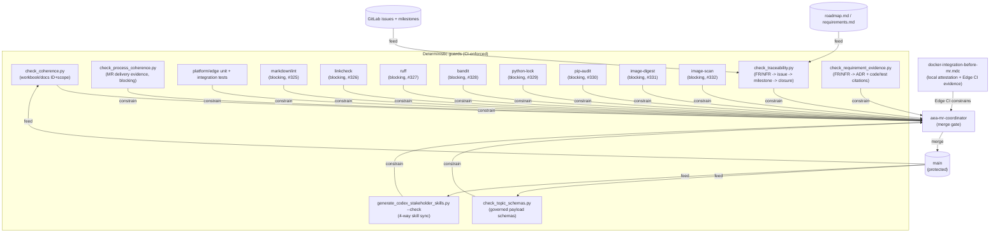
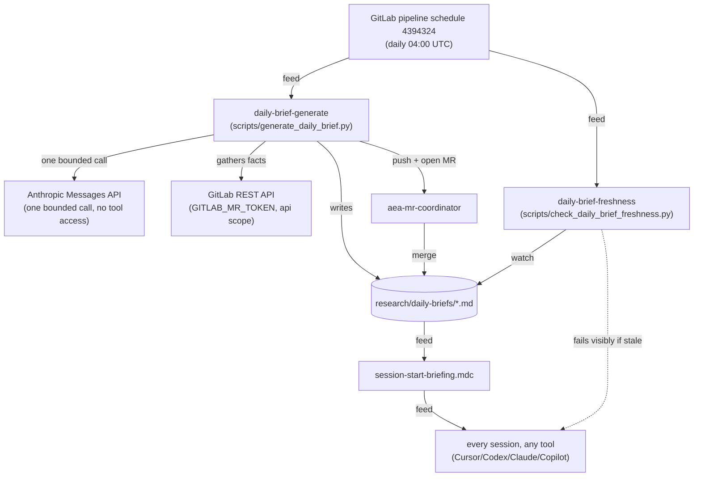
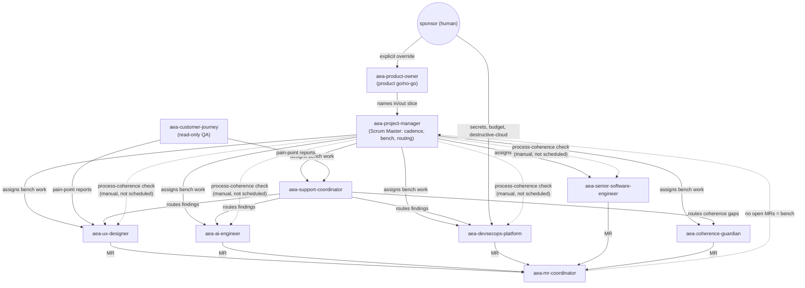

# Loop graph

tags: #aea #process #meta

## Why this exists

This repo runs many improvement/verification loops: guard scripts, a
coherence-findings intake/remediation cycle, ten stakeholder-role
workflows, CI jobs, a merge gate, a daily reporting cycle. Until now none
of that was drawn anywhere — each loop's existence and its relationships
to other loops lived implicitly, scattered across `.gitlab-ci.yml`,
`.cursor/skills/`, `.cursor/rules/`, and `research/`.

That scattering is not free. On 2026-08-18, building the daily-brief
reporting loop (`scripts/generate_daily_brief.py` +
`daily-brief-freshness`), four real failures surfaced one at a time, live,
because nothing had ever asked "does this loop's output actually reach
the loop that depends on it": missing `git`, missing `git-lfs`, a
disabled job-token push setting, and a REST endpoint job tokens don't
cover. Each was fixed only after hitting it. A graph doesn't prevent
every such gap, but a *missing edge* is visible by inspection once the
graph is drawn — the same principle as
[From Loop Engineering to Graph Engineering?](https://medium.com/intuitionmachine/from-loop-engineering-to-graph-engineering-d3ebeb08511c)
(Carlos E. Perez, Intuition Machine, Jul 2026): a single loop fails
silently in isolation; a graph of loops that watch, feed, constrain, and
correct one another is how a system stays grounded to reality instead of
fooling itself.

This document is that graph, made explicit. It is not itself a running
loop — see "Keeping this current" below for how it stays real.

## Legend

- **Node** = one loop: something that runs repeatedly (on a schedule, on
  every push, or on invocation) and checks or changes repo state.
- **Edge** = a relationship between two loops:
  - **feed** — one loop's output is the other's required input
  - **watch** — one loop checks whether another is doing its job
  - **constrain** — one loop must pass before another may proceed (a gate)
  - **correct** — one loop's job is specifically to fix drift another
    loop introduced or failed to prevent
- **Status** on an edge: `automated` (enforced by CI/script), `manual`
  (a human or an AI session has to remember to do it, nothing checks),
  or `missing` (no edge exists yet — a gap).

## Diagram 1 — Governance and CI guard loops

## Diagram 2 — Daily-brief reporting loop (closed 2026-08-18)

Unverified as of merge (2026-08-18): the Anthropic call and
`GITLAB_MR_TOKEN` auth are both gated behind protected-CI-variable
exposure, which only happens on `main` — every pre-merge test ran on an
unprotected branch and couldn't see either credential. First real
scheduled run is the actual validation; `daily-brief-freshness` is the
edge that watches for a silent failure.

## Diagram 3 — Stakeholder team loops

## Node catalog

| Node | Type | Trigger | Owner | Status |
|---|---|---|---|---|
| `check_coherence.py` | guard | CI, on `docs/`/`archive/` changes + every MR/main | script (no role) | automated |
| `check_topic_schemas.py` | guard | CI, on topic-contract/schema changes + every MR/main | script | automated |
| `generate_codex_stakeholder_skills.py --check` | guard | CI, on skill-file changes + every MR/main | script | automated |
| `check_daily_brief_freshness.py` | guard | CI, schedule only (04:00 UTC) | `aea-coherence-guardian` | automated |
| `generate_daily_brief.py` | producer | CI, schedule only (04:00 UTC) | `aea-coherence-guardian` | automated, **unverified end-to-end** |
| `platform-foundation-unit` / `edge-perimeter-unit` / `platform-foundation-integration` / `edge-docker-integration` | guard | CI, on relevant `platform/`/`edge/` changes | script | automated |
| `check_traceability.py` | guard | CI, on `requirements.md`/`roadmap.md`/self changes + every MR/main | `aea-senior-software-engineer` | automated, blocking (`traceability-guard`, #323) |
| `check_process_coherence.py` | guard | every MR/main + scheduled daily-brief evidence | `aea-project-manager` | automated, blocking (`process-coherence-guard`, #324); named `Process-Exception` values remain the only explicit exceptions; inaccessible MR change details become explicit findings instead of aborting the loop; semantic focus remains manual |
| `check_requirement_evidence.py` | guard | CI, on requirements/ADR/platform/edge/evidence changes + every MR/main | `aea-senior-software-engineer` | automated, blocking citation evidence (`traceability-guard`, #323) |
| `markdownlint` | guard | every MR/main (`markdownlint` job) | `aea-knowledge-guardian` / `aea-devsecops-platform` | automated, blocking (`markdownlint`, #325); pinned `markdownlint-cli2@0.23.2`; scoped to published architecture markdown; `scripts/check_markdownlint.py` proves a known-bad fixture fails |
| `linkcheck` | guard | every MR/main (`linkcheck` job) | `aea-knowledge-guardian` / `aea-devsecops-platform` | automated, blocking (`linkcheck`, #326); pinned `markdown-link-check@3.15.0`; scoped to published architecture markdown; `scripts/check_linkcheck.py` proves a known-bad fixture fails |
| `ruff` | guard | every MR/main (`ruff` job) | `aea-senior-software-engineer` / `aea-devsecops-platform` | automated, blocking (`ruff`, #327); pinned `ruff==0.16.5`; scoped to `scripts/`, `platform/`, and `edge/`; `scripts/check_ruff.py` proves a known-bad fixture fails |
| `bandit` / `check_sast.py` | guard | every MR/main (`bandit` job) | `aea-appsec-auditor` / `aea-senior-software-engineer` / `aea-devsecops-platform` | automated, blocking (`bandit`, #328); pinned `bandit==1.9.4`; scoped to `scripts/`, `platform/`, and `edge/`; High findings fail; `scripts/check_sast.py` proves a known-bad fixture fails and retains `bandit-report.json` |
| `python-lock` / `check_python_locks.py` | guard | every MR/main (`python-lock` job) | `aea-senior-software-engineer` / `aea-devsecops-platform` | automated, blocking (`python-lock`, #329); human-authored `platform/requirements.txt` and `edge/requirements.txt` retained; committed `requirements.lock` consumed by build/test installs; unchanged regeneration has no diff |
| `pip-audit` / `check_python_sca.py` | guard | every MR/main (`pip-audit` job) | `aea-appsec-auditor` / `aea-senior-software-engineer` / `aea-devsecops-platform` | automated, blocking (`pip-audit`, #330); pinned `pip-audit==2.10.1`; scans committed `platform/requirements.lock` and `edge/requirements.lock`; High/Critical fail unless an exception lists owner, reason, and expiry; `scripts/check_python_sca.py` proves a known-bad fixture fails and retains `pip-audit-report.json` |
| `image-digest` / `check_image_digests.py` | guard | every MR/main (`image-digest` job) | `aea-devsecops-platform` / `aea-senior-software-engineer` | automated, blocking (`image-digest`, #331); runtime/base and material CI/Compose images digest-pinned; resolutions in `image-digest-pins.csv` and the pin-cadence ledger; LiteLLM overlay exception expires; `scripts/check_image_digests.py` proves a known-bad floating tag fails and retains `image-digest-report.json` |
| `image-scan` / `check_image_scan.py` | guard | every MR/main (`image-scan` job) | `aea-devsecops-platform` / `aea-appsec-auditor` | automated, blocking (`image-scan`, #332); builds local commit-SHA tags for orchestration/BFF/gateway/agent-runner; pinned Trivy 0.74.0 with checksum; fixable High/Critical fail unless an exception lists owner, reason, and expiry; seeded PyYAML 5.3 fixture fails; retains `image-scan-report.json`, `trivy-*.json`, and CycloneDX `sbom-*.json`; `deploy-ecs` / `deploy-ecs-agent-runner` need this job |
| `docker-integration-before-mr.mdc` | guard | local attestation per MR; Edge runner repeated in CI | every specialist role / `aea-devsecops-platform` | **automated for edge** by `edge-docker-integration`; **partially automated for platform** (`platform-foundation-integration` runs equivalent Postgres+Kafka coverage via CI `services:`, not the literal script) |
| `research/coherence-findings-loop.md` | remediation cycle | on-demand / `aea-coherence-guardian` invocation | `aea-coherence-guardian` | manual trigger, disciplined procedure |
| `aea-project-manager` | role loop | on-demand / cadence (08:00/12:00/16:00/20:00, **no automated trigger**) | human or AI session acting as PM | manual trigger |
| `aea-product-owner` | role loop | on-demand | human or AI session | manual trigger |
| `aea-ux-designer` | role loop | on-demand / PM assignment | human or AI session | manual trigger |
| `aea-customer-journey` | role loop (read-only) | on-demand | human or AI session | manual trigger |
| `aea-support-coordinator` | role loop | on-demand / PM assignment | human or AI session | manual trigger |
| `aea-ai-engineer` | role loop | on-demand / PM assignment | human or AI session | manual trigger |
| `aea-devsecops-platform` | role loop | on-demand / PM assignment | human or AI session | manual trigger |
| `aea-senior-software-engineer` | role loop | on-demand / PM assignment | human or AI session | manual trigger |
| `aea-coherence-guardian` | role loop | on-demand + CI schedule (via `generate_daily_brief.py`) | human or AI session | **partially automated** |
| `aea-mr-coordinator` | gate loop | on-demand, invoked per MR or batch | human or AI session | manual trigger, but its gates are automated-checkable |
| `session-start-briefing.mdc` | feed SOP | every session start | every role | **manual, unverifiable mechanically** |
| `stakeholder-skills-sync-sop.mdc` | governance SOP | on any skill-role change | `aea-senior-software-engineer` / whoever edits | manual discipline, backed by automated `--check` |
| `coherence-findings-sop.mdc` | governance SOP | on any coherence finding | `aea-coherence-guardian` | manual discipline |
| `claude-obsidian-loop.mdc` | content lifecycle | on any capture/promotion | human (Obsidian) + AI (triage) | manual |
| `figma-shop-ui-sync.mdc` | sync SOP | on any `edge/gateway/ui/` change | `aea-ux-designer` | manual, not CI-enforced |
| `build-ecr` / `deploy-ecs` | deploy loop | CI, on `main` + `platform/`/`edge/`/`.gitlab-ci.yml` changes | `aea-devsecops-platform` | automated; `deploy-ecs` and `deploy-ecs-agent-runner` `needs` required `image-scan` (#332); `build-ecr` keeps stage order so the scan finishes before ECR push |
| `android-bundle-release` | mobile deliverable | CI manual on android/`.gitlab-ci.yml` changes when `ANDROID_UPLOAD_KEYSTORE` set | `aea-devsecops-platform` | manual trigger; signed `.aab` artifact only |
| `android-play-internal-upload` | Play internal/closed publish | CI manual; needs optional bundle artifact; `PLAY_API_SERVICE_ACCOUNT_JSON` | `aea-devsecops-platform` + sponsor SA | manual; skips/honest-fail without SA; never Production (#354) |
| `android-app-distribution` | Firebase UX distribute | CI manual when `FIREBASE_APP_DISTRIBUTION_CREDENTIALS` set | `aea-devsecops-platform` | manual; not Play |
| GitLab pipeline schedule `4394324` | trigger | cron, daily 04:00 UTC | `aea-coherence-guardian` | automated |

## Known gaps (edges that are weak or missing)

Ordered by leverage, not just severity — a cheap fix that removes a
recurring blind spot outranks an expensive fix for a rare one.

1. **Requirements→issue→milestone→closure and citation traceability —
   closed as a blocking CI gate by #323.** `scripts/check_traceability.py`
   (CI, `aea-senior-software-engineer`) continuously checks, for all 40
   canonical FR/NFR IDs: a canonical GitLab issue exists (no orphans), its
   milestone matches any `roadmap.md` claim including the Future row
   (thin-delivered dual-listed IDs such as FR-006 / NFR-014 align with
   GitLab `Future Backlog`), and a closed issue was actually closed by a
   merged MR. The v2 `requirement-evidence.json` inventory and
   `check_requirement_evidence.py` add explicit ADR, implementation, and test
   citation dispositions for all 40 IDs. They reject false paths and ADR
   declarations and expose `unclaimed` debt. They deliberately do not equate a
   source comment or test citation with proof that behavior is sufficient;
   substantive coverage remains a specialist/reviewer judgment.
   `traceability-guard` is required: no `allow_failure` and no `|| true`.
2. **PM-SM process coherence — closed as a blocking CI gate by #324.**
   `scripts/check_process_coherence.py` checks falsifiable MR evidence:
   one closing issue (or the allowlisted `Process-Exception: recurring-report`),
   branch discipline, a validation section, and integration/CI-only evidence when
   platform, edge, or infra paths change. `process-coherence-guard` is required:
   no `allow_failure` and no `|| true`. Semantic focus and whether evidence is
   substantively adequate remain PM-SM review responsibilities; unknown
   exception tokens still fail.
3. **Markdown lint — closed as a blocking CI gate by #325.**
   `markdownlint` is required: pinned `markdownlint-cli2@0.23.2`, scoped to
   published architecture markdown (`docs/`, `implementations/`, root agent
   files), with `scripts/check_markdownlint.py` proving a known-bad fixture
   fails. No failure suppression.
4. **Markdown link check — closed as a blocking CI gate by #326.**
   `linkcheck` is required: pinned `markdown-link-check@3.15.0`, scoped to
   published architecture markdown (`docs/`, `implementations/`, root agent
   files), with `scripts/check_linkcheck.py` proving a known-bad fixture
   fails. Narrow ignore patterns cover localhost Compose URLs, `file://`
   workstation paths, in-page heading fragments (same class as
   markdownlint MD051), Figma design URLs that 403 to CI, and this
   project's GitLab HTML (403 to the CI user-agent). Framework `.html`
   hrefs map to sibling `.md` files. First-party `aea.artof.link` stays
   checked. No `allow_failure` and no `|| true`. `research/`, `wiki/`,
   and `archive/` stay out of this gate.
5. **Python Ruff baseline — closed as a blocking CI gate by #327.**
   `ruff` is required: pinned `ruff==0.16.5`, scoped to `scripts/`,
   `platform/`, and `edge/` (same trees as `python-compile-gate`), with
   `scripts/check_ruff.py` proving a known-bad fixture fails. Lint select
   is the syntax / undefined-name class only (`E9`, `F63`, `F7`, `F82`).
   Line length stays 600 so this slice does not reflow existing long
   lines. Fixture path `scripts/fixtures/ruff` is the only extend-exclude.
   Format excludes `scripts/**`, `platform/**`, and `edge/**` (a mass
   unwrap/reflow is the leftover dirty `ruff --fix` class of change);
   `ruff check` still covers all three. Gate files
   (`scripts/check_ruff.py`, `scripts/test_ruff.py`, the clean fixture)
   are format-checked by path.
   No `allow_failure` and no `|| true`.
6. **Python SAST baseline — closed as a blocking CI gate by #328.**
   `bandit` is required: pinned `bandit==1.9.4`, scoped to `scripts/`,
   `platform/`, and `edge/` (same trees as `python-compile-gate` / `ruff`),
   with `scripts/check_sast.py` proving a known-bad fixture fails at High
   (`B602` `shell=True`). The required job fails on unaccepted High
   findings only. Medium/Low stay in the retained `bandit-report.json`
   artifact (`when: always`) and wait for a later slice. Fixture path
   `scripts/fixtures/sast` is the only exclude. No High test IDs are
   skipped. No `allow_failure` and no `|| true`. Separate from
   dependency locks (#329) and SCA (#330).
7. **Python dependency locks — closed as a blocking CI gate by #329.**
   `python-lock` is required: human-authored
   `platform/requirements.txt` and `edge/requirements.txt` stay as
   inputs; committed `platform/requirements.lock` and
   `edge/requirements.lock` pin the resolved graph. Unchanged
   regeneration (`scripts/compile_python_locks.py --check`) has no
   diff. Build/test installs consume the locks (`-c`). Fresh install
   of both trees runs on `python:3.12` (debian, not alpine) so
   `confluent-kafka` / `psycopg-binary` wheels resolve. No
   `allow_failure` and no `|| true`. Separate from dependency SCA
   (#330). Do not stack #330–#334 on this slice.
8. **Python dependency SCA — closed as a blocking CI gate by #330.**
   `pip-audit` is required: pinned `pip-audit==2.10.1`, scanning the
   committed `platform/requirements.lock` and `edge/requirements.lock`
   from #329. Unaccepted High/Critical findings fail. Unknown severity
   is fail-closed High. Exceptions in `python-sca-exceptions.json`
   require owner, reason, and expiry; unused or expired rows fail.
   `scripts/check_python_sca.py` proves a known-bad fixture
   (`pyyaml==5.3`) fails and retains `pip-audit-report.json`
   (`when: always`). No `allow_failure` and no `|| true`. Separate
   from image digest pinning, image SBOM/scan, and IaC scan.
   Do not stack #331–#334 on this slice.
9. **Image digest pins — closed as a blocking CI gate by #331.**
   `image-digest` is required: runtime/base Dockerfiles, material
   CI `image:` / `services:`, and default Compose images are
   `name:tag@sha256:…`. Resolutions live in
   `research/random-thoughts/image-digest-pins.csv` and the latest
   pin-cadence ledger row. Opt-in LiteLLM `main-latest` stays an
   expiring exception (`image-digest-exceptions.json`) until GHCR
   can be live-resolved. `scripts/check_image_digests.py` proves
   unpinned fixtures fail and retains `image-digest-report.json`
   (`when: always`). No `allow_failure` and no `|| true`. Separate
   from image SBOM/scan (#332) and IaC scan (#334).
   Do not stack #332–#334 on this slice.
10. **Image SBOM/scan — closed as a blocking CI gate by #332.**
   `image-scan` is required: it builds local commit-SHA tags for
   the four Path B deployable Dockerfiles, scans them with pinned
   Trivy `0.74.0` (release tarball checksum-verified), and retains
   CycloneDX SBOMs plus `image-scan-report.json` (`when: always`).
   Unaccepted fixable High/Critical findings fail. Exceptions in
   `image-scan-exceptions.json` require owner, reason, and expiry;
   unused or expired rows fail. `scripts/check_image_scan.py`
   proves a seeded PyYAML 5.3 image/report fails. `deploy-ecs`
   and `deploy-ecs-agent-runner` `needs` this job. No new AWS
   secret; existing OIDC stays on the deploy jobs. No
   `allow_failure` and no `|| true`. Separate from IaC scan
   (#334). Do not stack #334 on this slice.
11. **Edge Docker integration evidence — closed by #228.**
   `edge-docker-integration` invokes `edge/scripts/run_integration_tests.py`
   against the repository Compose stack in GitLab Docker-in-Docker. It checks
   gateway/BFF/orchestration health, the customer path, and the assistant SLO,
   then cleans up Compose resources. The local SOP remains required before an
   MR; CI now independently constrains Edge-impacting merges. Platform remains
   equivalent rather than literal runner coverage through
   `platform-foundation-integration` (real PostgreSQL and Kafka services).
12. **`session-start-briefing.mdc` compliance is unverifiable
   mechanically.** No loop watches whether a session actually read the
   brief before acting — this is inherent to the mechanism (you can't
   automatically prove a model read something), not a fixable gap so
   much as a known soft spot.
13. **Stakeholder cadence status guard — closed by #234.**
   `scripts/check_stakeholder_cadence.py` and `stakeholder-cadence-guard`
   CI job continuously monitor role activity windows, active issue owners,
   and daily brief freshness across all AEA stakeholder roles.
14. **Gemini and Grok adapters — closed by #232 and #237.**
   `scripts/generate_codex_stakeholder_skills.py` now enforces 6-way skill
   synchronization across Cursor, Codex, Claude, Copilot, Gemini, and Grok.
15. **A disabled Claude Code cloud routine
   (`aea-coherence-guardian-daily-brief`) is dead weight.** Superseded by
   `generate_daily_brief.py`'s CI-native approach after the routine's
   GitHub-only repo-source limitation made it unusable for this
   GitLab-hosted repo. Not cleaned up (routines can't be deleted by an
   agent session — only by the account owner at
   `claude.ai/code/routines`).
16. **`generate_daily_brief.py`'s Anthropic call and `GITLAB_MR_TOKEN`
   auth are unproven end to end** as of this document's writing — see
   Diagram 2.

## Keeping this current

This document is not itself a loop — nothing regenerates or `--check`s
it. That is a deliberate, known trade-off, not an oversight: unlike the
skill-sync graph (which has an unambiguous source of truth to diff
against — the canonical `.cursor/skills/` files), there is no single
source of truth this document could be mechanically generated from. It
would need the same discipline `research/daily-briefs/` needed and
initially didn't get: someone has to remember to update it.

- Whenever a new loop (guard, role, CI job, SOP) is added or removed,
  update the relevant diagram and both catalog tables in the same
  MR — same discipline as `stakeholder-skills-sync-sop.mdc`'s "add or
  remove in all representations."
- `aea-coherence-guardian` should treat a diff between this document and
  actual `.gitlab-ci.yml` / `.cursor/skills/` / `.cursor/rules/` contents
  as a coherence finding during intake, the same as any other doc/code
  drift.
- Revisit the "Known gaps" section whenever one closes — move it to the
  relevant diagram/table instead of just deleting the line, so the
  historical record of what used to be a gap survives (matching how
  `research/coherence-findings-loop.md` keeps `verified` rows instead of
  removing them).
