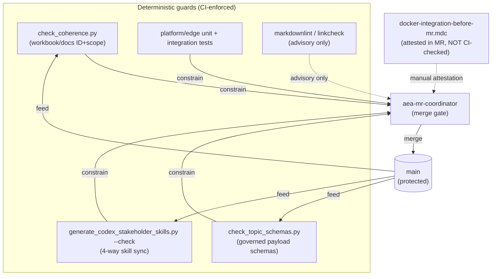
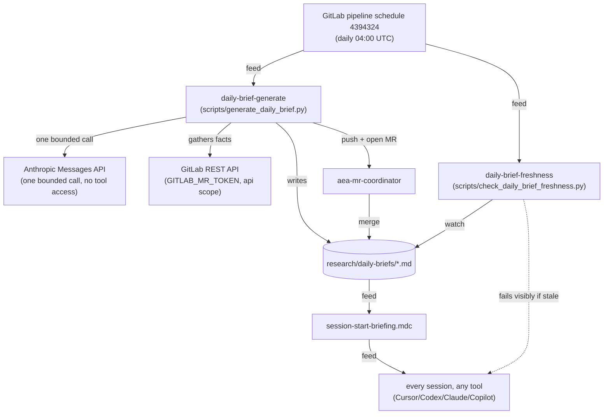
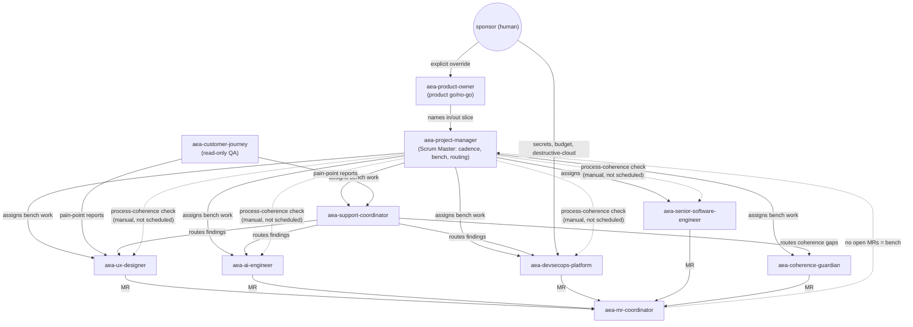

# Loop graph

tags: #aea #process #meta

## Why this exists

This repo runs many improvement/verification loops: guard scripts, a
coherence-findings intake/remediation cycle, ten stakeholder-role
workflows, CI jobs, a merge gate, a daily reporting cycle. Until now none
of that was drawn anywhere — each loop's existence and its relationships
to other loops lived implicitly, scattered across `.gitlab-ci.yml`,
`.cursor/skills/`, `.cursor/rules/`, and `research/`.

That scattering is not free. On 2026-08-18, building the daily-brief
reporting loop (`scripts/generate_daily_brief.py` +
`daily-brief-freshness`), four real failures surfaced one at a time, live,
because nothing had ever asked "does this loop's output actually reach
the loop that depends on it": missing `git`, missing `git-lfs`, a
disabled job-token push setting, and a REST endpoint job tokens don't
cover. Each was fixed only after hitting it. A graph doesn't prevent
every such gap, but a *missing edge* is visible by inspection once the
graph is drawn — the same principle as
[From Loop Engineering to Graph Engineering?](https://medium.com/intuitionmachine/from-loop-engineering-to-graph-engineering-d3ebeb08511c)
(Carlos E. Perez, Intuition Machine, Jul 2026): a single loop fails
silently in isolation; a graph of loops that watch, feed, constrain, and
correct one another is how a system stays grounded to reality instead of
fooling itself.

This document is that graph, made explicit. It is not itself a running
loop — see "Keeping this current" below for how it stays real.

## Legend

- **Node** = one loop: something that runs repeatedly (on a schedule, on
  every push, or on invocation) and checks or changes repo state.
- **Edge** = a relationship between two loops:
  - **feed** — one loop's output is the other's required input
  - **watch** — one loop checks whether another is doing its job
  - **constrain** — one loop must pass before another may proceed (a gate)
  - **correct** — one loop's job is specifically to fix drift another
    loop introduced or failed to prevent
- **Status** on an edge: `automated` (enforced by CI/script), `manual`
  (a human or an AI session has to remember to do it, nothing checks),
  or `missing` (no edge exists yet — a gap).

## Diagram 1 — Governance and CI guard loops

## Diagram 2 — Daily-brief reporting loop (closed 2026-08-18)

Unverified as of merge (2026-08-18): the Anthropic call and
`GITLAB_MR_TOKEN` auth are both gated behind protected-CI-variable
exposure, which only happens on `main` — every pre-merge test ran on an
unprotected branch and couldn't see either credential. First real
scheduled run is the actual validation; `daily-brief-freshness` is the
edge that watches for a silent failure.

## Diagram 3 — Stakeholder team loops

## Node catalog

| Node | Type | Trigger | Owner | Status |
|---|---|---|---|---|
| `check_coherence.py` | guard | CI, on `docs/`/`archive/` changes + every MR/main | script (no role) | automated |
| `check_topic_schemas.py` | guard | CI, on topic-contract/schema changes + every MR/main | script | automated |
| `generate_codex_stakeholder_skills.py --check` | guard | CI, on skill-file changes + every MR/main | script | automated |
| `check_daily_brief_freshness.py` | guard | CI, schedule only (04:00 UTC) | `aea-coherence-guardian` | automated |
| `generate_daily_brief.py` | producer | CI, schedule only (04:00 UTC) | `aea-coherence-guardian` | automated, **unverified end-to-end** |
| `platform-foundation-unit` / `edge-perimeter-unit` / `platform-foundation-integration` | guard | CI, on `platform/`/`edge/` changes | script | automated |
| `markdownlint` / `linkcheck` | guard | CI, on `.md` changes, MR only | script | automated, advisory only |
| `docker-integration-before-mr.mdc` | guard | manual, attested per-MR | every specialist role | **manual, not CI-enforced** |
| `research/coherence-findings-loop.md` | remediation cycle | on-demand / `aea-coherence-guardian` invocation | `aea-coherence-guardian` | manual trigger, disciplined procedure |
| `aea-project-manager` | role loop | on-demand / cadence (08:00/12:00/16:00/20:00, **no automated trigger**) | human or AI session acting as PM | manual trigger |
| `aea-product-owner` | role loop | on-demand | human or AI session | manual trigger |
| `aea-ux-designer` | role loop | on-demand / PM assignment | human or AI session | manual trigger |
| `aea-customer-journey` | role loop (read-only) | on-demand | human or AI session | manual trigger |
| `aea-support-coordinator` | role loop | on-demand / PM assignment | human or AI session | manual trigger |
| `aea-ai-engineer` | role loop | on-demand / PM assignment | human or AI session | manual trigger |
| `aea-devsecops-platform` | role loop | on-demand / PM assignment | human or AI session | manual trigger |
| `aea-senior-software-engineer` | role loop | on-demand / PM assignment | human or AI session | manual trigger |
| `aea-coherence-guardian` | role loop | on-demand + CI schedule (via `generate_daily_brief.py`) | human or AI session | **partially automated** |
| `aea-mr-coordinator` | gate loop | on-demand, invoked per MR or batch | human or AI session | manual trigger, but its gates are automated-checkable |
| `session-start-briefing.mdc` | feed SOP | every session start | every role | **manual, unverifiable mechanically** |
| `stakeholder-skills-sync-sop.mdc` | governance SOP | on any skill-role change | `aea-senior-software-engineer` / whoever edits | manual discipline, backed by automated `--check` |
| `coherence-findings-sop.mdc` | governance SOP | on any coherence finding | `aea-coherence-guardian` | manual discipline |
| `claude-obsidian-loop.mdc` | content lifecycle | on any capture/promotion | human (Obsidian) + AI (triage) | manual |
| `figma-shop-ui-sync.mdc` | sync SOP | on any `edge/gateway/ui/` change | `aea-ux-designer` | manual, not CI-enforced |
| `build-ecr` / `deploy-ecs` | deploy loop | CI, on `main` + `platform/`/`edge/`/`.gitlab-ci.yml` changes | `aea-devsecops-platform` | automated |
| GitLab pipeline schedule `4394324` | trigger | cron, daily 04:00 UTC | `aea-coherence-guardian` | automated |

## Known gaps (edges that are weak or missing)

Ordered by leverage, not just severity — a cheap fix that removes a
recurring blind spot outranks an expensive fix for a rare one.

1. **No requirements→code traceability loop.** FR/NFR → ADR → Milestone →
   Issue → MR → Code → Test has no loop watching the whole chain
   continuously — only piecemeal catches via individual coherence
   findings when someone happens to notice (CF-044 taxes/discounts,
   CF-045 encryption-at-rest claims). This is the biggest remaining gap:
   everything else in this graph watches the *team's process*; nothing
   watches whether the *product* stays honest end to end.
2. **PM-SM's process-coherence check is manual.** Nothing scheduled
   verifies specialists actually followed one-issue-one-branch-one-MR;
   it only happens when someone invokes the PM persona. Could fold into
   `generate_daily_brief.py`'s evidence-gathering cheaply, since that
   loop already reads recent MRs.
3. **`docker-integration-before-mr.mdc` is attested, not verified.**
   `aea-mr-coordinator` trusts the MR description's claim that Docker
   integration ran; nothing checks it's true.
4. **`session-start-briefing.mdc` compliance is unverifiable
   mechanically.** No loop watches whether a session actually read the
   brief before acting — this is inherent to the mechanism (you can't
   automatically prove a model read something), not a fixable gap so
   much as a known soft spot.
5. **Stakeholder cadence (08:00/12:00/16:00/20:00 Europe/Paris) has no
   automated trigger**, in any tool. `generate_daily_brief.py` proves the
   "CI schedule → narrow LLM call → deterministic action" pattern works
   in this repo; the same pattern could drive a cadence-status loop.
6. **Gemini and Grok have no adapters**, deliberately — their real
   instruction-file conventions were never confirmed against
   documentation. See `stakeholder-skills-sync-sop.mdc` → "Adding a new
   target tool."
7. **A disabled Claude Code cloud routine
   (`aea-coherence-guardian-daily-brief`) is dead weight.** Superseded by
   `generate_daily_brief.py`'s CI-native approach after the routine's
   GitHub-only repo-source limitation made it unusable for this
   GitLab-hosted repo. Not cleaned up (routines can't be deleted by an
   agent session — only by the account owner at
   `claude.ai/code/routines`).
8. **`generate_daily_brief.py`'s Anthropic call and `GITLAB_MR_TOKEN`
   auth are unproven end to end** as of this document's writing — see
   Diagram 2.

## Keeping this current

This document is not itself a loop — nothing regenerates or `--check`s
it. That is a deliberate, known trade-off, not an oversight: unlike the
skill-sync graph (which has an unambiguous source of truth to diff
against — the canonical `.cursor/skills/` files), there is no single
source of truth this document could be mechanically generated from. It
would need the same discipline `research/daily-briefs/` needed and
initially didn't get: someone has to remember to update it.

- Whenever a new loop (guard, role, CI job, SOP) is added or removed,
  update the relevant diagram and both catalog tables in the same
  MR — same discipline as `stakeholder-skills-sync-sop.mdc`'s "add or
  remove in all representations."
- `aea-coherence-guardian` should treat a diff between this document and
  actual `.gitlab-ci.yml` / `.cursor/skills/` / `.cursor/rules/` contents
  as a coherence finding during intake, the same as any other doc/code
  drift.
- Revisit the "Known gaps" section whenever one closes — move it to the
  relevant diagram/table instead of just deleting the line, so the
  historical record of what used to be a gap survives (matching how
  `research/coherence-findings-loop.md` keeps `verified` rows instead of
  removing them).
