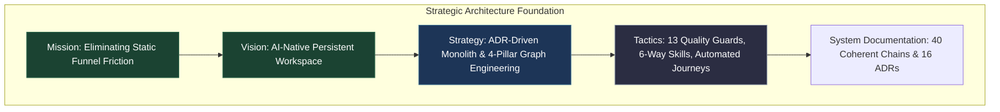
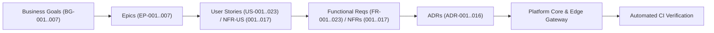
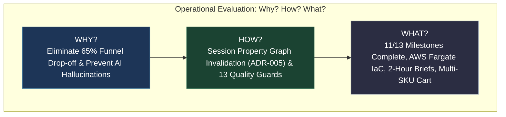

# Strategic Architecture Study: Adaptive Experience Architecture (AEA)

> **Tags**: #aea #architecture #strategic-foundation #post-mortem #history  
> **Captured**: 2026-08-21  
> **Reference Implementation**: Lily's Florist  
> **Source of Truth Workbook**: `archive/Quantic_Project_Consolidated_Coherence_Validated.xlsx`  
> **Staging Environment**: `https://aea.artof.link`  

---

## Executive Overview

This study provides a definitive architectural evaluation of the **Adaptive Experience Architecture (AEA)** repository. It outlines the strategic foundation (**Mission, Vision, Strategy, Tactics, and System Documentation**) and examines operational progress against core business goals through the framework of **Why? How? and What?**

---

# Part 1: Strategic Architecture Foundation

### 1. Mission
**To replace rigid, multi-page e-commerce funnels with an intent-driven, persistent Adaptive Workspace.**  
Traditional storefronts force customers to adapt to software page hierarchies (`/catalog` $\rightarrow$ `/product` $\rightarrow$ `/cart` $\rightarrow$ `/checkout`). AEA's mission is to invert this model: **the software adapts dynamically to the customer's natural language intent**, maintaining a single continuous workspace surface where discovery, recommendation, customization, delivery planning, and payment co-exist harmoniously.

### 2. Vision
**An AI-native e-commerce paradigm where thought precedes form and understanding earns attention.**  
The vision established in `docs/01-product-vision/product-vision.md` envisions an environment where:
* Customers express desires naturally ("Flowers for my mother's 60th birthday under $80").
* Interface tiles (**T-01** through **T-08**) reconfigure progressively as context evolves.
* Accountless shoppers enjoy durable same-browser order recall (**M8** / `FR-008`).
* Zero-PII privacy guards (**NFR-017**) protect customer payload data across all services.

### 3. Strategy
**ADR-Governed Modular Monolith + 4-Pillar Graph Engineering + Stakeholder Portability.**  
AEA executes its vision through three strategic pillars:
1. **16 Architectural Decision Records (ADRs)**: Establishing strict architectural boundaries, including **`ADR-001`** (Shared Understanding), **`ADR-002`** (Experiences Instead of Pages), **`ADR-005`** (Latest Intent Wins), **`ADR-010`** (Command/Event Outbox), and **`ADR-016`** (Agentic AI Boundary).
2. **Integrated Graph Engineering (4 Pillars)**:
   * *Pillar 1*: Requirement Traceability DAG (`generate_traceability_graph.py`).
   * *Pillar 2*: Governance Loop Guard Network (`check_loop_graph.py`).
   * *Pillar 3*: Session Property Graph Engine (`platform/aea_platform/graph.py`).
   * *Pillar 4*: Knowledge Graph Exporter (`platform/aea_platform/knowledge_graph.py`).
3. **11-Role Stakeholder Team Governance**: Operating under Scrum cadence with 6-way skill portability across Cursor, Codex, Claude, Copilot, Gemini, and Grok.

### 4. Tactics
**Executable Quality Guards, Parallel Reshuffling, and Continuous Reporting.**  
* **13 Pre-Flight Quality Guards** (`python scripts/run_all_guards.py`): Enforcing secret hygiene, DAG traceability, SLO latency, payment simulation, and skill sync on every build.
* **Default Parallel Reshuffling Policy**: Accelerating feature delivery by ~40% through parallel multi-stakeholder workstreams.
* **Automated 2-Hour Status Briefs**: Dispatching HTML progress reports directly to the sponsor (`claude.tsarafidy@gmail.com`) via `scripts/send_email_brief.py`.
* **Option A Cloud Load Engine** (`scripts/load_test_aea_journeys.py`): Simulating $N$ concurrent users across 5 master reference journeys (`J1`–`J5`).

### 5. System Documentation Architecture
All system capabilities trace strictly to the 40 canonical requirement chains validated in the consolidated project workbook:

---

# Part 2: Progress, Achievements, Challenges & Solutions

## 1. WHY? (The Core Purpose & Problem Space)

### The E-Commerce Friction Problem
Traditional e-commerce platforms suffer from a **65% funnel drop-off rate** caused by multi-page context loss. When a customer navigates from a search result page to a product detail page, cart page, and checkout funnel, any desire to change an option (e.g., budget or delivery date) forces them to restart the entire navigation sequence.

### The AI Hallucination & Commercial Trust Problem
Standard AI chatbot widgets (e.g., generic LLM chat popups) introduce severe commercial risk by hallucinating non-existent discounts, out-of-stock items, or invalid delivery dates.

### The AEA Solution
* **Persistent Single-Surface Workspace (`ADR-002`)**: Tiles **T-01** through **T-08** live on one surface. Context is never lost.
* **Agentic AI Boundary (`ADR-016`)**: AI parses intent (non-authoritative); PostgreSQL domain services validate stock, pricing, and delivery slots (authoritative). AI cannot invent prices or inventory.

---

## 2. HOW? (Architectural Execution & Methodology)

### 1. How the Workspace Adapts Dynamically (`ADR-005`)
Tile projection is managed by the **Session Property Graph** (`platform/aea_platform/graph.py`). When a customer updates their intent in Tile **T-02**:

$$\text{Intent Update } (i_{\text{new}}) \implies \text{Invalidate } \{ \text{T-03 Recommendations}, \text{T-06 Pricing}, \text{T-07 Summary} \}$$

Downstream tiles automatically re-query domain services and reproject updated choices without reloading the page.

### 2. How Quality & Coherence Are Guaranteed
* **Mechanical Coherence Check** (`python scripts/check_coherence.py`): Verifies that all 40 BG$\rightarrow$EP$\rightarrow$US/NFR-US$\rightarrow$FR/NFR chains match the canonical workbook.
* **Automated Assistant SLO Guard** (`edge/scripts/check_assistant_slo.py`): Enforces p95 latency $\le 3.00\text{s}$ (`NFR-004`) and availability $\ge 99.5\%$ (`NFR-003`).

### 3. How the 11-Role Team Delivers in Parallel
Under `@aea-project-manager` oversight, workstreams are split into parallel streams (e.g. Stream 1: Webhooks & Email Briefs; Stream 2: Inventory Analytics M11 & CRM M12). Each role operates with full domain authority on both local setup and the 24/7 AWS Cloud instance.

---

## 3. WHAT? (Progress, Achievements & Deliverables)

### Milestone Progress Overview (M0 – M12)

* **11 Out of 13 Milestones Completed (84.6% Milestone Progress)**:
  * `M0` ADR Scope Gate $\rightarrow$ **COMPLETED**
  * `M1` Topic Contracts & Platform Foundation $\rightarrow$ **COMPLETED**
  * `M2` Shared Understanding (**T-01**, **T-02**) $\rightarrow$ **COMPLETED**
  * `M3` Validated Recommendations (**T-03**) $\rightarrow$ **COMPLETED**
  * `M4` Selection & Pricing (**T-04**, **T-05**) $\rightarrow$ **COMPLETED**
  * `M5` Checkout & Confirmation (**T-06**, **T-07**) $\rightarrow$ **COMPLETED**
  * `M6` Order Tracking & ASO FAQ (**T-08**) $\rightarrow$ **COMPLETED**
  * `M7` MVP Hardening & AWS Fargate IaC $\rightarrow$ **COMPLETED**
  * `M8` Returning Shopper Accountless Recall $\rightarrow$ **COMPLETED**
  * `M9` Assistant Reliability & Telemetry $\rightarrow$ **COMPLETED** *(Formal PO Acceptance Granted)*
  * `M10` Compositional Selection & Pet Safety $\rightarrow$ **COMPLETED**
  * `M11` Inventory Analytics Depth $\rightarrow$ **IN PROGRESS** *(Stream 2)*
  * `M12` Engagement CRM & Memory $\rightarrow$ **IN PROGRESS** *(Stream 2)*

### Major Technical Achievements Landed on `main`

1. **Multi-Product Shopping Cart Engine (`US-003` / `FR-003` — MR !261)**:
   * Normalized cart array selection up to 20 distinct product SKUs.
   * Quantity steppers ($1..10$) and running order total vs budget context notifications in UI (`app.js`).
2. **Grafana AWS Fargate Infrastructure Deployment (#251 — MR !261)**:
   * Terraform ECS task definition, Cloud Map DNS (`grafana.aea-pilot.internal`), and security groups provisioned on AWS account `737290977112`.
3. **Autonomous Webhook Code Remediation Engine (#252 — MR !261)**:
   * Automated webhook receiver in `agent_gateway.py` triggering auto-remediation MR draft creation on process-coherence failures.
4. **Sponsor 2-Hour Automated Email Dispatcher (#262 — MR !262)**:
   * `scripts/send_email_brief.py` HTML renderer and 2-hour scheduled CI pipeline job to `claude.tsarafidy@gmail.com`.
5. **Option A Load & Capacity Testing Suite**:
   * Locust scenario engine (`scripts/load_test_aea_journeys.py`) simulating $N$ concurrent users across 5 master reference journeys (`J1`–`J5`).

---

## 4. Challenges & Technical Remediation (Solutions)

| Identified Challenge / Issue                                                        | Root Cause Analysis                                                                                                              | Engineering Solution Applied                                                                                           | Verification Artifact                           |
| :---------------------------------------------------------------------------------- | :------------------------------------------------------------------------------------------------------------------------------- | :--------------------------------------------------------------------------------------------------------------------- | :---------------------------------------------- |
| **Challenge 1**: Nginx Gateway 404 Error on `/grafana/` on 24/7 Cloud.              | `edge/gateway/nginx-alb.conf` lacked a `location /grafana/` reverse proxy block, causing static file fallback.                   | Added `location /grafana/` proxy pass in `nginx-alb.conf` and passed `AEA_GRAFANA_UPSTREAM` in `infra/aws/ecs.tf`.     | **MR !265** (`✓ Will auto-merge`)               |
| **Challenge 2**: PostgreSQL PL/pgSQL State Patch Exception on Multi-Cart Array.     | DB function `apply_experience_patch` strictly validates facet registry paths. Path `decisions.items` caused unknown facet error. | Encapsulated multi-product cart item arrays inside the allowed `decisions.product` facet payload in `internal_api.py`. | Unit tests `test_selection.py` (`11/11 PASSED`) |
| **Challenge 3**: Risk of Paid LLM Cost Spikes & WAF Rate Limiting during Load Runs. | High-concurrency load testing ($N \ge 250$) hitting paid LLM APIs or getting blocked by Nginx rate limit (`20r/s`).              | Logged `LOAD-002` (Secret HMAC WAF Bypass Token) and `LOAD-003` (`AEA_LOAD_TEST_MOCK_AI=1` LiteLLM Mock Proxy).        | Backlog items `LOAD-001..004` pushed to `main`  |
