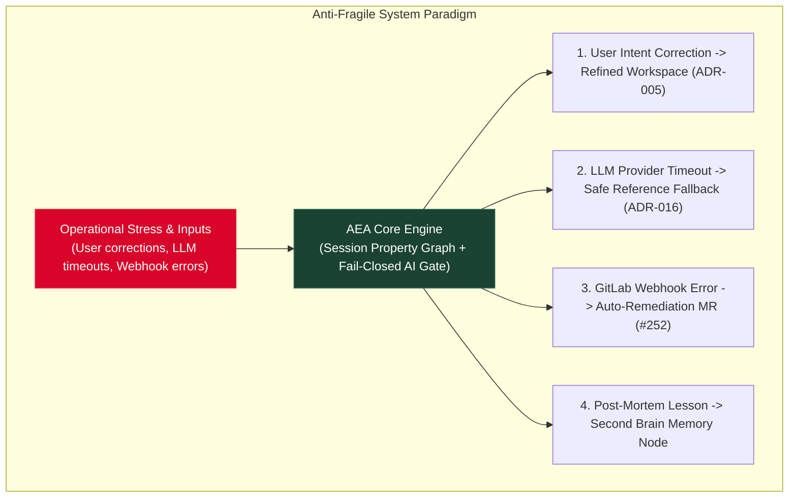

# Strategic Architecture SOP: Anti-Fragility as a System Cornerstone

> **Tags**: #aea #architecture #antifragility #sop #cornerstone #second-brain  
> **Captured Date**: 2026-08-21  
> **Governing Rules**: `.cursor/rules/antifragility-cornerstone-sop.mdc`, `AGENTS.md`  
> **Target System**: Adaptive Experience Architecture (AEA)  

---

## Executive Overview

Anti-fragility is a foundational governing cornerstone of the **Adaptive Experience Architecture (AEA)**.

Unlike fragile systems (which break under stress) or robust systems (which merely resist stress), an **anti-fragile system grows stronger, safer, and more capable from stress, friction, unexpected user inputs, process failures, and operational chaos**.

---

# 1. Architectural Principles of AEA Anti-Fragility

### Key Principles

1. **User Stress as Input**: When users change their mind, correct an AI inference (**FR-021**), or adjust budget mid-session, the workspace uses the stress event to refine tile state without data loss.
2. **Failure as Intelligence**: When LLMs fail or output unknown attributes, `QualityMonitor` catches the error fail-closed and logs structured telemetry to refine future models.
3. **Automated Self-Healing**: System errors emit transactional outbox events that trigger autonomous webhook remediation routines (`agent_gateway.py`).
4. **Permanent Knowledge Ratcheting**: Every post-mortem generates an Obsidian memory node (`research/random-thoughts/`) linked via `[[wikilinks]]`, ensuring the system never repeats a past failure.

---

# 2. Implementation Across Repo Services

| AEA Service Layer | Fragile Pattern (Forbidden) | Anti-Fragile Pattern (Mandatory SOP) |
| :--- | :--- | :--- |
| **Edge Gateway / BFF** | Crashing or clearing session cookies on invalid user payload. | Re-mints session context version, logs audit event, and prompts user to review Shared Understanding. |
| **Platform Core & DB** | Throwing uncaught exceptions on missing facet schema paths. | Validates facets via `apply_experience_patch` and rebases context version smoothly (**`ADR-009`**). |
| **Agentic AI Subsystem** | Trusting raw LLM outputs to mutate inventory or prices directly. | Strictly enforces **`ADR-016`** Agentic AI Boundary (non-authoritative AI interpretation + authoritative domain validation). |
| **CI/CD & Quality Guards** | Bypassing failing unit tests or disabling strict lint rules under deadline pressure. | Adding new pre-flight guards (`run_all_guards.py`) for every bug fix to permanently ratchet quality. |

---

### Conclusion & Memory Integration

This Anti-Fragility SOP is enforced across all repository stakeholder roles (`@aea-*`) and indexed in the Second Brain Knowledge Graph.
