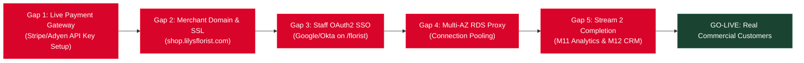

# Architectural Study: Pilot vs. Production Live Architecture & Launch Readiness

> **Tags**: #aea #architecture #pilot-vs-production #launch-readiness #history #post-mortem  
> **Captured**: 2026-08-21  
> **Target System**: Adaptive Experience Architecture (AEA)  
> **Reference Implementation**: Lily's Florist  
> **Staging Pilot Domain**: `https://aea.artof.link` (AWS ECS Fargate `aea-pilot` us-east-1)  
> **Production Target**: `https://shop.lilysflorist.com` (Multi-AZ AWS VPC)

---

## Executive Summary

This study presents an architectural comparison between the **Current Staging Pilot** (`aea-pilot`) and the **Recommended Production Live Architecture**, detailing **Similarities**, **Required Changes & Rationale**, and the **5 Specific Launch Gaps** that must be closed before real commercial users can start placing orders.

---

# Part 1: Pilot vs. Production Live Architectural Comparison

```mermaid
flowchart TD
    subgraph Staging Pilot ("Current Pilot: https://aea.artof.link")
        P_Compute["Single-AZ ECS Fargate Task (1 Task / Svc)"]
        P_DB["Single-AZ RDS PostgreSQL 16"]
        P_Pay["Sandbox Token Simulation (tok_sandbox_*)"]
        P_Auth["Path B Flag Header Exception (AEA_FLORIST_OPERATOR)"]
        P_DNS["Staging Domain (aea.artof.link)"]
    end

    subgraph Production Live ("Recommended Production Architecture")
        C_Compute["Multi-AZ ECS Fargate (2..20 Auto-scaling Tasks across 3 AZs)"]
        C_DB["Multi-AZ RDS PostgreSQL + AWS RDS Proxy Connection Pool"]
        C_Pay["Production Gateway Integration (Stripe / Adyen API)"]
        C_Auth["OAuth2 / OIDC Staff Single Sign-On (Google / Okta)"]
        C_DNS["Merchant Apex Domain (shop.lilysflorist.com)"]
    end

    Staging Pilot -->|5 Launch Gaps Remediated| Production Live

    style Staging Pilot fill:#1d3557,stroke:#457b9d,color:#fff
    style Production Live fill:#1b4332,stroke:#2d6a4f,color:#fff
```

### 1. Similarities (What Remains Unchanged)

The core application architecture developed and hardened during the Pilot is **production-ready and remains 100% unchanged**:

1. **Experience-Oriented Modular Monolith Architecture (`ADR-002`)**:
   * The single-surface workspace tiles (**T-01** through **T-08**) and Backend-for-Frontend (**BFF**) remain identical.
2. **Session Property Graph State Engine (`platform/aea_platform/graph.py`)**:
   * Directed property graph tile invalidation (**`ADR-005`**) and context versioning (**`ADR-009`**) run without modification.
3. **Agentic AI Boundary & Anti-Hallucination Gate (`ADR-016`)**:
   * Strict separation between AI interpretation (non-authoritative) and domain verification (authoritative) remains the core safety mechanism.
4. **Hybrid RAG & `pgvector` Datastore (`ADR-014`)**:
   * `pgvector` cosine similarity (`<=>`) and BM25 lexical search for FAQ knowledge chunks and catalog matching remain identical.
5. **Contract-First Transactional Outbox Pattern (`ADR-008` / `ADR-010`)**:
   * Outbox pattern writing events to PostgreSQL before streaming to Amazon MSK Kafka remains the event backbone.
6. **Unified Pre-Flight Quality Guards**:
   * The 13 automated pre-flight quality guards (`scripts/run_all_guards.py`) continue to run on every production deployment.

---

### 2. Architectural Changes & Rationale

| Architecture Component | Staging Pilot Implementation | Recommended Production Live Target | Architectural Rationale (WHY?) |
| :--- | :--- | :--- | :--- |
| **Compute & Scalability** | Single ECS Fargate task per service (1 Gateway, 1 BFF, 1 Orchestration). | **Multi-AZ Fargate Tasks** (min 2, max 20 tasks per service across 3 AZs: `us-east-1a`, `us-east-1b`, `us-east-1c`) with Target Tracking Auto Scaling. | Eliminates single-point-of-failure (SPOF) risks and absorbs traffic spikes during peak gifting holidays (Valentine's, Mother's Day). |
| **Database Connection Pooling** | Direct PostgreSQL connection pool (`max_connections=100`). | **Multi-AZ RDS PostgreSQL + AWS RDS Proxy** (PgBouncer connection multiplexer). | Prevents database connection pool exhaustion when scaling up to 20 Fargate tasks during load bursts. |
| **Payment Gateway Integration** | Sandbox token simulation (`tok_sandbox_*` in `payment.py`). | **Live Payment Gateway SDK** (Stripe / Adyen / Square API integration). | Required to process real customer credit cards, Apple Pay, and Google Pay securely without touching PAN data (**`NFR-015`**). |
| **Operator Console Auth (`T-09`)** | Path B flag header exception (`AEA_FLORIST_OPERATOR_EXCEPTION=aea-pilot`). | **OAuth2 / OIDC Single Sign-On** (Google Workspace / Okta integration for `/florist`). | Secures the operator inbox from unauthorized external web access; enforces staff role-based access control (RBAC). |
| **Security & WAF Rulesets** | Nginx rate limiting (`20r/s` per IP). | **AWS WAF v2 Managed Rulesets** (OWASP Top 10 + Bot Control + Fraud Prevention). | Protects against credential stuffing, automated bots, and distributed denial-of-service (DDoS) attacks. |
| **Domain & Email Identity** | Staging subdomain `aea.artof.link`. | **Merchant Domain Identity** (`shop.lilysflorist.com`) + AWS SES DKIM/SPF domain verification. | Builds brand trust and guarantees high inbox deliverability for order receipts and 2-hour daily briefs. |

---

# Part 2: The 5 Gaps Preventing Real User Launch

To transition from the live staging pilot to an active commercial platform where real customers place paid orders, **the following 5 launch gaps must be remediated**:



### 1. Gap 1: Live Payment Gateway Integration (`FR-019` / Payment Service)
* **Current State**: Payments use sandbox token simulation (`tok_sandbox_*`) in `platform/aea_platform/payment.py`.
* **Gap**: Real credit cards cannot be charged.
* **Remediation**: Add Stripe/Adyen SDK integration in `payment.py`, storing real API keys in AWS Secrets Manager (`AEA_STRIPE_SECRET_KEY`).

### 2. Gap 2: Production Merchant Domain & DNS Identity (`shop.lilysflorist.com`)
* **Current State**: System operates on staging subdomain `aea.artof.link`.
* **Gap**: Real customers expect the official brand domain (`shop.lilysflorist.com`).
* **Remediation**: Create Route 53 alias records for `shop.lilysflorist.com` pointing to the AWS ALB, and issue production ACM SSL certificates with HSTS preload.

### 3. Gap 3: Staff Single Sign-On (SSO) for Operator Console (`T-09` / `/florist`)
* **Current State**: Operator inbox relies on environment flag `AEA_FLORIST_OPERATOR_EXCEPTION=aea-pilot`.
* **Gap**: Anyone who knows the `/florist` URL on production could view incoming support requests.
* **Remediation**: Implement OAuth2 / OIDC authentication (Google Workspace / Okta) on `edge/gateway/ui/florist.html` so only authenticated florist staff can view and manage requests.

### 4. Gap 4: Multi-AZ RDS PostgreSQL & AWS RDS Proxy Connection Pooling
* **Current State**: Database is a single-AZ RDS PostgreSQL instance.
* **Gap**: High traffic spikes could exhaust database connections or cause downtime if a single AWS Availability Zone fails.
* **Remediation**: Enable Multi-AZ replication in `infra/aws/rds.tf` and deploy AWS RDS Proxy (PgBouncer) to multiplex database connections across auto-scaled Fargate tasks.

### 5. Gap 5: Completion of Stream 2 Workstreams (M11 Inventory Analytics & M12 CRM)
* **Current State**: Stream 2 parallel workstreams (**M11** & **M12**) are in progress.
* **Gap**: Full stock trend forecasting (**M11**) and zero-PII customer occasion reminders (**M12**) are needed to maximize customer retention.
* **Remediation**: Complete and land Stream 2 code changes to `main`.
