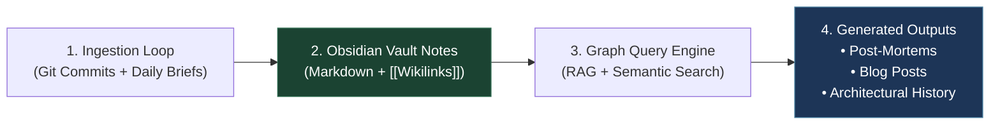

# Architectural Proposal: Project Memory & Second Brain Obsidian Vault

> **Tags**: #aea #second-brain #obsidian-vault #knowledge-management #post-mortem #history #architecture  
> **Captured**: 2026-08-21  
> **Author**: Antigravity AI & AEA Team  
> **Target Vault Path**: `docs/` and `research/` (Obsidian Compatible Markdown)

---

## Executive Summary

This proposal evaluates the value of organizing project studies, decision records, incident post-mortems, and daily briefs into an **Obsidian Vault / Second Brain Architecture**, integrated with **Autonomous AI Memory Loops**. 

Creating a queryable, bi-directionally linked knowledge graph preserves **the why, the trials, the failed paths, the architectural trade-offs, and the evolution of project consensus**. This memory engine enables automated post-mortem generation, technical blog writing, and instant onboarding for future developers or AI agents.

---

# Part 1: Strategic Benefits of a Project "Second Brain"

```mermaid
flowchart TD
    subgraph Raw Repository Artifacts
        Commits["Git Commit Stream & MRs"]
        Briefs["Daily Briefs & 2h Dispatches"]
        ADRs["Architectural Decision Records (ADR-001..016)"]
        Incidents["Incident Logs & Coherence Failures"]
    end

    subgraph Second Brain Obsidian Vault ("Bi-Directional Knowledge Graph")
        Nodes["Wikilink Nodes ([[ADR-016]], [[M9-Telemetry]], [[Nginx-Fix]])"]
        Tags["Semantic Graph Tags (#aea #post-mortem #challenge #solution)"]
    end

    subgraph Autonomous AI Memory Loop
        Query["Natural Language Query Engine"]
        PostMortem["Automated Post-Mortem Generator"]
        Blog["Project History Blog Writer"]
        Onboarding["New Developer / Agent Onboarding Brief"]
    end

    Raw Repository Artifacts --> Second Brain Obsidian Vault
    Second Brain Obsidian Vault --> Autonomous AI Memory Loop

    style Second Brain Obsidian Vault fill:#1b4332,stroke:#2d6a4f,color:#fff
    style Autonomous AI Memory Loop fill:#1d3557,stroke:#457b9d,color:#fff
```

### 1. Capturing "The Why" Beyond Flat Code
Codebases document *what* the software does today, but rarely *why* alternative approaches were rejected. An Obsidian Vault Second Brain captures:
* **The Trials & Errors**: Why PL/pgSQL array state patches failed before encapsulating cart arrays in `decisions.product`.
* **The Security Rationale**: Why Nginx strips internal bearer headers on perimeter proxies (`ADR-007` / `NFR-017`).
* **The Cost Safeguards**: Why `LOAD-003` LiteLLM mock proxy was introduced before running high-concurrency cloud load tests.

### 2. Bi-Directional Linking (`[[wikilinks]]`)
Obsidian's native `[[wikilink]]` format connects concepts across files:
* Link `[[ADR-016]]` directly to `[[2026-08-21-rag-architecture-challenges-and-refactoring-study]]` and `[[M9-Telemetry]]`.
* Trace any requirement (e.g. `[[FR-019]]`) back to its implementation (`platform/aea_platform/payment.py`), its test suite, and its production launch gap (`[[Gap-1-Stripe-Gateway]]`).

---

# Part 2: Vault Folder Structure Mapping

To map the project memory effectively, the repository's `docs/` and `research/` directories follow this Obsidian-optimized layout:

```
aea-second-brain-vault/
├── 01-Product-Vision/
│   ├── product-vision.md
│   └── customer-personas.md
├── 02-Architectural-Decisions/
│   ├── ADR-001-shared-understanding.md
│   ├── ADR-005-latest-intent-wins.md
│   └── ADR-016-agentic-ai-boundary.md
├── 03-Milestones-and-Roadmap/
│   ├── milestone-m0-to-m7-mvp-summary.md
│   ├── milestone-m8-returning-shopper.md
│   └── milestone-m9-assistant-reliability.md
├── 04-Incident-Post-Mortems/
│   ├── 2026-08-20-nginx-grafana-404-postmortem.md
│   └── 2026-08-20-pgsql-patch-facet-postmortem.md
├── 05-Daily-Briefs-and-Journal/
│   ├── daily-briefs/2026-08-21.md
│   └── email-dispatches/
└── 06-Strategic-Studies-and-Thoughts/
    ├── random-thoughts/2026-08-21-aea-strategic-architecture-study.md
    ├── random-thoughts/2026-08-21-pilot-vs-production-live-architecture-study.md
    ├── random-thoughts/2026-08-21-rag-architecture-challenges-and-refactoring-study.md
    └── random-thoughts/2026-08-21-project-history-second-brain-obsidian-vault-architecture.md
```

---

# Part 3: Autonomous AI Memory Loop Architecture



### How the Autonomous AI Memory Loop Operates:

1. **Continuous Capture Loop**: Each daily sprint or major MR landing automatically triggers an update to `research/daily-briefs/` and `research/random-thoughts/`.
2. **Graph Construction**: The AI links new findings to existing ADRs, user stories, and incident notes via `[[wikilinks]]`.
3. **Query & Knowledge Extraction**: When asked to write a technical blog or post-mortem:
   * The AI traverses the vault graph starting from initial requirements (`BG-001`) to the final implementation (`MR !265`).
   * It extracts the **trial-and-error narrative** (e.g. initial Nginx ALB 404 syntax error $\rightarrow$ root cause analysis $\rightarrow$ MR !265 auto-merge).
4. **Publishing Pipeline**: Generates clean, reader-ready markdown blogs or technical post-mortems suitable for Medium, Dev.to, or company engineering publications.

---

### Conclusion & Recommendation

Yes, mapping this knowledge under `research/random-thoughts/` within an **Obsidian-compatible Second Brain Vault** provides immense long-term value. It transforms a standard code repository into a **living, queryable memory system**, capturing the full history, trade-offs, and lessons learned for future AI agents and human developers alike.
