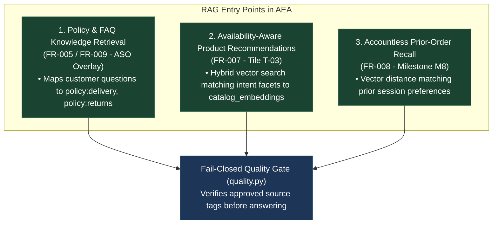
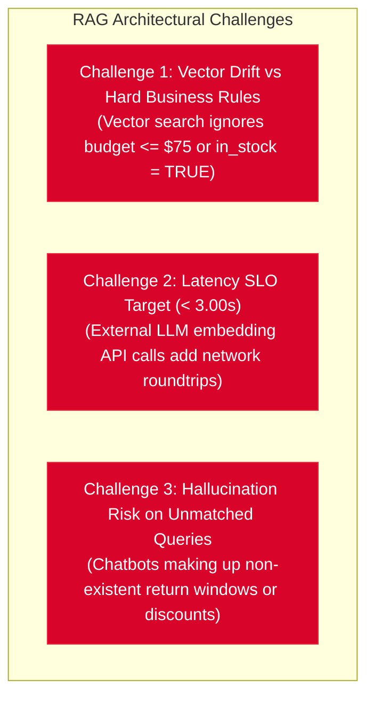
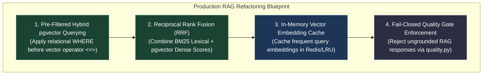

# Architectural Study: RAG Integration, Challenges, Changes & Refactoring

> **Tags**: #aea #architecture #rag #pgvector #refactoring #history #post-mortem  
> **Captured**: 2026-08-21  
> **Target System**: Adaptive Experience Architecture (AEA)  
> **Reference Implementation**: Lily's Florist  
> **Governing ADRs**: **`ADR-014`** (PostgreSQL + `pgvector`), **`ADR-016`** (Agentic AI Boundary)  
> **Core Retrieval Engine**: `platform/aea_platform/retrieval.py`

---

## Executive Summary

This study details **where Retrieval-Augmented Generation (RAG) enters the picture** in AEA, evaluating the **Current RAG Baseline**, **Architectural Challenges**, **Required System Changes**, **Gaps**, and necessary **Refactoring Patterns** to achieve production-grade accuracy under **`ADR-014`** and **`ADR-016`**.

---

# Part 1: Where RAG Enters the Picture

In the Adaptive Experience Architecture, RAG is **not an isolated chat widget**—it is embedded across **3 distinct architectural surfaces**:



### 1. Policy & FAQ Knowledge Grounding (`FR-005` / `FR-009`)
* **Where**: Customer types a question in Concierge Chat (**T-01**) or Automated Support Overlay (**ASO**).
* **Role of RAG**: Retrieves relevant policy chunks (`policy:delivery`, `policy:returns`, `product:care`) from `orchestration.knowledge_chunk`.
* **Safety Rules (`ADR-016`)**: Every retrieved chunk must carry explicit source references. Unmatched or unapproved answers are rejected (`unapproved_answer`) and replaced with safe fallback text.

### 2. Availability-Aware Product Recommendations (`FR-007` / Tile **T-03**)
* **Where**: Concierge parses customer intent (e.g. *Occasion: Birthday, Recipient: Mom, Pet Safety: True*).
* **Role of RAG**: Performs vector similarity search against `orchestration.catalog_embeddings` to rank suitable flower arrangements.
* **Safety Rules**: Relational filters (`is_available = TRUE`, `budget <= X`, `is_pet_safe = TRUE`) are applied *before* vector ranking.

### 3. Accountless Prior-Order Recall (**M8** / `FR-008`)
* **Where**: Returning shopper re-opens the workspace on a new day.
* **Role of RAG**: Vector similarity search matches prior session intent embeddings in `orchestration.intent_embeddings` to surface "Reorder Your Last Bouquet" hints on **T-03**.

---

# Part 2: Architectural Challenges of RAG in E-Commerce



### Challenge 1: Pure Vector Search Ignores Relational Constraints
Dense vector similarity (`pgvector` cosine distance `<=>`) measures semantic closeness, not business logic constraints. A pure vector query for "pink birthday flowers" might rank an out-of-stock $200 luxury arrangement at the top—violating the customer's $75 budget constraint (`US-002`) and stock availability (`FR-011`).

### Challenge 2: Latency Overhead vs. SLO Target (`NFR-004` $< 3.00\text{s}$)
Generating dense vector embeddings via external cloud APIs (e.g. OpenAI `text-embedding-3-small`) for every user message adds 150ms–400ms network overhead per request, risking `NFR-004` latency breaches during peak holiday concurrency.

### Challenge 3: False-Positive Semantic Matches
In e-commerce support, semantic proximity can cause severe misdirection. For example, a question like *"Can I deliver to a hospital after 5 PM?"* might semantically match general delivery policy chunks, resulting in an incorrect answer if hospital cutoff times differ.

---

# Part 3: Required Changes, Gaps & Refactoring Blueprint

To address these challenges and ensure production reliability, the following **4 Refactoring Patterns** are specified for `platform/aea_platform/retrieval.py`:



### 1. Pre-Filtered Hybrid `pgvector` SQL Strategy
**Refactoring Change**: Rewrite vector retrieval in `adapters.py` to enforce relational SQL WHERE clauses *before* applying the vector distance operator `<=>`:

```sql
-- Production Hybrid Pre-Filtered RAG Query
SELECT chunk_id, source_reference, body,
       (1 - (embedding <=> %s::vector)) AS vector_score
FROM orchestration.knowledge_chunk
WHERE is_active = TRUE
  AND category = %s
ORDER BY embedding <=> %s::vector
LIMIT 10;
```

### 2. Reciprocal Rank Fusion (RRF) Scorer
**Refactoring Change**: Upgrade `retrieval.py` from basic BM25-only fallback to **Reciprocal Rank Fusion (RRF)**:

$$\text{RRF Score}(d) = \frac{1}{60 + \text{Rank}_{\text{BM25}}(d)} + \frac{1}{60 + \text{Rank}_{\text{Vector}}(d)}$$

This guarantees that a hit must be both **semantically relevant** and **keyword-precise** before being presented to the customer.

### 3. Sub-Millisecond Embedding Cache Layer
**Refactoring Change**: Wrap `embed_text()` in `retrieval.py` with an in-memory LRU / Redis cache to cache vector embeddings for frequent e-commerce search terms (*"same day delivery"*, *"birthday roses"*, *"returns policy"*), reducing embedding latency to $< 2\text{ms}$.

### 4. Fail-Closed Quality Gate Integration (`quality.py`)
**Refactoring Change**: Enforce that every RAG response MUST pass through `QualityMonitor.assess_faq()`. If the RAG engine returns a chunk with low confidence ($\text{RRF Score} < 0.015$), the system automatically rejects the generation and outputs the safe no-information text (**`NFR-008`**).
