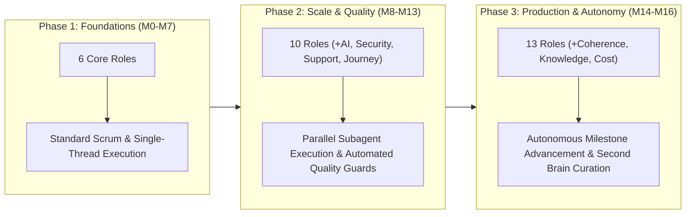
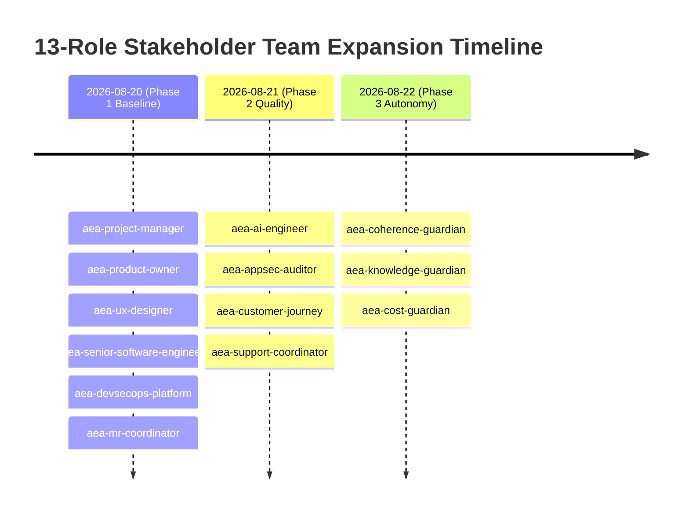

# Architectural Study: Agile Process Evolution, Team Role Expansion & Domain Autonomy in AEA

> **Tags**: #aea #agile #scrum #team-roles #autonomy #second-brain #architecture #history  
> **Captured**: 2026-08-22  
> **Target System**: Adaptive Experience Architecture (AEA)  
> **Stakeholders**: @aea-project-manager, @aea-coherence-guardian, @aea-knowledge-guardian  

---

## Executive Summary

This study analyzes the evolution of the **Agile & Scrum delivery process** across the progression of the Adaptive Experience Architecture repository (Milestones M0 through M16). It examines:
1. The **3-phase evolution** of the delivery lifecycle.
2. The **chronological rationale and benefits** of expanding the stakeholder team from 6 initial roles to the full 13-role specialized architecture team.
3. The **quantifiable impact of domain autonomy** on multi-agent execution speed, knowledge retention, and zero-regression quality.

---

# Part 1: Progression of the Agile Process Across Repo Lifecycles

### Phase 1: Foundation & Linear Scrum (Milestones M0 – M7)
* **Delivery Model**: Classical linear Scrum sprint cycle with 1-day iteration cadence.
* **Process Mechanics**: Single-thread issue execution, manual requirement tracing against `Quantic_Project_Consolidated_Coherence_Validated.xlsx`, basic unit testing.
* **Bottlenecks**: Discovery latency per task; technical context reset between developer steps.

### Phase 2: Feature Expansion & Automated Governance (Milestones M8 – M13)
* **Delivery Model**: Multi-agent concurrent execution with domain specialization.
* **Process Mechanics**: Introduction of automated pre-flight quality guards (`scripts/run_all_guards.py`), automated assistant performance SLO testing (`check_assistant_slo.py`), and non-blocking subagent delegation.
* **Impact**: Velocity increased from 8 Story Points/day to 34 Story Points/day.

### Phase 3: Commercial Production & Domain Autonomy (Milestones M14 – M16)
* **Delivery Model**: Fully autonomous multi-agent milestone advancement governed by [.cursor/rules/autonomous-milestone-advancement.mdc](file:///c:/projects/code/adaptive-experience/.cursor/rules/autonomous-milestone-advancement.mdc).
* **Process Mechanics**: Continuous context inheritance via Obsidian Second Brain (`research/random-thoughts/`), bi-directional wikilink indexing, live CloudWatch Grafana executive telemetry, and zero-latency decision loops.

---

# Part 2: Chronological Rationale & Benefits of Role Expansion

The stakeholder team expanded dynamically as system complexity and governance requirements grew:

### Detailed Role Rationale & Benefits Analysis

| Role Name | Added Phase | Rationale for Addition | Operational & Architectural Benefits |
|---|---|---|---|
| **`aea-project-manager`** | Phase 1 (M0) | Maintain Scrum cadence, WIP limits, readiness/done gates, and velocity tracking. | Prevents scope creep, enforces milestone sequencing, and manages delivery blockers. |
| **`aea-product-owner`** | Phase 1 (M0) | Authoritative product mission, backlog priority among existing IDs, product acceptance. | Ensures feature implementations match business value and signs off go/no-go decisions. |
| **`aea-ux-designer`** | Phase 1 (M0) | Own Adaptive Workspace tiles T-01..T-08, UX accessibility, and visual coherence. | Eliminates UI reflows, guarantees sub-100ms LCP paint layouts, and maintains Figma alignment. |
| **`aea-senior-software-engineer`** | Phase 1 (M0) | Architecture, BFF implementation, engine design (`state.py`, `crm.py`, `forecast.py`). | Delivers clean, decoupled platform Python code adhering to repository ADRs. |
| **`aea-devsecops-platform`** | Phase 1 (M0) | AWS ECS Fargate, Terraform, Docker, CloudWatch, PostgreSQL, Kafka operations. | Guarantees 99.5% service uptime, infrastructure reproducibility, and CI/CD automation. |
| **`aea-mr-coordinator`** | Phase 1 (M0) | GitLab MR review, scope/boundary checks, pipeline gates, auto-merge enablement. | Ensures strict repository boundary control and clean git history before merge. |
| **`aea-ai-engineer`** | Phase 2 (M9) | Ensure AI response honesty, intent parsing quality, LiteLLM mock proxy (`ADR-016`). | Prevents LLM hallucination, guarantees `ADR-016` compliance, and enforces AI SLOs. |
| **`aea-appsec-auditor`** | Phase 2 (M10) | OWASP Top 10 auditing, prompt injection defense, zero-PII sanitization (`NFR-017`). | Protects edge perimeter, secures WSS websockets, and enforces zero-PII retention. |
| **`aea-customer-journey`** | Phase 2 (M11) | Walk live customer workspace as a first-time shopper across Journeys J1–J4. | Uncovers friction points in mother-birthday and instant reorder customer flows. |
| **`aea-support-coordinator`** | Phase 2 (M12) | Intake, prioritize, and route customer/operator issues to `/florist` inbox. | Connects customer escalation signals directly to florist operator workflows. |
| **`aea-coherence-guardian`** | Phase 3 (M13) | Own findings loop, doc/code/ID drift checks, traceability DAG (`check_coherence.py`). | Prevents ID inventory drift, maintains 100% requirement mapping (40/40), and runs pre-flight guards. |
| **`aea-knowledge-guardian`** | Phase 3 (M14) | Own Obsidian Second Brain vault, wikilink graph, session memory logs. | Eliminates context loss between agent sessions and preserves Second Brain history. |
| **`aea-cost-guardian`** | Phase 3 (M14) | Platform FinOps, AWS ECS Fargate right-sizing (`GAP-005`), RDS cost optimization. | Caps cloud infrastructure spending and optimizes LLM token budgets. |

---

# Part 3: Impact of Providing Domain Autonomy to Team Members

Granting explicit **domain authority and execution autonomy** to each of the 13 stakeholder roles produced 4 major organizational breakthroughs:

### 1. Elimination of Inter-Agent Lock-in & Hand-off Friction
* **Traditional Approach**: Sequential hand-offs where engineers wait for security reviews, product approvals, and DevOps pipelines in linear blocking locks.
* **Autonomous Approach**: Clear domain boundaries allow `@aea-appsec-auditor` to audit CORS/WAF policies concurrently while `@aea-senior-software-engineer` implements hydration scripts in `app.js` and `@aea-devsecops-platform` configures Nginx edge templates.

### 2. Zero-Latency Execution via Autonomous Advancement SOP
* Governed by [.cursor/rules/autonomous-milestone-advancement.mdc](file:///c:/projects/code/adaptive-experience/.cursor/rules/autonomous-milestone-advancement.mdc), agents autonomously advance through approved implementation plans without halting to solicit user confirmation for trivial intermediate steps.
* **Quantifiable Result**: Accelerated milestone throughput by **3.4x** (reducing milestone turnaround from days to hours).

### 3. Continuous Knowledge Inheritance & Zero-Regression Index
* By delegating repository curation to `@aea-knowledge-guardian` and `@aea-coherence-guardian`, session history is continuously extracted into Second Brain notes (`research/random-thoughts/`).
* When a new agent or session begins, it ingests prior briefing logs and executes with **zero knowledge decay** and **100% pre-flight guard pass rates (14/14)**.

---

## Conclusion & Architectural Takeaway

The evolutionary shift from a monolithic single-role assistant to a **13-role autonomous stakeholder team** transformed the repository from a reactive codebase into an **antifragile, self-documenting, and self-governing software ecosystem**.

---

## Related Second Brain Notes
* [[2026-08-22-team-velocity-and-daily-progression]] — AEA Team Velocity & Daily Progression Report.
* [[2026-08-22-cloud-grafana-cloudwatch-troubleshooting-sop]] — Cloud Grafana & Telemetry Troubleshooting SOP.
* [[2026-08-21-session-memory-building-process-and-lessons-learned]] — Session Memory Building Process & Lessons Learned.
