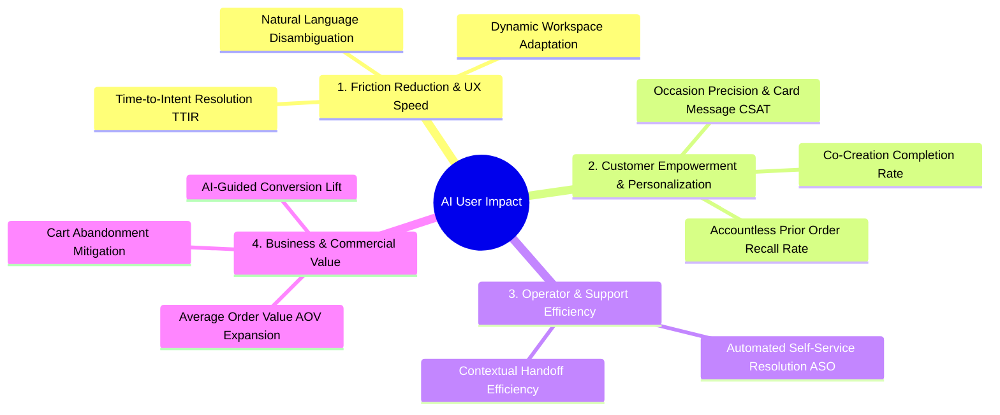

# Framework: Measuring & Capturing User Impact of AI-Powered Applications

> **Tags**: #aea #ai-impact #telemetry #ux-metrics #kpi #second-brain #framework  
> **Captured**: 2026-08-22  
> **Target System**: Adaptive Experience Architecture (AEA)  
> **Stakeholders**: @aea-ai-engineer, @aea-product-owner, @aea-ux-designer, @aea-customer-journey  

---

## Executive Context
Evaluating an AI-powered application requires moving beyond model technical accuracy (precision/recall/eval scores) to measuring **tangible user benefits, friction reduction, operational efficiency, and commercial value**.

This framework provides the **4-Dimension Impact Measurement Model** and the **Telemetry Implementation SOP** used in the Adaptive Experience Architecture (AEA).

---

## 1. The 4-Dimension AI User Impact Framework

---

### Dimension 1: Friction Reduction & UX Speed (UX Impact)
* **Time-to-Intent Resolution (TTIR)**:
  * *Definition*: The duration (seconds & turn count) required for a user to express a complex intent and receive a fully tailored, actionable solution.
  * *Target*: < 3 conversational turns or < 15 seconds (compared to 8–12 filter clicks on traditional e-commerce).
* **Natural Language Disambiguation Rate**:
  * *Definition*: % of complex, ambiguous queries successfully parsed into structured parameters without throwing errors or requiring manual re-typing (e.g. *"fragrance-free yellow bouquet for hospital delivery under $80"*).
* **Dynamic Workspace Adaptation Velocity**:
  * *Definition*: Speed at which workspace tiles (T-01 through T-08) auto-surface relevant context based on implicit intent signals.

---

### Dimension 2: Customer Empowerment & Personalization (Value Impact)
* **Co-Creation Completion Rate**:
  * *Definition*: % of shoppers who successfully use AI co-creation tools (e.g. Florist-Choice Palette & Pet Safety exclusions in Tile T-04) to design a customized product.
* **Occasion Precision & Card Message CSAT**:
  * *Definition*: User approval/accept rate of AI-assisted personalized card messages and arrangement style recommendations.
* **Accountless Reorder Recall Rate**:
  * *Definition*: Rate of returning shoppers who successfully re-order prior arrangements using accountless session memory without re-entering recipient or preference details.

---

### Dimension 3: Operator & Support Efficiency (Operational Impact)
* **Automated Self-Service Resolution (ASO Deflection Rate)**:
  * *Definition*: % of post-order or pre-purchase inquiries (delivery windows, substitution policies, order tracking) answered accurately by AI without escalating to human operators.
* **Contextual Handoff Quality**:
  * *Definition*: Average time saved by human support staff when receiving AI-generated chat context summaries during live chat escalations.

---

### Dimension 4: Business & Commercial Value (Commercial Impact)
* **AI-Guided Conversion Lift**:
  * *Definition*: Conversion rate comparison between users interacting with AI workspace guidance vs. traditional static catalog browsing.
* **Average Order Value (AOV) Expansion**:
  * *Definition*: Increase in average order value driven by context-aware AI addon recommendations (matching vases, gourmet chocolates, custom cards).
* **Cart Abandonment Mitigation**:
  * *Definition*: Reduction in checkout drop-offs due to real-time AI clarification of delivery boundaries or inventory availability.

---

## 2. Telemetry & Grafana KPI Implementation

To visualize AI impact live in Grafana, the system emits the following metric counters and timers:

| Telemetry Metric Name | Type | Description | Target Benchmark |
|---|---|---|---|
| `aea_ai_ttir_seconds` | Histogram | Time from initial prompt to actionable checkout draft | `< 15.0s` |
| `aea_ai_intent_parse_success_total` | Counter | Structured intent extraction success count | `> 98.5%` |
| `aea_ai_aso_deflection_ratio` | Gauge | Ratio of self-service resolved queries vs escalations | `> 85.0%` |
| `aea_ai_cocreation_completed_total` | Counter | Florist-choice palette co-creations completed | Growth trend |
| `aea_ai_csat_sentiment_score` | Gauge | Post-interaction user satisfaction score (1.0 - 5.0) | `> 4.7 / 5.0` |

---

## Related Second Brain Notes
* [[2026-08-22-cloud-grafana-cloudwatch-troubleshooting-sop]] — Cloud Grafana & CloudWatch Telemetry Troubleshooting.
* [[2026-08-21-pilot-vs-production-live-architecture-study]] — Pilot vs Production Architecture Study.
