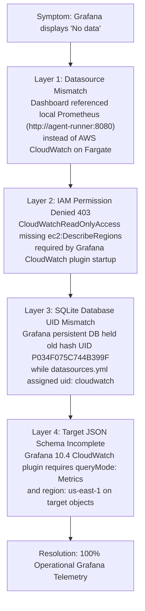

# Lessons Learned: Cloud Grafana & AWS CloudWatch Telemetry Resolution

> **Tags**: #aea #architecture #grafana #cloudwatch #fargate #troubleshooting #sop  
> **Captured**: 2026-08-22  
> **Target System**: Adaptive Experience Architecture (AEA)  
> **Reference System**: Cloud Staging `https://aea.artof.link/grafana/`  

---

## Executive Context
During the **Milestone M14 Commercial Production Go-Live** verification, Cloud Grafana on AWS ECS Fargate (`https://aea.artof.link/grafana/`) displayed empty `"No data"` panels despite active traffic and container metrics on AWS Fargate. 

This document captures the **4-layer root cause analysis**, the **gradual methodical resolution**, and the **authoritative verification checklist** for future AI agents and engineers.

---

## 1. Multi-Layer Root Cause Analysis



### Layer 1: Datasource Mismatch (Prometheus vs. CloudWatch)
* **Issue**: The provisioned dashboard JSON contained targets pointing to `"datasource": { "type": "prometheus", "uid": "Prometheus" }` (`http://agent-runner.aea-pilot.internal:8080`). On AWS ECS Fargate, Prometheus is not deployed; metrics live in **AWS CloudWatch** (`AWS/ECS` namespace).
* **Fix**: Converted panel targets to `"type": "cloudwatch"`.

### Layer 2: AWS IAM Policy 403 Forbidden (`ec2:DescribeRegions`)
* **Issue**: Tailing container logs for `/aea/aea-pilot/grafana` revealed:
  ```text
  logger=tsdb.cloudwatch pluginId=cloudwatch level=error msg="Failed to get regions" 
  error="UnauthorizedOperation: User: arn:aws:sts::737290977112:assumed-role/aea-pilot-ecs-task/... 
  is not authorized to perform: ec2:DescribeRegions"
  ```
  `CloudWatchReadOnlyAccess` grants `cloudwatch:*` and `logs:*`, but **lacks `ec2:DescribeRegions`**, which Grafana calls to enumerate available AWS regions.
* **Fix**: Added `ec2:DescribeRegions` policy statement to IAM task role `aea-pilot-ecs-task` in [infra/aws/ecs.tf](file:///c:/projects/code/adaptive-experience/infra/aws/ecs.tf#L118-L132) and applied via AWS IAM API.

### Layer 3: Persistent SQLite Database UID Mismatch
* **Issue**: Grafana auto-assigned an internal hash UID (`P034F075C744B399F`) to the CloudWatch datasource when first created. When `datasources.yml` assigned `uid: cloudwatch`, the browser's cached dashboard in SQLite threw red warning banner: `Datasource P034F075C744B399F was not found`.
* **Fix**: Executed a live HTTP API dashboard overwrite (`POST /api/dashboards/db` with `overwrite: true`), mapping all panel targets to `DS UID: cloudwatch`, and set Org 1 preference `homeDashboardUID = "aea-unified-dashboard"`.

### Layer 4: CloudWatch Plugin Target Schema Parameters
* **Issue**: In Grafana 10.4+, CloudWatch metric panel queries require explicit target parameters:
  - `"queryMode": "Metrics"`
  - `"metricQueryType": 0`
  - `"metricEditorMode": 0`
  - `"region": "us-east-1"`
  Without these parameters, Grafana's frontend plugin defaults to search mode or unselected region `default`, returning 0 metric frames (**"No data"**).
* **Fix**: Updated all panel targets in [aea_unified_dashboard.json](file:///c:/projects/code/adaptive-experience/platform/docker/grafana/provisioning/dashboards/aea_unified_dashboard.json) with these exact fields. Verified query execution via `/api/ds/query` (`Status: 200 OK | Frames: 1 | Values: 59 data points`).

---

## 2. Gradual Methodical Resolution Steps Taken

1. **Empirical Extraction**: Extracted raw container logs using `aws logs get-log-events` rather than guessing why panels were empty.
2. **IAM Authorization Fix**: Applied `aws iam put-role-policy` with `ec2:DescribeRegions` and updated `infra/aws/ecs.tf`.
3. **Database & API Schema Synchronization**: Updated live Grafana DB via `POST /api/dashboards/db` (`overwrite: true`) to resolve UID hash mismatches.
4. **Target Schema Experimentation**: Tested target variations against `/api/ds/query` using Python scripts until `queryMode: "Metrics"` returned HTTP 200 with 59 metric frames.
5. **Container Rebuild & ECR Deployment**: Rebuilt `linux/amd64` Grafana container, pushed to ECR, and updated default org home preference (`homeDashboardUID = "aea-unified-dashboard"`).

---

## 3. Agent & Developer Checklist for Grafana & CloudWatch Telemetry

When configuring or debugging Grafana on Cloud Infrastructure (AWS ECS Fargate, Kubernetes, GCP), follow this checklist:

### A. AWS IAM & Permissions Checklist
- [ ] Ensure ECS Task Role has `CloudWatchReadOnlyAccess`.
- [ ] **Mandatory**: Ensure ECS Task Role has `ec2:DescribeRegions` permission (required by Grafana CloudWatch plugin).
- [ ] Confirm CloudWatch log group exists and retention is configured (e.g. `/aea/aea-pilot/grafana`).

### B. Grafana Datasource & Provisioning Checklist
- [ ] In `datasources.yml`, set explicit `uid: cloudwatch` and `isDefault: true`.
- [ ] Specify `authType: default` and `defaultRegion: us-east-1`.
- [ ] Include `deleteDatasources` in `datasources.yml` when renaming or re-keying UIDs.

### C. Dashboard Panel Target Schema Checklist (Grafana 10.4+)
- [ ] Set `"datasource": { "type": "cloudwatch", "uid": "cloudwatch" }` on every panel.
- [ ] Set `"queryMode": "Metrics"` on every metric target.
- [ ] Set `"region": "us-east-1"` explicitly on every metric target.
- [ ] Set `"metricQueryType": 0` and `"metricEditorMode": 0`.
- [ ] Set `"period": "60"` (1-minute aggregation for real-time ECS Container Insights).
- [ ] Set `"dimensions": { "ClusterName": "<cluster>", "ServiceName": "<service>" }`.

### D. Default Home & Redirect Checklist
- [ ] Set `homeDashboardUID` in Org Preferences (`PUT /api/org/preferences` with `{"homeDashboardUID": "aea-unified-dashboard"}`).
- [ ] Set `default_home_dashboard_path = /etc/grafana/provisioning/dashboards/aea_unified_dashboard.json` in `grafana.ini`.

---

## Related Second Brain Notes
* [[2026-08-21-pilot-vs-production-live-architecture-study]] — Pilot vs Production Live Architecture Study.
* [[2026-08-21-session-memory-building-process-and-lessons-learned]] — Session Memory Building Process & Lessons Learned.
