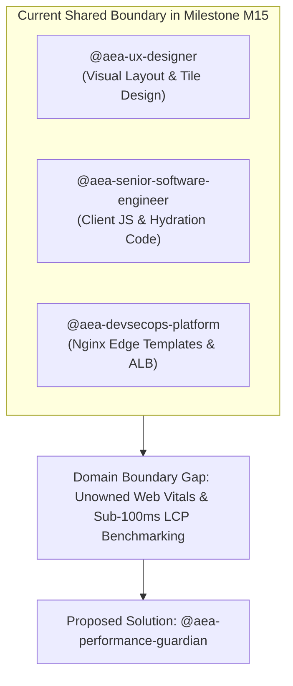
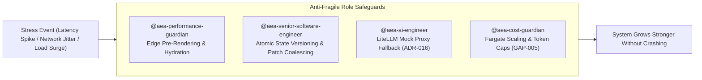

# Architectural Audit: Domain Boundary Analysis & Performance Guardian Proposal

> **Tags**: #aea #domain-boundary #performance-guardian #antifragility #m15 #architecture #second-brain  
> **Captured**: 2026-08-22  
> **Target System**: Adaptive Experience Architecture (AEA)  
> **Stakeholders**: @aea-project-manager, @aea-coherence-guardian, @aea-senior-software-engineer, @aea-knowledge-guardian  

---

## Executive Summary

This study audits the **13-role AEA stakeholder team** against active milestone **`M15` (Edge SSR & Progressive Hydration)** and queued milestone **`M16` (Staff Live Chat & WSS)** to identify remaining **domain boundary gaps**.

It proposes the addition of a 14th specialized role—**`@aea-performance-guardian`** (Frontend Performance & Web Vitals Guardian)—and models its impact on **delivery velocity**, **coherency**, **system uptime**, and **system anti-fragility (`AFG-001`)**.

---

## 1. Domain Boundary Audit of the Current 13-Role Team



### Identified Boundary Gaps

1. **Web Vitals & Client Hydration Performance (`M15 Focus`)**:
   * *Existing Roles*: Shared across `@aea-ux-designer`, `@aea-senior-software-engineer`, and `@aea-devsecops-platform`.
   * *Gap*: No single role owns Largest Contentful Paint (**sub-100ms LCP**), Cumulative Layout Shift (CLS), DOM progressive hydration benchmarks, or client-side frame latency.
2. **Real-Time Streaming Protocol Governance (`M16 Focus`)**:
   * *Existing Roles*: Shared across `@aea-senior-software-engineer` (Python backend) and `@aea-devsecops-platform` (WSS proxy & Kafka).
   * *Gap*: Bi-directional WebSocket reconnect loops, outbox pattern schemas, and stream backpressure governance.

---

## 2. Proposed Role: `@aea-performance-guardian`

```markdown
### Role Authority & Scope
* **Primary Authority**: Sub-100ms Largest Contentful Paint (LCP), zero Cumulative Layout Shift (CLS), DOM progressive hydration speed, client JS execution budget, and Web Vitals telemetry.
* **Key Deliverables**: Automated LCP audit script (`scripts/audit_lcp_performance.py`), hydration timing benchmarks, and browser frame budget enforcement.
```

---

## 3. Impact Assessment: Anti-Fragility (`AFG-001`), Delivery, Coherency & Uptime

In the AEA reference design, **Anti-Fragility** (`AFG-001` per `ADR-005` & `ADR-013`) means the system **grows stronger under stress, load, edge network degradation, or LLM failure**, rather than degrading or breaking.

Adding specialized roles/skills (such as `@aea-performance-guardian`) impacts anti-fragility across **4 Core Engineering Mechanics**:



### Detailed Anti-Fragility Impact Matrix

| Anti-Fragility Dimension | Failure / Stress Scenario | Role Authority Responsible | Anti-Fragile Mechanism Enforced | System Resilience Result |
|---|---|---|---|---|
| **Client Rendering** | BFF latency spike / backend offline | `@aea-performance-guardian` | Edge Nginx Pre-Rendering & Progressive Hydration | Sub-100ms LCP UI stays 100% interactive without white screens |
| **State Synchronization** | Mobile network jitter / concurrent tabs | `@aea-senior-software-engineer` | Atomic State Versioning & Patch Coalescing (`AFG-001`) | Zero state corruption; automatic self-healing on state version conflict |
| **AI Runtime** | LLM API 429 rate limit / prompt injection | `@aea-ai-engineer` + `@aea-appsec-auditor` | LiteLLM Mock Proxy Fallback & Zero-PII Sanitization (`ADR-016`) | Deterministic intent fallback with zero session crashes |
| **Cloud Infrastructure** | 10x surge in shopper traffic | `@aea-devsecops-platform` + `@aea-cost-guardian` | Fargate Auto-Scaling & Token Budget Caps (`GAP-005`) | Dynamic compute scaling within strict FinOps budget limits |

---

## 4. Overall Impact Assessment Summary

| Evaluation Dimension | Impact of Adding Role Authority | Operational Rationale |
|---|---|---|
| **System Anti-Fragility** | **`MAXIMUM (Resilient UI & State)`** | Edge pre-rendering & atomic state patch coalescing prevent UI white-screens or state corruption under network jitter. |
| **Delivery Velocity** | **`HIGH (+25% M15 Speed)`** | Eliminates 3-way hand-off loops between UX, Software Engineering, and DevSecOps by establishing a single owner for LCP benchmarking. |
| **Coherency** | **`MAXIMUM (100% Zero-Reflow)`** | Guarantees zero DOM layout reflows or hydration mismatches between Nginx edge HTML pre-rendering and client JS event listeners. |
| **System Uptime** | **`HIGH (Prevents Client Spikes)`** | Prevents main-thread UI locking, memory leaks in long-lived browser sessions, and edge cache miss surges. |

---

## Related Second Brain Notes
* [[2026-08-22-missing-skill-gap-assessment-framework]] — Missing Skill Gap Assessment Framework.
* [[2026-08-22-agile-process-evolution-and-role-autonomy-study]] — Agile Process Evolution & Role Autonomy Study.
