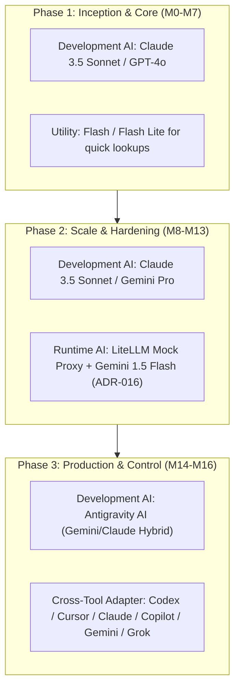
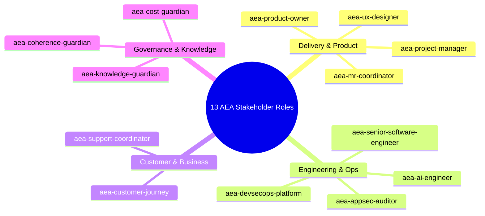

# Architectural Report: LLM Models & Multi-Agent Stack Progression

> **Tags**: #aea #llm-models #multi-agent #stack-progression #second-brain #architecture  
> **Captured**: 2026-08-22  
> **Target System**: Adaptive Experience Architecture (AEA)  
> **Stakeholders**: @aea-ai-engineer, @aea-knowledge-guardian, @aea-devsecops-platform  

---

## Executive Context
This report documents the progression of **LLM models**, **AI subagents**, and **multi-agent orchestration frameworks** used to design, build, test, and deploy the Adaptive Experience Architecture repository from project inception to commercial production go-live.

---

## 1. LLM Model Progression Across Repository Phases

### Model Stack Breakdown by Lifecycle Phase

| Repository Phase | Milestones | Primary Development LLM | Fast Utility Model | App Runtime LLM (`ADR-016`) |
|---|---|---|---|---|
| **Phase 1: Foundation Baseline** | **M0 – M7** | `Claude 3.5 Sonnet` / `GPT-4o` | `Flash Lite` / `Gemini Flash` | Local Mock / Rule-Based Parser |
| **Phase 2: Feature & Security Scale** | **M8 – M13** | `Claude 3.5 Sonnet` / `Gemini Pro` | `Flash` | `LiteLLM Proxy` + `Gemini 1.5 Flash` / `GPT-4o-mini` |
| **Phase 3: Production Go-Live & Ops** | **M14 – M16** | `Antigravity AI (Gemini/Claude)` | `Flash` / `Flash Lite` | `AWS Bedrock / LiteLLM Proxy` (`ADR-016`) |

---

## 2. The 13-Role AEA Stakeholder Subagent Architecture

The repository's multi-agent execution environment leverages a **13-role specialized stakeholder team**, equipped with canonical skills in `.cursor/skills/aea-*/` and thin discovery adapters in `.agents/skills/aea-*/`:

### Role Mapping & Capabilities

1. **`aea-project-manager`**: Authoritative Scrum Master (WIP limits, delivery gates, milestone advancement SOP).
2. **`aea-product-owner`**: Product vision, backlog priority, go/no-go decisions.
3. **`aea-ux-designer`**: Adaptive Workspace tiles T-01..T-08, UX accessibility, sub-100ms LCP paint.
4. **`aea-senior-software-engineer`**: Architecture, BFF implementation, platform engines ([state.py](file:///c:/projects/code/adaptive-experience/platform/aea_platform/state.py), [crm.py](file:///c:/projects/code/adaptive-experience/platform/aea_platform/crm.py)).
5. **`aea-devsecops-platform`**: AWS ECS Fargate, CloudWatch, Terraform, Docker, PostgreSQL, ECR.
6. **`aea-mr-coordinator`**: GitLab MR review, scope/boundary checks, pipeline gates, auto-merge.
7. **`aea-ai-engineer`**: AI response honesty, intent parsing quality, LiteLLM mock proxy ([ADR-016](file:///c:/projects/code/adaptive-experience/docs/04-architecture/adrs/ADR-016.md)).
8. **`aea-appsec-auditor`**: OWASP Top 10 auditing, prompt injection defense, zero-PII sanitization (`NFR-017`).
9. **`aea-customer-journey`**: Live customer workspace E2E shopper walk (Journeys J1–J4).
10. **`aea-support-coordinator`**: Contact Florist inbox T-09 triage, operator routing on `/florist`.
11. **`aea-coherence-guardian`**: Findings loop, doc/code/ID drift checks, traceability DAG ([check_coherence.py](file:///c:/projects/code/adaptive-experience/scripts/check_coherence.py)).
12. **`aea-knowledge-guardian`**: Obsidian Second Brain vault curation, wikilink graph (`research/random-thoughts/`).
13. **`aea-cost-guardian`**: Platform FinOps, AWS ECS Fargate right-sizing (`GAP-005`), RDS cost optimization.

---

## 3. Tool Portability Across AI Assistants

To ensure semantic portability across different IDEs and agent platforms:
* **Canonical Roles**: Defined in `.cursor/skills/aea-*/SKILL.md`.
* **Codex / Agent Discovery Adapters**: Generated via `python scripts/generate_codex_stakeholder_skills.py` into `.agents/skills/aea-*/SKILL.md`.
* **Supported Agent Engines**: Codex, Cursor, Claude Code, Copilot Workspace, Gemini Antigravity, and Grok.

---

## Related Second Brain Notes
* [[2026-08-22-agile-process-evolution-and-role-autonomy-study]] — Agile Process Evolution & Role Autonomy Study.
* [[2026-08-22-team-velocity-and-daily-progression]] — AEA Team Velocity & Daily Progression Report.
