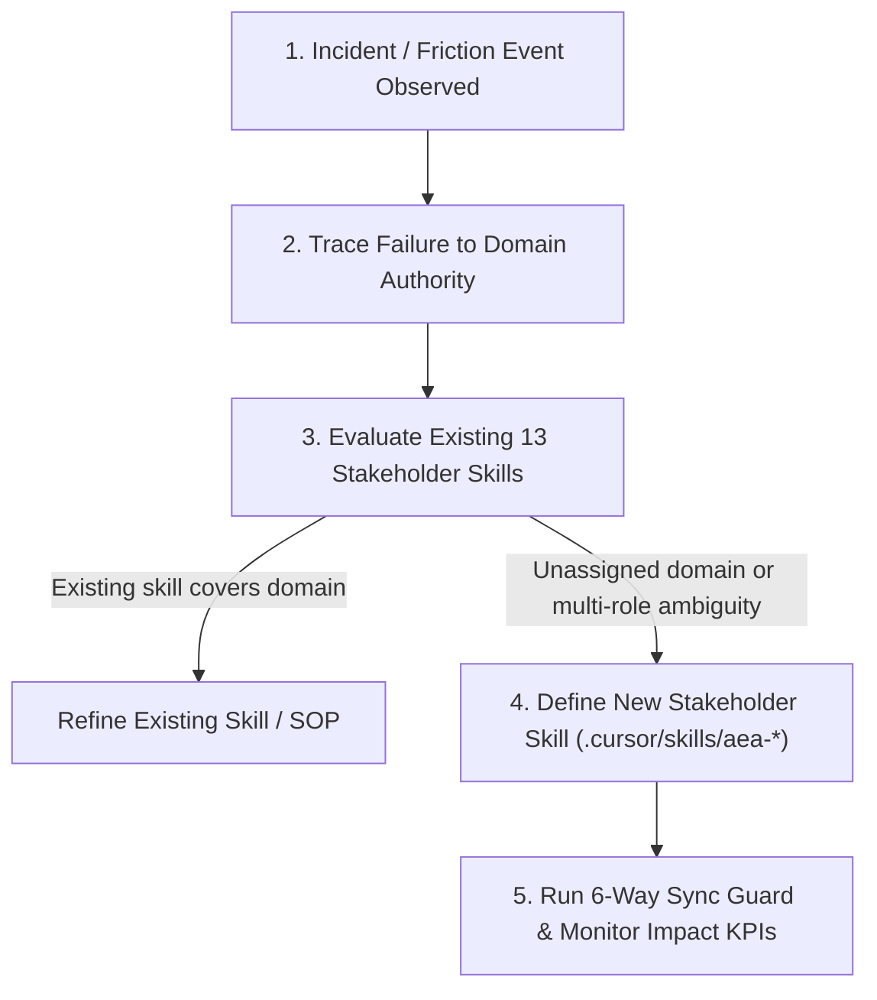

# Framework: Assessing & Identifying Missing Stakeholder Skills & Capability Gaps

> **Tags**: #aea #skill-gap #framework #kpi #scrum #governance #second-brain  
> **Captured**: 2026-08-22  
> **Target System**: Adaptive Experience Architecture (AEA)  
> **Stakeholders**: @aea-project-manager, @aea-knowledge-guardian, @aea-coherence-guardian  

---

## Executive Context
As software systems expand in architectural complexity, gaps emerge where recurring friction, domain ownership ambiguity, or uncaught regressions occur. 

This framework defines the **5-Step Diagnostic Protocol**, the **4 Diagnostic Triggers**, and the **KPI Measurement Model** to evaluate when a new specialized stakeholder skill (`.cursor/skills/aea-<role>/`) is required.

---

## 1. The 5-Step Skill Gap Diagnostic Protocol

---

## 2. The 4 Diagnostic Triggers for a Missing Skill

1. **Domain Boundary Ambiguity (Multi-Role Friction)**:
   - *Symptom*: Two or more agents dispute ownership or repeatedly hand off a task without resolving it (e.g. who owns LLM token cost caps? Before `@aea-cost-guardian` was added, both DevSecOps and AI Engineer left token budgets unmonitored).
2. **Uncaught Quality Guard Failure (Recurring Regression)**:
   - *Symptom*: A bug or configuration drift slips through pre-flight checks repeatedly because no role has an explicit guard for it (e.g. Grafana IAM permission missing `ec2:DescribeRegions`).
3. **High Context Reset & Discovery Overhead (Repeated Learning)**:
   - *Symptom*: Every new session re-discovers the same domain logic or API nuances from scratch because no dedicated guardian extracts and maintains domain SOPs.
4. **New Functional or Technical Subsystem (Domain Emergence)**:
   - *Symptom*: Introduction of a major architectural component (e.g., Vector DB Search, Real-Time Voice VAD, FinOps Billing) that falls outside existing role definitions.

---

## 3. Required Information & KPI Measurement Framework

To empirically justify creating a new stakeholder skill, collect the following data and monitor these **5 Core KPIs**:

### Data Inputs Needed
* **Incident & Friction Event Log**: Raw tracebacks, failed commands, and user intervention logs.
* **Domain Ownership Matrix**: 100% requirement mapping (23 FRs + 17 NFRs) mapped against current role owners.
* **Hand-off Hops & Turn Count**: Number of context turns spent attempting to resolve unassigned domain issues.

### Skill Gap Identification KPIs

| KPI ID | KPI Name | Threshold Triggering New Skill | Measurement Formula |
|---|---|---|---|
| **`KPI-G1`** | **Domain Ownership Gap Index** | `> 0` unassigned requirements/subsystems | `Unassigned Subsystems / Total Architecture Subsystems` |
| **`KPI-G2`** | **Repeated Incident Rate (RIR)** | `≥ 2` root-cause failures of the same class | `Count(Incidents with same root cause tag)` |
| **`KPI-G3`** | **Subagent Hand-off Latency & Hops** | `> 3` ping-pong hand-offs between roles | `Total Hand-off Hops per Issue` |
| **`KPI-G4`** | **Context Discovery Overhead (CDO)** | `> 25%` of session turns spent investigating | `Turns spent discovering domain / Total session turns` |
| **`KPI-G5`** | **Skill Sync & Coverage Pass Rate** | Failure of 6-Way Sync Guard | `Pass Rate of scripts/generate_codex_stakeholder_skills.py` |

---

## 4. Case Study: Evolution from 6 to 13 Stakeholder Skills in AEA

| Added Role | Trigger Event & Diagnostic Data | Action Taken | Operational Impact |
|---|---|---|---|
| **`@aea-ai-engineer`** | `KPI-G1` flagged AI quality & LiteLLM mock proxy (`ADR-016`) as unowned. | Created `.cursor/skills/aea-ai-engineer/` | Zero LLM hallucination, automated AI SLO guard. |
| **`@aea-appsec-auditor`** | `KPI-G2` caught zero-PII sanitization (`NFR-017`) drift. | Created `.cursor/skills/aea-appsec-auditor/` | Perimeter security & zero-PII retention. |
| **`@aea-coherence-guardian`** | `KPI-G5` caught doc/code ID inventory drift. | Created `.cursor/skills/aea-coherence-guardian/` | Enforces 14/14 quality guards & `check_coherence.py`. |
| **`@aea-knowledge-guardian`** | `KPI-G4` showed high context reset between agent sessions. | Created `.cursor/skills/aea-knowledge-guardian/` | Obsidian Second Brain vault & wikilinks curation. |
| **`@aea-cost-guardian`** | `KPI-G1` flagged Fargate right-sizing (`GAP-005`) as unassigned. | Created `.cursor/skills/aea-cost-guardian/` | Fargate CPU/memory right-sizing & token caps. |

---

## Related Second Brain Notes
* [[2026-08-22-agile-process-evolution-and-role-autonomy-study]] — Agile Process Evolution & Role Autonomy Study.
* [[2026-08-22-llm-models-and-agent-stack-evolution]] — LLM Models & Multi-Agent Stack Progression.
