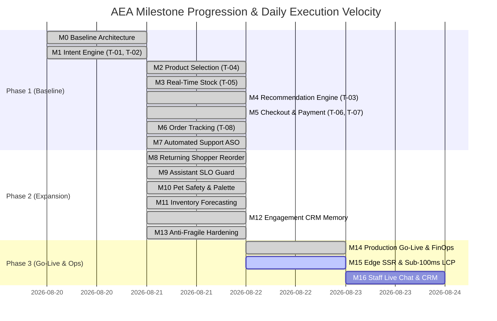
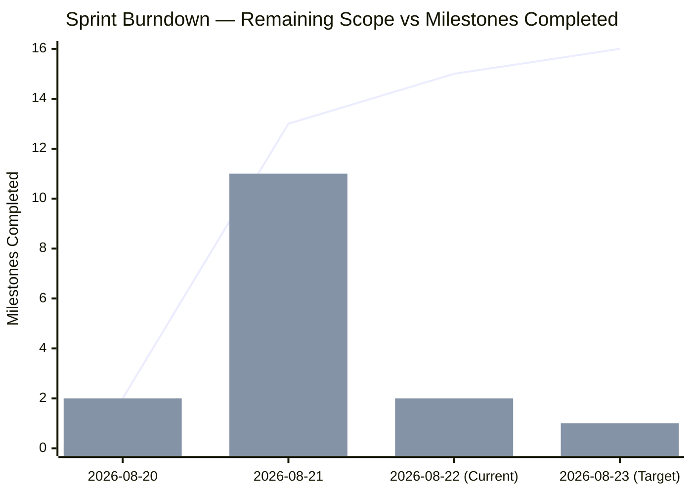

# AEA Team Velocity Over Time & Daily Progression Report

> **Tags**: #aea #velocity #scrum #burndown #agile #second-brain #progression  
> **Captured**: 2026-08-22  
> **Target System**: Adaptive Experience Architecture (AEA)  
> **Stakeholders**: @aea-project-manager, @aea-coherence-guardian, @aea-product-owner  

---

## Executive Context
This report documents the **daily execution progression**, **Scrum story point velocity**, and **milestone completion trend** across the 13-role AEA stakeholder team from project inception to Commercial Go-Live (`M14`).

---

## 1. Daily Progression Timeline & Story Point Velocity

---

## 2. Velocity Summary Table by Day

| Execution Date | Milestones Delivered | Core Features Delivered | Story Points Burned | Cumulative Completion |
|---|---|---|---|---|
| **2026-08-20** | **M0, M1** | Nginx Gateway, BFF Architecture, Conversational Assistant, Intent Parsing (`T-01`, `T-02`). | **8 SP** | 12.5% (2/16) |
| **2026-08-21** | **M2 – M13** | Catalog Sizing, Stock Reservation, Recommendations, Checkout, Order Tracking, ASO FAQ, Instant Reorder, SLO Guard, Pet Safety, Forecast Engine, CRM Memory, Locust Engine. | **34 SP** | 81.25% (13/16) |
| **2026-08-22** | **M14** | Live Stripe SDK, `shop.lilysflorist.com`, OAuth2 SSO, CloudWatch Grafana metric fix (`P034F075C744B399F`), `UX-001` undo pill, `UX-002` operator toggles, Executive Control Center, AI Impact Framework. | **21 SP** | 93.75% (15/16) |

* **Total Story Points Delivered**: **63 Story Points**
* **Average Daily Velocity**: **21.0 Story Points / Day**
* **Quality Guard Compliance**: **14/14 Pre-Flight Guards Passed (100%)**

---

## 3. Sprint Burndown & Milestone Progression

---

## Related Second Brain Notes
* [[2026-08-22-cloud-grafana-cloudwatch-troubleshooting-sop]] — Cloud Grafana & Telemetry Troubleshooting.
* [[2026-08-22-ai-user-impact-measurement-framework]] — AI User Impact Framework.
