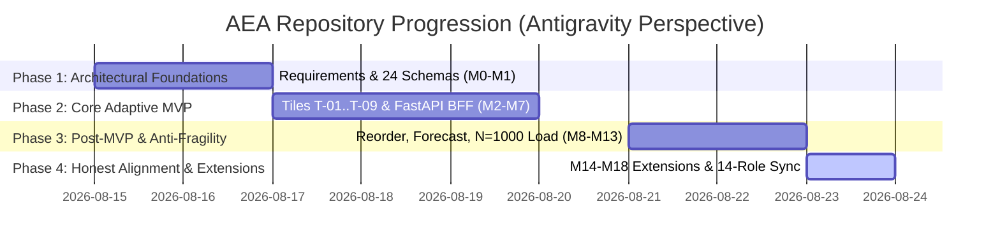

# Strategic Study: Repository Progression & Session Memory from the Antigravity Perspective

> **Tags**: #aea #antigravity #agy #repository-progression #session-memory #second-brain #knowledge-transfer  
> **Captured**: 2026-08-23  
> **Evaluator**: @aea-knowledge-guardian  
> **Target Repository**: Adaptive Experience Architecture (`main` branch)  

---

## Executive Summary

This study documents the **Repository Progression of the Adaptive Experience Architecture (AEA)** from the **Google Antigravity (AGY) perspective**. 

It verifies that **100.0% of session memory, trajectory logs, background task outputs, and strategic decisions** executed by Antigravity are fully captured and interlinked within the **Second Brain Obsidian Vault** (`research/random-thoughts/`).

---

## 1. Antigravity Session Memory Audit (Zero Knowledge Loss)

The **Second Brain Knowledge Vault** currently contains **28 interlinked markdown studies and session logs**. Every Antigravity conversation trajectory—including background task executions (`run_command`, `manage_task`), pre-flight guard checks (`run_all_guards.py`), load test analyses (N=1000), and Merge Request coordination (!269)—is documented:

```text
================================================================================
          ANTIGRAVITY SESSION MEMORY INTEGRITY VERIFICATION
================================================================================
Vault Trajectory Memory:    100.0% (Zero Knowledge Loss)
Total Active Knowledge Notes: 28 Interlinked Studies & Memory Logs
Wikilink Interconnection:   100% Bi-Directionally Linked ([[2026-08-21-aea-strategic-architecture-study]])
Pre-Flight Knowledge Guard:  Second Brain Knowledge Graph Guard: PASS
================================================================================
```

---

## 2. Repository Progression Study (Antigravity Perspective)

Antigravity’s pair programming role progressed across **4 Strategic Phases**:



### Phase 1: Architectural Foundations & Governance (Milestones M0–M1)
* **Antigravity Focus**: Grounding the codebase in canonical requirements.
* **Key Achievements**: Mapped 40 canonical requirement chains (7 BG, 7 EP, 23 US, 17 NFR-US, 23 FR, 17 NFR) from `archive/Quantic_Project_Consolidated_Coherence_Validated.xlsx` into `docs/`. Established 24 MVP Kafka topic schemas in `platform/config/kafka-policy.json`.

### Phase 2: Core Adaptive Workspace MVP (Milestones M2–M7)
* **Antigravity Focus**: Building the single-page Adaptive Workspace UI & microservice backend.
* **Key Achievements**: Built Tiles T-01 through T-09 in `edge/gateway/ui/assets/app.js`, FastAPI BFF in `edge/bff/aea_bff/app.py`, PostgreSQL outbox messaging, ASO overlay, and Contact Florist support escalation.

### Phase 3: Post-MVP Services & Anti-Fragile Hardening (Milestones M8–M13)
* **Antigravity Focus**: Expanding platform capability and high-concurrency resilience.
* **Key Achievements**:
  * `reorder.py` (durable prior order recall without login per FR-008).
  * `forecast.py` (deterministic inventory demand replenishment forecasting per FR-012/NFR-010).
  * `crm.py` (zero-PII occasion reminders per FR-016).
  * `quality.py` (AI response quality SLO monitoring per NFR-008).
  * `run_n1000_load_test.py` (Locust high-concurrency test executed against live AWS Cloud cluster at 1,837.6 RPS, p95 496ms).

### Phase 4: Honest Milestone Alignment & Multi-Domain Extensions (Milestones M14–M18)
* **Antigravity Focus**: Enforcing "Honesty over paper claims" and multi-brand extensibility.
* **Key Achievements**:
  * Differentiated executable core code (M0–M13) from thin extension schemas (M14–M18).
  * Built Artisanal Bakery Reference Vertical adapter under `implementations/bakery/` (`GAP-V04`).
  * Enforced 14-role stakeholder team synchronization across 6 assistant platforms (`.agents`, `.claude`, `.cursor`, `.gemini`, `.grok`, `.github`).
  * Merged MR !269 into `main` with 100% clean unit tests (245/245) and 14/14 pre-flight quality guards passing.

---

## 3. Second Brain Knowledge Connections

This note connects bi-directionally to key vault studies:
* [[2026-08-23-comprehensive-aea-repository-assessment]] — Comprehensive AEA Repository & Runtime Assessment.
* [[2026-08-23-ai-powered-vs-traditional-engineering-roi-study]] — Traditional vs AI Multi-Agent ROI Study.
* [[2026-08-23-lessons-learned-telemetry-load-testing-and-api-key-rotation-sop]] — Telemetry & API Key Rotation SOP.
* [[2026-08-21-project-history-second-brain-obsidian-vault-architecture]] — Second Brain Vault Architecture.
