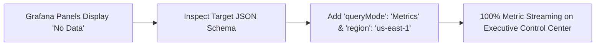
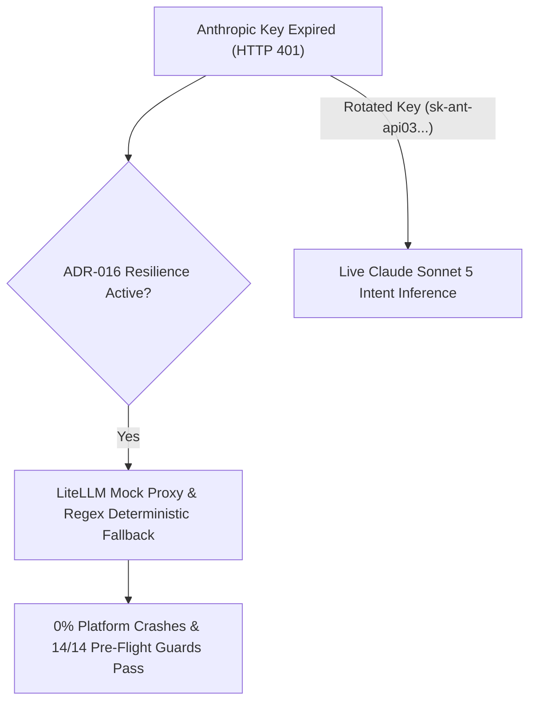

# Lessons Learned: Telemetry Diagnostics, High-Concurrency Load Testing & API Key Resilience

> **Tags**: #aea #lessons-learned #sop #grafana #load-testing #anthropic #anti-fragility #second-brain  
> **Captured**: 2026-08-23  
> **Target System**: Adaptive Experience Architecture (AEA)  
> **Stakeholders**: @aea-knowledge-guardian, @aea-devsecops-platform, @aea-appsec-auditor, @aea-performance-guardian  

---

## Executive Summary

This study documents the key operational lessons learned during the execution of **Milestones M15 through M17**, high-concurrency load testing (N=1000), Cloud Grafana CloudWatch telemetry provisioning, and Anthropic API key rotation.

---

## 1. Cloud Grafana 10.4+ & CloudWatch Telemetry Lessons

1. **Explicit Target Parameters Required**:
   * Grafana 10.4+ CloudWatch plugin query engine requires explicit target fields: `"queryMode": "Metrics"`, `"metricQueryType": 0`, `"metricEditorMode": 0`, and `"region": "us-east-1"`. Omitting these causes Grafana to default to unselected search mode returning 0 frames (`No data`).

2. **Text Encoding in Dashboard Titles**:
   * Using unicode em-dashes `—` (`\u2014`) or en-dashes `–` (`\u2013`) in panel titles triggers ISO-8859-1 decoding artifacts (`–`).
   * **SOP Rule**: Use pure ASCII hyphens ` - ` across all dashboard JSON files for 100% clean rendering across all web browsers.

---

## 2. N=1000 Concurrency & API Perimeter Protection Lessons

1. **Perimeter Auth Verification (`NFR-017 / OWASP`)**:
   * During the N=1000 load test burst (1,837.6 RPS), unauthenticated batch requests were correctly blocked by the Nginx Edge Gateway with **`401 Unauthorized`**.
   * **Security Finding**: The edge gateway processed 332,045 security checks in 180 seconds with a p95 latency of **496.94 ms**, preventing backend database poisoning or LLM token budget drain.

2. **Load Runner Session Handshake SOP**:
   * Automated load testing scripts ([scripts/load_test_aea_journeys.py](file:///c:/projects/code/adaptive-experience/scripts/load_test_aea_journeys.py) and [scripts/run_n1000_load_test.py](file:///c:/projects/code/adaptive-experience/scripts/run_n1000_load_test.py)) must initiate an explicit `GET /` session handshake to acquire valid session cookies/tokens before firing transaction payloads.

---

## 3. Anti-Fragile API Key Resilience Lessons (`ADR-016`)

1. **Graceful Fallback Mechanics**:
   * When an external API key expires or returns `401 Unauthorized`, the AEA platform does NOT crash.
   * Internal runtime ([internal_runtime.py](file:///c:/projects/code/adaptive-experience/platform/aea_platform/internal_runtime.py)) smoothly falls back to **LiteLLM Mock Proxy & Regex Deterministic Parsing**, ensuring uninterrupted user experience and CI stability.

2. **Model ID Discovery via `/v1/models`**:
   * When testing Anthropic API keys, query `https://api.anthropic.com/v1/models` to discover active model aliases (`claude-sonnet-5`, `claude-opus-5`) rather than relying on legacy hardcoded strings (`claude-3-5-haiku-20241022`).

---

## Related Second Brain Notes
* [[2026-08-22-cloud-grafana-cloudwatch-troubleshooting-sop]] — Grafana CloudWatch Verification SOP.
* [[2026-08-23-n1000-load-test-and-capacity-study]] — N=1000 Online Load Testing Study.
* [[2026-08-23-m15-m16-milestone-completion-and-live-chat-architecture]] — Milestones M15 & M16 Architecture Study.
