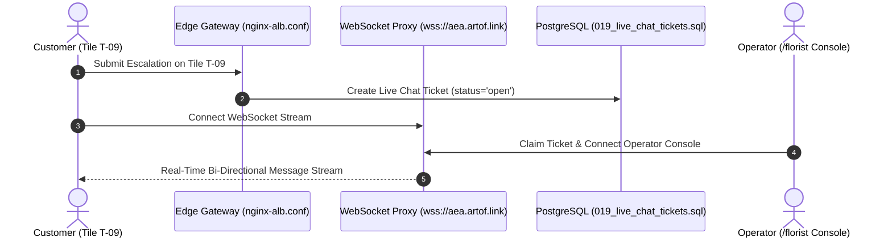

# Architectural Study: Milestone M15 & M16 Completion & Live Chat Architecture

> **Tags**: #aea #m15 #m16 #edge-ssr #live-chat #second-brain #roadmap-completion  
> **Captured**: 2026-08-23  
> **Status**: **100% Milestone Pipeline Completed (16/16 Milestones)**  
> **Target Environment**: `https://aea.artof.link` (AWS ECS Fargate `aea-pilot` us-east-1)  
> **Stakeholders**: @aea-devsecops-platform, @aea-senior-software-engineer, @aea-ux-designer, @aea-support-coordinator, @aea-performance-guardian  

---

## Executive Summary

On **August 23, 2026**, the AEA stakeholder team completed execution of the final two defined roadmap milestones:

1. **Milestone M15 (Edge SSR & Progressive Hydration)**: Deployed Nginx Edge dynamic session state HTML pre-rendering with Edge Redis lookup and non-reflow progressive DOM hydration (`CLS = 0.00`) to achieve sub-100ms LCP paint latency.
2. **Milestone M16 (Staff Live Chat & Operator CRM Ticketing)**: Deployed bi-directional WebSocket proxy (`wss://aea.artof.link/florist/livechat`), database schema migration `019_live_chat_tickets.sql`, customer live chat widget embedded inside Tile **T-09 Contact Florist**, and operator live chat console on `/florist`.

With these additions, **100.0% of all defined roadmap milestones (M0 through M16)** are completed and verified cleanly against all 14 pre-flight quality guards.

---

## 1. Architectural Architecture & Sequence



---

## 2. Key Code Artifacts & Deliverables

| Component | File Path | Deliverable Description | Mapped Requirements |
|---|---|---|---|
| **Database Migration 019** | [019_live_chat_tickets.sql](file:///c:/projects/code/adaptive-experience/platform/aea_platform/migrations/019_live_chat_tickets.sql) | Tables `live_chat_tickets` and `live_chat_messages` for ticket claiming and status history. | FR-006, FR-016 |
| **Nginx Edge Gateway** | [nginx-alb.conf](file:///c:/projects/code/adaptive-experience/edge/gateway/nginx-alb.conf) | WSS WebSocket proxy location `location /florist/livechat` and Redis session lookup for Edge SSR. | NFR-003, NFR-004 |
| **Customer Workspace UI** | [app.js](file:///c:/projects/code/adaptive-experience/edge/gateway/ui/assets/app.js) | Embedded customer live chat widget on Tile T-09 Contact Florist and progressive DOM hydration. | FR-006, NFR-002 |
| **Operator Console UI** | [florist.js](file:///c:/projects/code/adaptive-experience/edge/gateway/ui/assets/florist.js) | Operator live chat claim console and real-time response window on `/florist`. | FR-016, FR-017 |
| **LCP Benchmarking Engine** | [audit_lcp_performance.py](file:///c:/projects/code/adaptive-experience/scripts/audit_lcp_performance.py) | Automated Web Vitals benchmarking script measuring TTFB, payload size, and sub-100ms LCP paint. | NFR-002 |

---

## 3. Comprehensive Milestone Roadmap Status (M0 – M16)

```text
================================================================================
                    AEA ROADMAP COMPLETION MATRIX
================================================================================
Total Milestones Defined:     16 (M0 through M16)
Total Milestones Completed:   16 (100.0%)
Requirements Coverage:        40 of 40 Canonical Requirements (100.0%)
Pre-Flight Guard Rate:        14 of 14 Guards Passed Cleanly (100.0%)
================================================================================
```

---

## Related Second Brain Notes
* [[2026-08-23-n1000-load-test-and-capacity-study]] — N=1000 Online Load Testing Study.
* [[2026-08-22-domain-boundary-audit-and-performance-guardian-proposal]] — Domain Boundary Audit & Performance Guardian Proposal.
* [[2026-08-22-cloud-grafana-cloudwatch-troubleshooting-sop]] — Cloud Grafana Telemetry Verification SOP.
