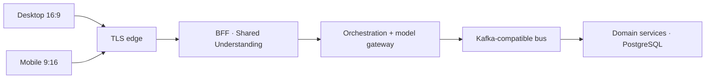
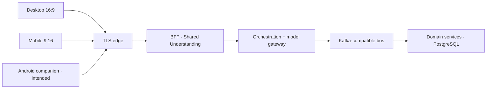

# Public /stack Path B HLD as-is and native to-be

> **Tags**: #aea #promote #second-brain #public-site
> **Captured**: 2026-08-31
> **Related**: #344

Sponsor asked to publish the Path B–lens framework HLD on architecture.artof.link/stack, including as-is and a native to-be, with state honesty, and to update the 2nd brain.

## Probe (31 Aug 2026, Europe/Berlin)

- Live `GET https://architecture.artof.link/stack` 200 before this MR: two-hostnames SVG + florist runtime prose. No Path B topology HLD. No native to-be.
- Builder `docs/framework/README.md`: mermaid fences are **not** rendered. Safe assets only (`png|jpg|jpeg|webp|svg|mp4|webm`). Public diagrams are SVG.
- #307 / !341 Phase 0 Android scaffold merged 30 Aug. That is git/CI evidence, **not** a live shop-client probe.
- #308 Firebase Crashlytics / App Distribution still **opened**.

## Honesty

- Payment mockup. Dual-viewport after CSS **Unknown**.
- Native is **not** in the live Path B stack. To-be is intended, not verified live.
- Play Store is out of Phase 0.
- No invented ALB / ECS / broker product names beyond public /stack (public HTTPS LB, containers for gateway/BFF/orchestration, managed PostgreSQL, Kafka-compatible bus, model gateway private).
- 3DX Lab out of Pages.

## Why SVG, not mermaid on Pages

`scripts/build_framework_site.py` does not render mermaid. Shipping fences would become paragraphs. Mermaid source is kept here so later agents do not rediscover the topology.

### As-is flow (mermaid source)

### To-be flow (mermaid source — intended)

## What this MR ships

Public `/stack` gains three allowlisted SVGs and honesty copy. Vault this note + daily-brief §3 wikilink. MRC hat merges. Implementer does not self-merge. Do not claim published until `GET https://architecture.artof.link/assets/path-b-hld-as-is.svg` is 200 after merge.
