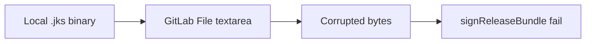
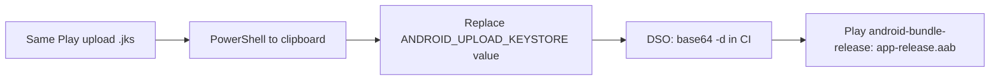

# GitLab File variable trap: Play upload keystore is not a JKS in the textarea

> **Tags**: #aea #second-brain #native-mobile #ci #secrets
> **Captured**: 2026-09-01
> **Owners**: `@aea-knowledge-guardian` with `@aea-devsecops-platform`
> **Traceability**: GitLab #351 (decode job), #347 (first `.aab`), #308 / #321 stay closed
> **Canvas (session UI only, not git)**: `issue-351-keystore-steps.canvas.tsx` beside chat

Inherits [[2026-08-29-native-mobile-companion-system-docs-and-toolkit]] and
[[2026-08-28-native-mobile-app-feasibility-and-devops-study]]. Native push
stays [[ADR-019]] (no FCM in this slice). Milestone label [[M19]].

## Why this note exists

Sponsor asked for diagrams of #351, then asked Knowledge Guardian to capture
that canvas in the Second Brain so later sessions do not depend on a Cursor
canvas file (those live outside git). This is operator knowledge. It is **not**
a promote into `docs/`. Do not reopen #308 or #321. Do not paste keystore
bytes, passwords, SHA-1, or `google-services.json` here.

Sponsor 2026-09-01: `ANDROID_UPLOAD_KEYSTORE` re-paste as base64 is **done**.
Firebase `GOOGLE_SERVICES_JSON` and Android-app API-key restrict (package
`link.artof.aea.companion` + SHA-1) are **already current**.

## What broke

GitLab **File** CI variables use a **Value textarea**, not a binary picker.
Pasting a raw `.jks` corrupts the bytes. Gradle then fails at
`:app:signReleaseBundle` with `DerInputStream.getLength(): lengthTag=98, too big`.
Evidence: `main` pipeline 1406, job 16221506091. No `app-release.aab` artifact.
First closed-track bundle stayed Unknown.

## Correct path

Use the **existing** Play App Signing upload keystore. Do not generate a
second key if Play already has one.

Sponsor encodes; DSO decodes in `android-bundle-release`. Success for #347 is
a job-produced `app-release.aab`. Play Console upload and tester install remain
later slices.

## Sponsor steps (names only)

1. PowerShell (not Command Prompt). Clipboard only — not chat:

   `[Convert]::ToBase64String([IO.File]::ReadAllBytes("C:\path\to\upload-keystore.jks")) | Set-Clipboard`

2. GitLab → Settings → CI/CD → Variables → **edit** `ANDROID_UPLOAD_KEYSTORE`
   (do not Add a second copy). Keep Type **File**, Protected on, Mask off.
   Select all in Value, paste, Save. A page refresh does not wipe other vars.

3. Leave sibling vars unless the alias is wrong. Typical alias name: `upload`.

4. Evidence sentence on #351: `re-pasted ANDROID_UPLOAD_KEYSTORE as base64 on DATE`.

5. After the DSO decode MR is on `main`, play the **manual** job
   `android-bundle-release`. Do not close #347 until that artifact exists.

## Four CI variable names

| Variable | Type | Notes |
|---|---|---|
| `ANDROID_UPLOAD_KEYSTORE` | File, protected | Base64 of the JKS after #351, not raw binary |
| `ANDROID_UPLOAD_KEYSTORE_PASSWORD` | Variable, protected, masked | Store password |
| `ANDROID_UPLOAD_KEY_ALIAS` | Variable, protected | Must match the keystore alias |
| `ANDROID_UPLOAD_KEY_PASSWORD` | Variable, protected, masked | Key password |

Do **not** recreate `GOOGLE_SERVICES_JSON` for this issue. Same paste-pattern
lesson as that File var, different secret.

## DSO remainder

Job must `base64 -d` `$ANDROID_UPLOAD_KEYSTORE` to a job-local `.jks`, point
Gradle `storeFile` there, never artifact or log the file. One MR, `Closes #351`.
MRC merges. Implementer does not merge. This vault note does **not** close #351.

Diagram-in-vault principle: [[2026-09-01-second-brain-diagram-clarity]].

## Do not claim

- Testers can install from the Play closed track.
- Play App Signing SHA-1 is in Firebase.
- Key rotate happened (#321 remainder was restrict + SHA-1 only).
- A Cursor canvas is shared memory — git `research/random-thoughts/` is.
