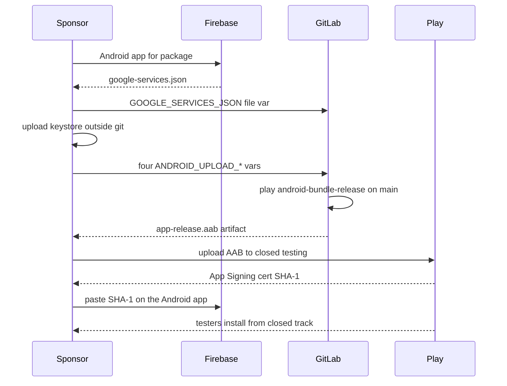

# Native Android app: setup and link operator runbook

> **Tags**: #aea #second-brain #native-mobile #m19
> **Captured**: 2026-09-01
> **Status**: operator memory — what was done vs what is still needed. Not a ship claim.
> **Does not replace**: [[2026-08-29-native-mobile-companion-system-docs-and-toolkit]] (architecture / Slice A–D plan) or `clients/mobile/android/README.md` (CI variable names).

Owner hats: `@aea-devsecops-platform` operates the link. Sponsor (human) pastes CI file vars and clicks Play Console. `@aea-knowledge-guardian` keeps this note honest. `@aea-mr-coordinator` merges the MR that lands it.

Public-safe: **names only**. No JSON, keystore bytes, passwords, or SHA-1 values. Do not paste those into issues, MRs, chat, or this vault.

Package: `link.artof.aea.companion`. Play display name: Lily's Florist Companion. Firebase project id: `aea-companion`. Do not reopen [#308](https://gitlab.com/artof-group/adaptive-experience-architecture/-/work_items/308). Do not reopen [#346](https://gitlab.com/artof-group/adaptive-experience-architecture/-/work_items/346) unless the sponsor asks (GitLab closed it when !365 merged even though that MR said Related, not Closes).

## Why this note

The 2026-08-29 companion note is the plan. The Android README names CI vars and still says some sponsor pastes are remaining. Those pastes happened on 2026-08-31. This note is the operator sequence: Firebase to GitLab to Play to signed `.aab` to Play App Signing SHA-1 back into Firebase to closed-track install.

First `.aab`, Play App Signing SHA-1 in Firebase, and install-from-track stay **Unknown** until each step has a live probe.

## Done (probed)

Dates are Europe/Berlin.

| When | What | Probe / note |
|---|---|---|
| 2026-08-31 | Google Play Developer account validated | Sponsor. Not a public-listing claim. |
| 2026-08-31 | Play Console Android app created | Package `link.artof.aea.companion`, name Lily's Florist Companion. Console UI for this sponsor is French. |
| 2026-08-31 | Closed-testing testers email list created | No `.aab` on the track yet. Testers cannot install. |
| 2026-08-31 | Firebase project `aea-companion` | Spark. Analytics off. Crashlytics / App Distribution Gradle plugins already wired ([#308](https://gitlab.com/artof-group/adaptive-experience-architecture/-/work_items/308) closed). No FCM / push (ADR-019). |
| 2026-08-31 | `GOOGLE_SERVICES_JSON` GitLab CI file var | Type File, Protected. Live file is not in git. Dummy `app/google-services.json.example` is. |
| 2026-08-31 | Upload keystore exists | Generated locally. Sponsor keeps a backup **outside the repo**. Alias name is `upload`. Never commit the JKS. |
| 2026-08-31 | Four GitLab CI vars pasted by sponsor | See table below. Do not re-create from an agent. |
| 2026-08-31 ~19:31 | !365 merged | Vault Slice D honesty. GitLab closed #346 anyway. |
| 2026-08-31 ~19:32 | !366 merged | `android-bundle-release` job on `main`. |
| 2026-09-01 ~07:54–08:02 | Manual `android-bundle-release` played on pipeline 1406 | Job [16221506091](https://gitlab.com/artof-group/adaptive-experience-architecture/-/jobs/16221506091) **failed** at `:app:signReleaseBundle` (keystore file not a readable JKS/PKCS12). No artifact. First `.aab` still Unknown. Follow-on: [#351](https://gitlab.com/artof-group/adaptive-experience-architecture/-/work_items/351). |

### GitLab CI variables (names and flags only)

Settings: CI/CD → Variables. This project's Variables UI is English. **Type File has no file picker** — GitLab still shows a Value textarea; paste the file contents there. CI sees a path in `$ANDROID_UPLOAD_KEYSTORE` / `$GOOGLE_SERVICES_JSON` and copies that path. **No base64 decode** in the job.

Leave **Allow merge request pipelines to access protected variables and runners** checked. **Minimum role to use pipeline variables** is No one allowed (pipeline variables ≠ CI/CD Variables; do not loosen).

| Key | Type | Protected | Masked | Expand | Scope |
|---|---|---|---|---|---|
| `GOOGLE_SERVICES_JSON` | File | yes | no (file) | off | `*` |
| `ANDROID_UPLOAD_KEYSTORE` | File | yes | no (file / binary) | off | `*` |
| `ANDROID_UPLOAD_KEYSTORE_PASSWORD` | Variable | yes | yes | off | `*` |
| `ANDROID_UPLOAD_KEY_ALIAS` | Variable | yes | no (alias too short to mask) | off | `*` |
| `ANDROID_UPLOAD_KEY_PASSWORD` | Variable | yes | yes | off | `*` |

README still lists the four `ANDROID_UPLOAD_*` pastes as a remaining sponsor step. They are **done** as of the 2026-08-31 probe. Do not paste them again.

Protected vars typically do **not** inject on unprotected MR source branches. Expect a real `.aab` from a `main` pipeline (push or web), then play the manual job. The job is omitted entirely when `$ANDROID_UPLOAD_KEYSTORE` is unset (not skip-green). `allow_failure: true`. It is not an MR gate.

Artifact when the job succeeds: `clients/mobile/android/app/build/outputs/bundle/release/app-release.aab` only. Never attach the keystore or `google-services.json`.

## Needed (not done)

1. **First signed `.aab`.** Play `android-bundle-release` on `main` and wait for success. In flight 2026-09-01 ~07:54 Berlin on [pipeline 1406](https://gitlab.com/artof-group/adaptive-experience-architecture/-/pipelines/2807961339) / [job 16221506091](https://gitlab.com/artof-group/adaptive-experience-architecture/-/jobs/16221506091). Until that probe is SUCCESS with an `app-release.aab` artifact, first bundle stays Unknown. [#347](https://gitlab.com/artof-group/adaptive-experience-architecture/-/work_items/347) stays open.
2. **Upload that `.aab` to Play closed testing.** Human in Play Console. Do not start this walk until the artifact exists. Not Production. No store listing.
3. **Play App Signing SHA-1 → Firebase Android app.** DSO waits for the first bundle. Copy from Play (App signing) into Firebase. Do not write the hash into git, issues, or this vault. Unknown until a tester can install.
4. **Testers install from the closed track.** Unknown until a human on the testers list actually installs.
5. **Unred `android-build-debug` on `main`.** Required job fails `:app:processDebugGoogleServices` because debug uses `applicationIdSuffix = ".debug"` and the live JSON has no client for `link.artof.aea.companion.debug`. Release processing does not use that suffix (job 16221506091 passed `processReleaseGoogleServices` while still running). Fix is [#348](https://gitlab.com/artof-group/adaptive-experience-architecture/-/work_items/348): drop the suffix, **or** add a Firebase Android app for the `.debug` package and paste an updated `GOOGLE_SERVICES_JSON`. Sponsor skipped that fork on 2026-08-31. Do not reopen #308.
6. **Optional, not redding main:** [#349](https://gitlab.com/artof-group/adaptive-experience-architecture/-/work_items/349) `git` missing in the stakeholder-cadence image (`allow_failure`).

## Operator gotchas

- Do not create CI/CD Variables from an agent. Sponsor pastes in the GitLab UI.
- File variables: Type = File, then paste into Value. There is no browse button.
- Same package name in Gradle `applicationId`, Play Console, and Firebase. The `.debug` suffix is a second package and needs a second Firebase client if kept.
- Dual-viewport / Play install / SHA-1 are Unknown until probed. Do not copy a claim from this note into a ship status.
- iOS is later (sponsor: Android first). Apple Developer Program is not this runbook.

## Pointers

- Plan: [[2026-08-29-native-mobile-companion-system-docs-and-toolkit]]
- Phase 0 CI: [[2026-08-29-m19-android-phase0-scaffold-and-ci-pipeline]]
- CI names: `clients/mobile/android/README.md`
- Bundle issue: [#347](https://gitlab.com/artof-group/adaptive-experience-architecture/-/work_items/347)
- Debug JSON mapping: [#348](https://gitlab.com/artof-group/adaptive-experience-architecture/-/work_items/348)
