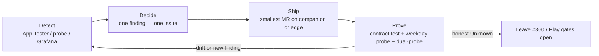

# Companion native↔web gap-closing loop

> **Tags**: #aea #companion #gap-loop #architecture-site #honesty #path-b #mobile #knowledge-first
> **Captured**: 2026-09-02
> **Public page**: [architecture.artof.link/companion](https://architecture.artof.link/companion) (`docs/framework/companion.md`)
> **Issues**: [#367](https://gitlab.com/artof-group/adaptive-experience-architecture/-/work_items/367) → [#368](https://gitlab.com/artof-group/adaptive-experience-architecture/-/work_items/368) → [#369](https://gitlab.com/artof-group/adaptive-experience-architecture/-/work_items/369); hygiene [#370](https://gitlab.com/artof-group/adaptive-experience-architecture/-/work_items/370); site [#371](https://gitlab.com/artof-group/adaptive-experience-architecture/-/work_items/371)
> **Honesty gate**: [#360](https://gitlab.com/artof-group/adaptive-experience-architecture/-/work_items/360) dual-probe still open
> **Related vault**: [[2026-09-02-android-companion-alpha-probe-mock-vs-bff]] · [[2026-09-02-companion-ux-online-validation-setup]] · [[2026-09-01-native-app-setup-and-link-runbook]]

## Why this note exists

Sponsor chat framed the Android app as a **thin live-BFF client** for the Need→Pick→Pay slice — not a full Adaptive Workspace port. After !376 / !379 / !380 the class of remaining risk is **native↔web contract drift** (totals, cookies, headers, probes), not “is there a BFF client at all?”. This note captures the **detect → decide → ship → prove** loop so agents do not recreate #367–#371 or over-claim.

## Loop diagram



ASCII twin (for contexts without Mermaid):

```
  DETECT ──► DECIDE ──► SHIP ──► PROVE ──┐
    ▲           │ one finding              │
    │           │ one issue                │
    └───────────┴── parity drift / new bug ┘
                         │
                         └── honest Unknown stays Unknown (#360, Play ≠ App Dist)
```

## Infra / process summary (sponsor chat)

| Pillar | Practice |
|--------|----------|
| **Thin client** | Companion reuses Path B Edge BFF (`https://aea.artof.link`): cookie jar + `X-CSRF-Token`, conversation/selection/delivery/order/checkout. No separate native backend. |
| **Same contracts as web** | Checkout `observed_total` must match workspace `order_summary.total` (web `confirmAndPay`). Start Over must clear `__Host-aea_*` before `createSession`. |
| **Gap loop** | Manual App Tester findings become sequenced MVP issues; automate **detection** next (tests → client label → weekday API probe). |
| **Observability split** | Today native and web share public Bearer `local-browser-token`. Add `X-AEA-Client` for Grafana series — not for auth. |
| **Distribution honesty** | Firebase App Distribution / debug APK = fast UX loop. **Play internal** = store-install honesty gate. |
| **Operator honesty** | T-09 Lily's Florist Operator sample inbox ≠ live atelier orders / CRM. Probe green ≠ operator write-through. |
| **Public story** | `/companion` on architecture.artof.link explains thin client + loop; Path B shop stays at aea.artof.link. |
| **Issue hygiene** | Retitle/close stale companion titles when reality moved (!376+); keep #360 until sponsor dual-probe. |

## Native vs web gap table

| Dimension | Web (Path B workspace) | Native companion (thin client) | Gap / probe |
|-----------|------------------------|--------------------------------|-------------|
| Surface | Full Adaptive Workspace + dual-viewport intent | Need → Pick → Pay (+ Tracking UI) slice | By design — not a port |
| Session | Browser cookies `__Host-aea_*` + CSRF | OkHttp cookie jar + CSRF (`BffClient`) | Start Over must clear jar (!380) |
| Auth label | Public browser Bearer (shared) + `X-AEA-Client: web` | Same Bearer + `X-AEA-Client: companion-android` | `#368` landed (header+logs); Grafana panel **partial** |
| Catalog | Live recommendations / workspace facets | May fall back to local list; selection still POSTs BFF | Sold-out fail-closed; do not claim full catalog parity |
| Checkout total | `order_summary.total` (product + delivery fee, e.g. +$12) | Must post same `observed_total` (!379) | `#367` contract tests |
| Confirm UX | Web `confirmAndPay` | Companion Pay Confirm | Product+$12 confirmed on live BFF path |
| SSE / tiles | Workspace topic bus / tiles | Not in thin client MVP | Out of companion scope |
| Contact Florist | Gated support in shop journeys | Not claimed from companion alpha | Dual-probe / product later |
| Operator / website write-through | Intended after order/checkout | **Unknown** until sponsor dual-probe | **`#360` still gate** |
| Metrics | Grafana via edge; `aea_client` in BFF/nginx logs | Same log field from companion header | `#368` partial (no as-code request panel) |
| Distribution | N/A (web) | App Dist ≠ Play internal ≠ production | Honesty section below |
| Parity automation | Golden web fixtures | FakeBffClient / recorded JSON | `#367` then `#369` weekday probe |

### Journey × capability matrix (living)

| Step | Web capability | Native status (post-!376/!379/!380) | Probe |
|------|----------------|--------------------------------------|-------|
| Need | Conversation + shared-understanding occasion | Live BFF `message_text`; Mom-only mock removed | App Tester + `#367` fixtures |
| Pick | Selection + catalog facets | Live selection POST; catalog may local-fallback | Sold-out fail-closed |
| Pay | Delivery fee → `order_summary.total` → checkout | Totals + back-nav + Start Over cookies shipped | `#367` regression tests |
| Tracking | Website tracking / atelier visibility | UI after checkout; **write-through Unknown** | **`#360` dual-probe** |
| SSE / tiles | Workspace bus | Absent (thin client) | N/A |
| Grafana client | `aea_client=web` in logs | `aea_client=companion-android` | `#368` partial |
| Distro | HTTPS shop | Debug / App Dist / Play internal | Play = store honesty |

## Sequenced MVP

1. **[#367](https://gitlab.com/artof-group/adaptive-experience-architecture/-/work_items/367) — BFF contract tests vs web golden checkout**  
   Automate detection of totals / Start Over cookie classes of bug. CI on `android-build-debug`. Does **not** close #360.

2. **[#368](https://gitlab.com/artof-group/adaptive-experience-architecture/-/work_items/368) — `X-AEA-Client` header**  
   Companion `companion-android`, web `web`. Edge/BFF log + echo `aea_client`. **Partial:** header+logs landed; Grafana as-code request panel still open (infra dashboards only). Not auth.

3. **[#369](https://gitlab.com/artof-group/adaptive-experience-architecture/-/work_items/369) — Weekday API parity probe**  
   Scripted Need→Pick→Pay against live/staging BFF; fail → comment on #360 or one finding issue. Probe ≠ Play honesty.

4. **[#370](https://gitlab.com/artof-group/adaptive-experience-architecture/-/work_items/370) — Parity matrix + stale issue hygiene**  
   This vault matrix + companion README pointer. Agents: close/retitle #357/#358 when verified on live BFF builds; refresh #360 description (mock checkout obsolete; gate = Confirm → website tracking).

5. **[#371](https://gitlab.com/artof-group/adaptive-experience-architecture/-/work_items/371) — Public Companion page**  
   Allowlisted `docs/framework/companion.md` → `/companion`.

## Honesty (do not soften)

- **#360 dual-probe still gate.** Live BFF POSTs ≠ proof that Confirm writes through to website tracking / atelier. Keep open until sponsor Confirm → website tracking probe.
- **T-09 operator ≠ orders.** Sample inbox rows are not live billing CRM; companion LF-#### absence/presence there is not the write-through proof.
- **App Distribution ≠ Play.** Debug APK and Firebase App Distribution speed UX; **Play internal** remains the honesty gate for “installs from Play”. Neither replaces #360.
- **Product + $12 delivery fee** is the confirmed checkout total shape on the live path (REFERENCE_DELIVERY_FEE); product-only `observed_total` → `total_mismatch` 409.

## Shipped context (do not rediscover)

| MR | What landed |
|----|-------------|
| **!376** | Live BFF wire for Need/Pick/Pay; local Mom-keyword mock happy path removed; opaque `session_pay_ref`; internal testing only. Closes #362. |
| **!379** | Checkout uses `facets.order_summary.total`; back-nav Pick↔Need / Pay↔Pick; Start Over on Need/Pick/Pay; distinct 409 copy. Closes #365. |
| **!380** | `clearSessionState()` before `createSession` on Start Over (cookie jar + CSRF). Closes #366. |

Companion README honesty: `clients/mobile/android/README.md` (Live BFF wiring + UX validation loop).

## What NOT to automate

- Auto-closing **#360** when contract tests or weekday probe go green.
- Claiming **operator / website dual-write** from debug, App Distribution, or CI probe success.
- Treating **T-09** sample operator as an orders oracle or alerting target.
- Replacing **Play internal** honesty with App Distribution success badges.
- Using `X-AEA-Client` (or a second Bearer) as a **security boundary** in MVP 2.
- Porting **full workspace / SSE / dual-viewport** into the companion “to close gaps”.
- Recreating issues **#367–#371** or re-opening closed Firebase/Play setup unless sponsor asks.
- Committing keystores, `google-services.json`, service-account JSON, or pasting secrets into issues/MRs/chat.
- Device-farm / BrowserStack matrix as a blocker for MVP 1 contract tests.
- Softening status words: unprobed claims stay **Unknown**.

## Agent rules

- Knowledge-first: read this note + companion README before opening new companion parity issues.
- One finding → one issue → one MR.
- Link implementation MRs back here; update the journey matrix when status changes.
- Public `/companion` voice stays thin (no `#aea` tags / wikilinks on the published page).
