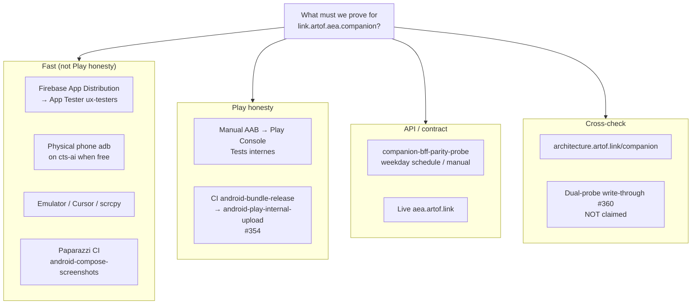

# Native client validation alternatives (Android companion)

> **Tags**: #aea #second-brain #native-mobile #ux #ci #play
> **Captured**: 2026-09-02
> **Owners**: `@aea-senior-software-engineer` · `@aea-devsecops-platform` · `@aea-knowledge-guardian` · sponsor (Play / App Dist ops)
> **Package**: `link.artof.aea.companion`
> **Related**: #363 / #364 (UX loop Phases A–C) · #354 (Play API CI) · honesty #360 (dual-probe, open)
> **This node is knowledge, not product code.**

Inherits [[2026-09-02-companion-ux-online-validation-setup]], [[2026-09-02-companion-native-web-gap-closing-loop]], and [[2026-09-02-play-api-ci-upload-closed-testing]]. Companion README: `clients/mobile/android/README.md`. Public story: [architecture.artof.link/companion](https://architecture.artof.link/companion).

Later agents: pick a path by what you need to **prove**, not by what is fastest to click. Fast paths are not Play honesty.

---

## 1. Mermaid — validation alternatives



### ASCII twin (non-Mermaid contexts)

```
What must we prove for link.artof.aea.companion?
│
├── Fast (not Play honesty)
│   ├── Firebase App Distribution → App Tester ux-testers
│   ├── Physical phone adb on cts-ai (when machine free)
│   ├── Emulator / Cursor / scrcpy
│   └── Paparazzi CI `android-compose-screenshots`
│
├── Play honesty
│   ├── Manual AAB → Play Console Tests internes
│   └── CI `android-bundle-release` → `android-play-internal-upload` (#354)
│
├── API / contract
│   ├── `companion-bff-parity-probe` (weekday schedule / manual)
│   └── vs live `aea.artof.link`
│
└── Cross-check
    ├── architecture.artof.link/companion
    └── dual-probe write-through #360 — NOT claimed
```

---

## 2. Choice table

| Path | Proves | Does not prove |
|------|--------|----------------|
| Firebase App Distribution → App Tester (ux-testers) | Real-device install + UX iteration outside Play; build reaches testers | Store install path; Play signing / track acceptance; production readiness |
| Physical phone adb on cts-ai | Sideload debug/release-unsigned on a known device when machine is free | Play honesty; multi-device matrix; always-on availability |
| Emulator / Cursor / scrcpy | Local Compose UX, screenshots, sponsor walkthrough | Play install; store-signed binary; live-device sensor quirks |
| Paparazzi CI `android-compose-screenshots` | JVM Compose Need/Pick/Pay visual regression (manual job) | Interaction / gesture; Play; live BFF behavior |
| Manual AAB → Play Console Tests internes | **Installs from Play** (internal track); Console acceptance of that versionCode | Automated CI→Play; production track; dual-probe write-through |
| CI `android-bundle-release` → `android-play-internal-upload` (#354) | Same Play-internal honesty when SA File var + commit edit succeed | Production; wiring alone ≠ success until first green upload recorded |
| `companion-bff-parity-probe` vs live `aea.artof.link` | Native↔BFF contract parity on schedule / manual run | Play install; operator/CRM write-through; UX polish |
| architecture.artof.link/companion | Public thin-client story matches docs on `main` | Runtime proof; any install path |
| Dual-probe #360 | *(open honesty gate)* website / operator write-through when sponsor proves it | **Do not claim** — parity green ≠ dual-probe |

---

## 3. Honesty bullets

- **App Dist ≠ Play.** Firebase App Distribution / App Tester is a fast UX loop. It is not the store install path and must not be labeled “installs from Play.”
- **Parity green ≠ Play.** A green `companion-bff-parity-probe` (or live `aea.artof.link` contract check) proves API/contract alignment, not Play Console acceptance or store-signed install.
- **T-09 operator ≠ orders.** Lily’s Florist Operator sample inbox is not live atelier orders / CRM. Operator UI ≠ proven write-through.
- **Only Play internal/closed supports an “installs from Play” claim.** Manual Tests internes or CI `#354` upload to the internal (or closed) track. Debug APK, App Dist, emulator, Paparazzi, and adb sideload do not.
- **cts-ai adb phone** is available for physical-device checks **when that machine is free** — not a guaranteed always-on runner; treat as opportunistic, not a CI gate.
- **Dual-probe write-through #360 is not claimed.** Leave Unknown until sponsor dual-probe closes it. Do not infer from App Dist, parity probe, or Play internal alone.

---

## 4. Pointers to related vault

| Topic | Where |
|-------|--------|
| Gap-closing loop (detect → decide → ship → prove) | [[2026-09-02-companion-native-web-gap-closing-loop]] |
| UX online validation Phases A/B/C (#363 / #364) | [[2026-09-02-companion-ux-online-validation-setup]] |
| Play API CI upload (#354) | [[2026-09-02-play-api-ci-upload-closed-testing]] |
| Alpha probe mock vs BFF | [[2026-09-02-android-companion-alpha-probe-mock-vs-bff]] |
| Companion README (CI jobs, Play, App Dist) | `clients/mobile/android/README.md` |
| Public companion page | https://architecture.artof.link/companion |

